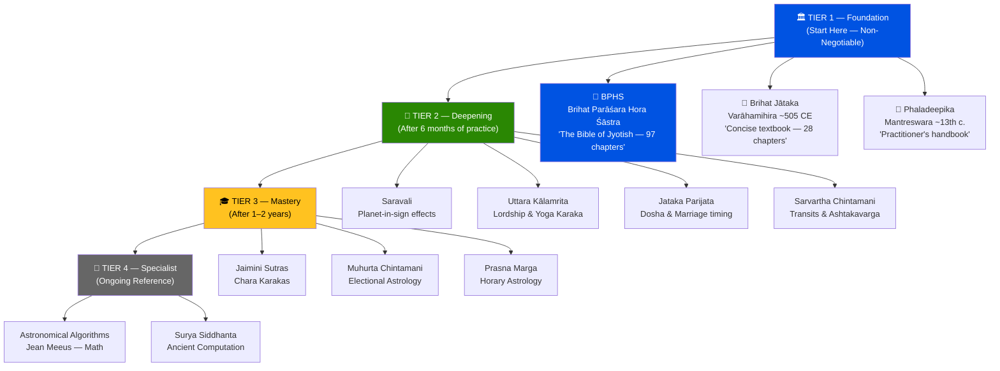
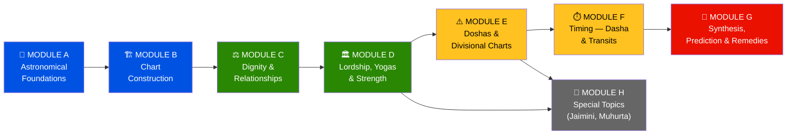
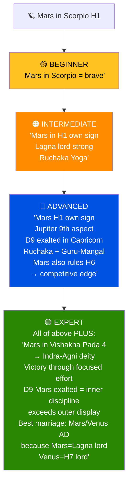
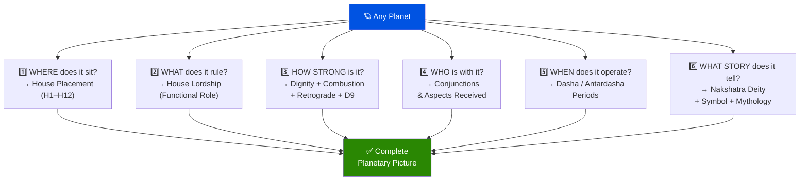
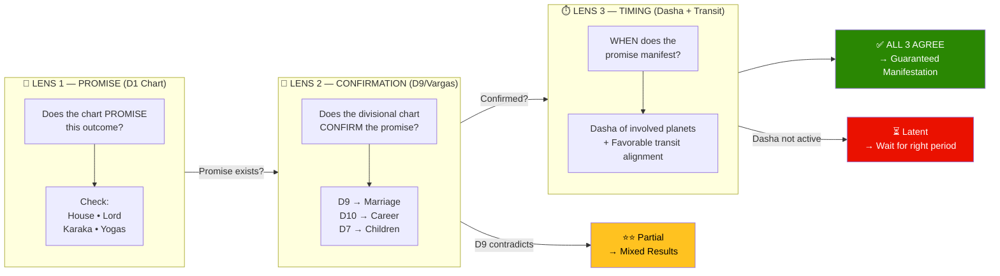
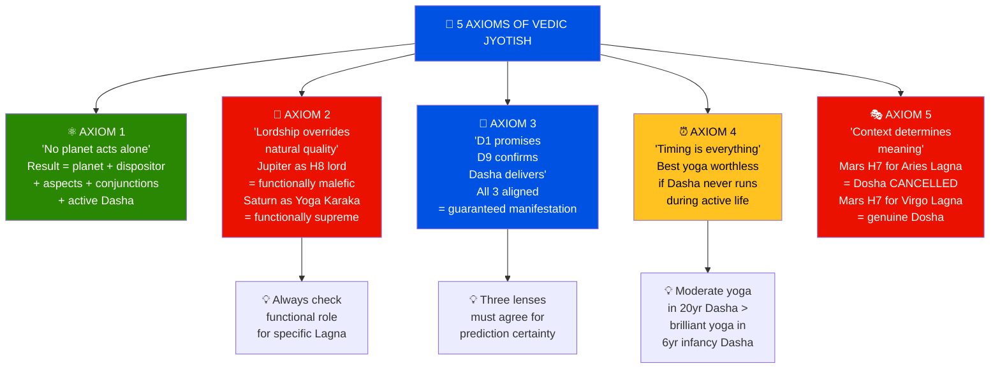

# 🎓 Jyotisha Vidyā — Complete Learning Guide
## Part 1 of 5 — Curriculum Structure & The Big Picture

> **Purpose**: Transform you from curious beginner to confident practitioner.
> **Method**: Progressive complexity — each concept builds on the previous.
> **References**: BPHS · Brihat Jataka · Phaladeepika · Saravali · Sarvartha Chintamani ·
> Uttara Kalamrita · Jataka Parijata · Muhurta Chintamani · Jaimini Sutras

📂 **Learning Guide Navigation**
- ▶ Part 1 — Curriculum Structure & Big Picture ← *You are here*
- [Part 2 — Calculation Engine: Rules, Inputs & Outputs](Jyotish_Learning_Part2_Calculations.md)
- [Part 3 — Interpretation: Simple → Complex](Jyotish_Learning_Part3_Interpretations.md)
- [Part 4 — Worked Examples Across Multiple Charts](Jyotish_Learning_Part4_Examples.md)
- [Part 5 — Mermaid Diagrams, Cheat Sheets & Quick Reference](Jyotish_Learning_Part5_Reference.md)

📂 **Related Reference** (detailed process guide):
- [Process Guide Part 1](Jyotish_Process_Guide_Part1.md) · [Part 2](Jyotish_Process_Guide_Part2.md) · [Part 3](Jyotish_Process_Guide_Part3.md) · [Part 4](Jyotish_Process_Guide_Part4.md)

---

## 🧭 How to Use This Guide

```
LEARNING PATH (recommended order):

  WEEK 1-2:  Part 1 (this file) — understand the framework
  WEEK 3-4:  Part 2 — learn every calculation step
  WEEK 5-8:  Part 3 — learn interpretation rules (easy → hard)
  WEEK 9-12: Part 4 — study worked examples, practice on real charts
  ONGOING:   Part 5 — cheat sheets & diagrams as daily reference

Each section has:
  📖 CONCEPT  — What it is and why it matters
  📐 RULE     — The formal rule from classical texts
  🔢 INPUT/OUTPUT — What goes in, what comes out
  💡 INSIGHT  — The "aha!" moment — why experts care about this
  ⚠️ PITFALL  — Common mistakes beginners make
```

---

## 📚 Classical Text Hierarchy — What to Read & When

> *"Śāstra-jñānam vinā jyotiṣī — andho yathā cakṣu-hīnaḥ."*
> — **Jataka Parijata Ch.1** *(An astrologer without scriptural knowledge is like a blind person)*



### Tier 1 — Foundation (READ FIRST — Non-Negotiable)

| Book | Author | Era | Why It's Essential |
|------|--------|-----|-------------------|
| **Brihat Parāśara Hora Śāstra (BPHS)** | Sage Parāśara | ~1st cent. CE text | The BIBLE of Jyotish. 97 chapters. Every rule traces here. |
| **Brihat Jātaka (BJ)** | Varāhamihira | ~505 CE | Concise, elegant. The "textbook" — 28 chapters of pure brilliance. |
| **Phaladeepika (PD)** | Mantreswara | ~13th cent. | Practical, clear. The "practitioner's handbook." Best for beginners. |

### Tier 2 — Deepening (After 6 months of practice)

| Book | Author | Focus |
|------|--------|-------|
| **Saravali** | Kalyana Varma (~9th c.) | Planet-in-sign/house effects — exhaustive detail |
| **Uttara Kālamrita (UK)** | Kalidāsa (~15th c.) | Advanced lordship, Yoga Karaka, remedies |
| **Jataka Parijata (JP)** | Vaidy14th c.) | Dosha rules, Neechabhanga, marriage timing |
| **Sarvartha Chintamani (SC)** | Venkatesh (~17th c.) | Transit effects, Ashtakavarga, practical prediction |

### Tier 3 — Mastery (After 1-2 years)

| Book | Author | Focus |
|------|--------|-------|
| **Jaimini Sutras** | Sage Jaimini | Chara Karakas, Upapada, sign-based Dasha |
| **Hora Sara** | Prithuyasas (~6th c.) | Son of Varahamihira — expands Brihat Jataka |
| **Muhurta Chintamani** | Rama Daivagna | Electional astrology, nakshatra phala |
| **Prasna Marga** | Harihara (~17th c.) | Horary astrology, advanced prediction |

### Tier 4 — Specialist (Ongoing reference)

| Book | Focus |
|------|-------|
| **Ratna Shastra** | Gemstone prescription rules |
| **Chamatkara Chintamani** | Rahu/Ketu effects, Kala Sarpa |
| **Astronomical Algorithms (Jean Meeus)** | Mathematical foundations for computation |
| **Surya Siddhanta** | Ancient astronomical computation |

---

## 🏗️ The Complete Curriculum — Sections & Subsections

### MODULE A — ASTRONOMICAL FOUNDATIONS

```
A1. Birth Data Collection & Validation
    A1.1  Required inputs (date, time, place, timezone)
    A1.2  Time conversion to UTC
    A1.3  Coordinate lookup (latitude, longitude)
    A1.4  Birth time rectification (when time is uncertain)

A2. Julian Day Number (JD)
    A2.1  Why JD exists (universal time anchor)
    A2.2  Meeus formula step-by-step
    A2.3  Gregorian vs Julian calendar correction
    A2.4  Day fraction from hours/minutes/seconds

A3. Ayanamsa (Sidereal-Tropical Offset)
    A3.1  Tropical vs Sidereal zodiac explained
    A3.2  Lahiri (Chitrapaksha) — the standard
    A3.3  Other systems: Raman, KP, Fagan-Bradley
    A3.4  Formula: approximate + Swiss Ephemeris exact
    A3.5  Sign-boundary edge cases

A4. Lagna (Ascendant) Computation
    A4.1  What the Lagna represents
    A4.2  GMST → LST → RAMC calculation
    A4.3  Tropical Ascendant from obliquity & latitude
    A4.4  Quadrant resolution
    A4.5  Sidereal conversion
    A4.6  Lagna changes every ~2 hours — sensitivity analysis
```

### MODULE B — CHART CONSTRUCTION

```
B1. Planetary Longitudes
    B1.1  The 9 Grahas — identities and orbital characteristics
    B1.2  Swiss Ephemeris computation
    B1.3  Tropical → Sidereal conversion
    B1.4  Retrograde detection (speed < 0)
    B1.5  Combustion detection (proximity to Sun)

B2. House Assignment (Whole Sign)
    B2.1  Whole Sign rule (BPHS Ch.11)
    B2.2  Counting signs from Lagna
    B2.3  The 12 houses — significations
    B2.4  House classifications: Kendra, Trikona, Upachaya, Dusthana, Maraka
    B2.5  Empty houses — how to read them

B3. Nakshatra & Pada
    B3.1  27 Nakshatras — the lunar zodiac
    B3.2  Calculation: longitude → nakshatra number → pada
    B3.3  Nakshatra lords and the Dasha connection
    B3.4  Nakshatra attributes: deity, gana, nadi, yoni, varna
    B3.5  The 4 Padas — Navamsha sub-signs

B4. Chart Rendering
    B4.1  South Indian chart format (fixed-sign grid)
    B4.2  North Indian chart format (fixed-house grid)
    B4.3  Reading planet placements from the chart
```

### MODULE C — DIGNITY & RELATIONSHIPS

```
C1. Planetary Dignity
    C1.1  Exaltation, Debilitation, Own Sign, Moolatrikona
    C1.2  Friendly, Neutral, Enemy sign placement
    C1.3  Neechabhanga (debilitation cancellation) — 5 conditions
    C1.4  Practical dignity scoring

C2. Planetary Relationships
    C2.1  Naisargika Maitri (permanent natural friendships)
    C2.2  Tatkalika Maitri (temporary chart-specific)
    C2.3  Panchadha Maitri (5-fold combined)
    C2.4  Dispositor chains — tracing sign lordship

C3. Aspects (Graha Drishti)
    C3.1  Universal 7th aspect (all planets)
    C3.2  Mars special: 4th and 8th aspects
    C3.3  Jupiter special: 5th and 9th aspects
    C3.4  Saturn special: 3rd and 10th aspects
    C3.5  Aspect interpretation: benefic vs malefic gaze
    C3.6  Rashi Drishti (Jaimini sign aspects) — advanced
```

### MODULE D — LORDSHIP, YOGAS & STRENGTH

```
D1. House Lordship
    D1.1  Functional benefics vs malefics (varies by Lagna!)
    D1.2  Kendradhipati Dosha
    D1.3  The Yoga Karaka planet
    D1.4  Maraka lords (H2, H7)
    D1.5  Lordship for all 12 Lagnas — master table

D2. Yoga Identification
    D2.1  The 8-step yoga verification process
    D2.2  Pancha Mahapurusha Yogas (Ruchaka, Bhadra, Hamsa, Malavya, Sasha)
    D2.3  Raja Yoga (Kendra-Trikona lord connection)
    D2.4  Viparita Raja Yoga (dusthana lords in dusthana)
    D2.5  Dhana Yoga (wealth combinations)
    D2.6  Budha-Aditya, Gaja-Kesari, Chandra-Mangal
    D2.7  Guru-Chandala, Kemadruma, Papakartari
    D2.8  Yoga cancellation rules
    D2.9  Timing: when does a yoga deliver results?

D3. Shadbala (Six-fold Strength)
    D3.1  Sthana Bala (positional)
    D3.2  Dig Bala (directional)
    D3.3  Kala Bala (temporal)
    D3.4  Chesta Bala (motional)
    D3.5  Naisargika Bala (natural/inherent)
    D3.6  Drik Bala (aspectual)
    D3.7  Simplified strength assessment for practical use
```

### MODULE E — DOSHAS & DIVISIONAL CHARTS

```
E1. Dosha Analysis
    E1.1  Mangal Dosha — rule + 11 cancellation conditions
    E1.2  Kala Sarpa Yoga — controversial; status in classical texts
    E1.3  Pitru Dosha (Sun/H9 affliction)
    E1.4  Guru Chandala (Jupiter + Rahu)
    E1.5  Vish Yoga, Shrapit Dosha, Grahan Yoga
    E1.6  Kemadruma, Papakartari, Daridra Yoga
    E1.7  Master cancellation checklist

E2. Divisional Charts (Vargas)
    E2.1  The 16 primary Vargas — what each one governs
    E2.2  D9 (Navamsha) — calculation formula & significance
    E2.3  D9 interpretation rules (Vargottama, dignity in D9)
    E2.4  D10 (Dashamsha) for career
    E2.5  D7 (Saptamsha) for children
    E2.6  Cross-referencing D1 and D9 — the expert's secret
```

### MODULE F — TIMING (DASHA & TRANSITS)

```
F1. Vimshottari Dasha
    F1.1  The 120-year cycle and 9 lords
    F1.2  Starting dasha from Moon's nakshatra
    F1.3  Dasha balance calculation at birth
    F1.4  Mahadasha sequence computation
    F1.5  Antardasha calculation formula
    F1.6  Pratyantardasha (sub-sub periods)
    F1.7  The 5-layer Dasha reading protocol

F2. Transit (Gochara)
    F2.1  Transit reference points: from Moon, Lagna, Sun
    F2.2  Jupiter annual transit (Guru Peyarchi)
    F2.3  Saturn 2.5-year transit — Sade Sati (7.5 years)
    F2.4  Ashtakavarga point scoring
    F2.5  Eclipse effects on natal chart
    F2.6  Triple agreement rule (Dasha + Jupiter + Saturn)
```

### MODULE G — SYNTHESIS, PREDICTION & REMEDIES

```
G1. The 10-Layer Synthesis Protocol
    G1.1  Layer 1: Chart vitality
    G1.2  Layer 2: Lagna lord direction
    G1.3  Layer 3: Planetary hierarchy
    G1.4  Layer 4: Yoga assessment
    G1.5  Layer 5: Dusthana review
    G1.6  Layer 6: House-by-house verdict
    G1.7  Layer 7: D9 cross-reference
    G1.8  Layer 8: Dasha timeline
    G1.9  Layer 9: Transit overlay
    G1.10 Layer 10: Final verdict

G2. Prediction Methodology
    G2.1  Career prediction framework
    G2.2  Marriage timing framework
    G2.3  Wealth prediction framework
    G2.4  Health & longevity framework
    G2.5  Children prediction framework
    G2.6  Foreign travel / relocation prediction

G3. Remedies (Upaya)
    G3.1  Seven categories: Mantra, Dana, Homa, Ratna, Vrata, Yantra, Seva
    G3.2  Planet-remedy correspondence table
    G3.3  ⚠️ Gemstone safety rules (NEVER for functional malefics!)
    G3.4  Behavioral remedies (modern, practical)
    G3.5  Remedy prioritization framework
```



### MODULE H — SPECIAL TOPICS

```
H1. Jaimini Karakas
    H1.1  Chara Karakas (variable significators by degree)
    H1.2  Atmakaraka, Amatyakaraka, Darakaraka
    H1.3  Upapada Lagna (UL) calculation
    H1.4  Jaimini vs Parashari — when to use which

H2. Marriage Compatibility (Ashtakuta)
    H2.1  The 8 Kutas: Varna, Vashya, Tara, Yoni, Graha Maitri, Gana, Bhakut, Nadi
    H2.2  Scoring system (36 points max)
    H2.3  Dosha Bhanga (cancellation conditions for each Kuta)
    H2.4  Beyond Ashtakuta: chart-level compatibility

H3. Mundane & Electional Astrology (Muhurta)
    H3.1  Choosing auspicious times
    H3.2  Panchanga elements: Tithi, Vara, Nakshatra, Yoga, Karana
```

---

## 🧠 The Expert's Mental Model

### How a Jyotish Expert THINKS (Not Just Calculates)



```
BEGINNER thinks:   "Mars is in Scorpio. Mars in Scorpio = brave."
INTERMEDIATE:      "Mars is in H1 in own sign. Lagna lord strong. Ruchaka Yoga."
ADVANCED:          "Mars in H1 own sign, Jupiter's 9th aspect on it, D9 exalted.
                    Ruchaka + Guru-Mangal. Triggered in Mars MD (2003-2010).
                    But Mars also rules H6 — competitive edge, not just courage."
EXPERT:            All of the above PLUS:
                    "Mars in Vishakha Pada 4 → Indra-Agni deity → victory through
                    relentless focused effort. Rahu sub-lord (Svati-like) gives
                    entrepreneurial independence. Temporary relationships with
                    co-tenants in H1. D9 Mars exalted in Capricorn = inner
                    discipline exceeds outer display. Saturn as H3+H4 lord
                    aspects H4 from H2 → Mars' H4 lordship + Saturn's aspect
                    = property/home matters require persistent effort.
                    Transit check: When Mars transits own sign during Mars MD,
                    Sarvottama effects manifest. Best marriage window was
                    Mars/Venus AD (2008-2009) because Mars = Lagna lord,
                    Venus = H7+H12 lord — Lagna-Kalatra connection."
```

### The 6 Questions Every Expert Asks About Every Planet



```
1. WHERE does it sit?          → House placement
2. WHAT does it rule?          → House lordship (functional role)
3. HOW STRONG is it?           → Dignity + combustion + retrograde + D9
4. WHO is with it?             → Conjunctions and aspects received
5. WHEN does it operate?       → Dasha/Antardasha periods
6. WHAT STORY does it tell?    → Nakshatra deity + symbol + mythology
```

### The 3 Lenses of Every Prediction



```
LENS 1: PROMISE (D1 Chart)
  → Does the chart PROMISE this outcome?
  → Check: house, lord, karaka, yogas

LENS 2: CONFIRMATION (D9 and other Vargas)
  → Does the divisional chart CONFIRM the promise?
  → D9 for marriage, D10 for career, D7 for children

LENS 3: TIMING (Dasha + Transit)
  → WHEN does the promise manifest?
  → Dasha of involved planets + favorable transit alignment
```

---

## 🎯 Learning Milestones

| Milestone | You Can... | Time Required |
|-----------|-----------|---------------|
| **L1: Observer** | Read a chart grid, identify planets and houses | 1-2 weeks |
| **L2: Calculator** | Compute JD, Ayanamsa, Lagna, planet positions from birth data | 2-4 weeks |
| **L3: Mapper** | Assign houses, nakshatras, padas; draw the chart | 1-2 weeks |
| **L4: Analyst** | Assess dignity, aspects, lordship for all planets | 2-4 weeks |
| **L5: Pattern-Finder** | Identify Yogas and Doshas; verify cancellations | 2-4 weeks |
| **L6: Timer** | Calculate Vimshottari Dasha; identify current period | 1-2 weeks |
| **L7: Interpreter** | Synthesize chart data into a coherent life narrative | 4-8 weeks |
| **L8: Predictor** | Combine Dasha + Transit for specific timing predictions | 4-8 weeks |
| **L9: Advisor** | Prescribe appropriate remedies; deliver complete readings | Ongoing |
| **L10: Master** | Cross-reference D1/D9/D10, Jaimini Karakas, Ashtakavarga | 1-2 years |

```mermaid
graph LR
    L1["👁️ L1\nObserver\n1-2 wks"] --> L2["🔢 L2\nCalculator\n2-4 wks"]
    L2 --> L3["🗺️ L3\nMapper\n1-2 wks"]
    L3 --> L4["🔬 L4\nAnalyst\n2-4 wks"]
    L4 --> L5["🎯 L5\nPattern-Finder\n2-4 wks"]
    L5 --> L6["⏱️ L6\nTimer\n1-2 wks"]
    L6 --> L7["📖 L7\nInterpreter\n4-8 wks"]
    L7 --> L8["🔮 L8\nPredictor\n4-8 wks"]
    L8 --> L9["💊 L9\nAdvisor\nOngoing"]
    L9 --> L10["🏆 L10\nMaster\n1-2 yrs"]

    style L1 fill:#cce5ff,color:#000
    style L2 fill:#cce5ff,color:#000
    style L3 fill:#cce5ff,color:#000
    style L4 fill:#d4edda,color:#000
    style L5 fill:#d4edda,color:#000
    style L6 fill:#d4edda,color:#000
    style L7 fill:#ffc220,color:#000
    style L8 fill:#ffc220,color:#000
    style L9 fill:#ea1100,color:#fff
    style L10 fill:#2a8703,color:#fff
```



---

## 🔑 Core Principles (Memorize These)

### The 5 Axioms of Vedic Jyotish



```
AXIOM 1: "No planet acts alone."
  Every planet's result is modified by its sign lord (dispositor),
  the planets aspecting it, the planets conjunct it, and the
  Dasha/Antardasha currently operating.

AXIOM 2: "House lordship overrides natural quality."
  Jupiter (natural benefic) as H8 lord = functionally malefic.
  Saturn (natural malefic) as Yoga Karaka = functionally supreme.
  ALWAYS check functional role for the specific Lagna.

AXIOM 3: "D1 promises, D9 confirms, Dasha delivers."
  A yoga in D1 without D9 support = partial manifestation.
  A yoga in both D1 and D9 without Dasha timing = latent potential.
  All three aligned = guaranteed manifestation.

AXIOM 4: "Timing is everything."
  The best yoga in the chart is worthless if its Dasha never runs
  during the native's lifetime. A moderate yoga in a long Dasha
  outperforms a brilliant yoga in a 6-year Sun Dasha that runs
  in infancy.

AXIOM 5: "Context determines meaning."
  Mars in H7 for Aries Lagna = Mangal Dosha CANCELLED (own sign).
  Mars in H7 for Virgo Lagna = genuine Mangal Dosha (Mars is H3+H8 lord!).
  Same placement, OPPOSITE meaning. Context is EVERYTHING.
```

---

📌 **End of Part 1**

**Next**: [Part 2 — Calculation Engine: Rules, Inputs & Outputs →](Jyotish_Learning_Part2_Calculations.md)

---
*Jyotisha Vidyā Learning Guide · Part 1 of 5 · Created April 2026*
