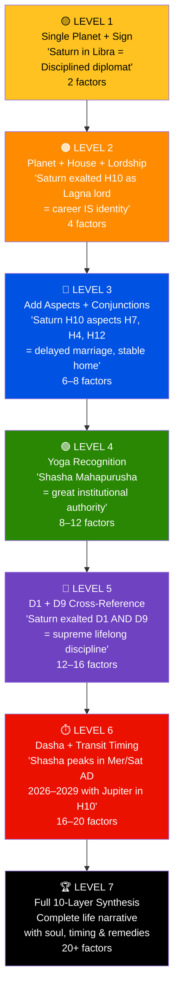
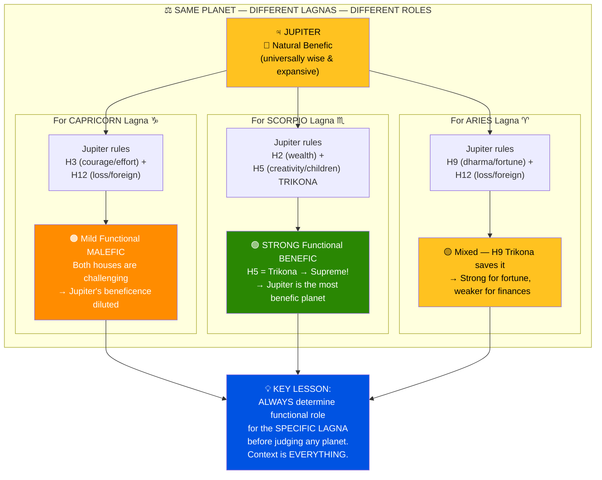
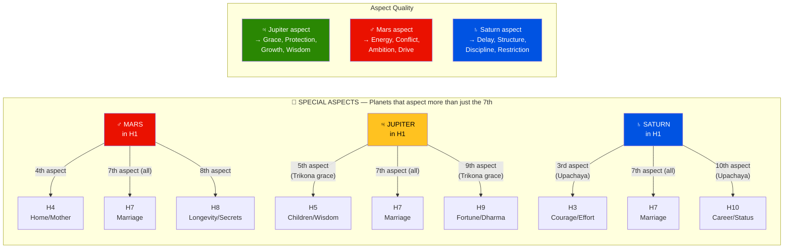
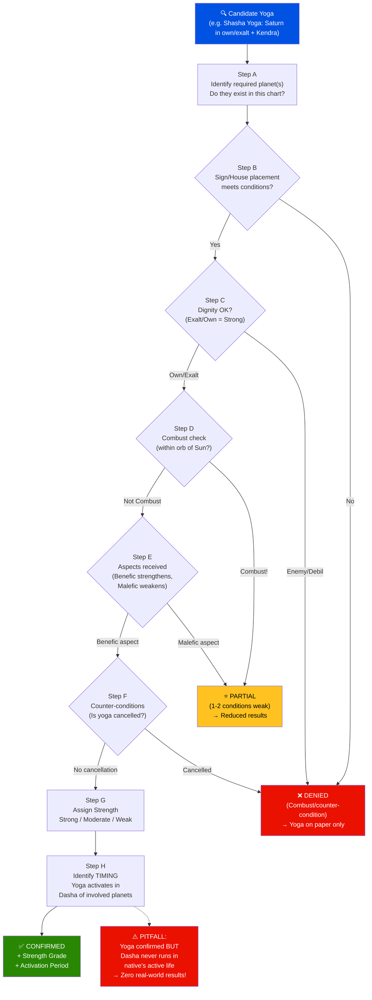
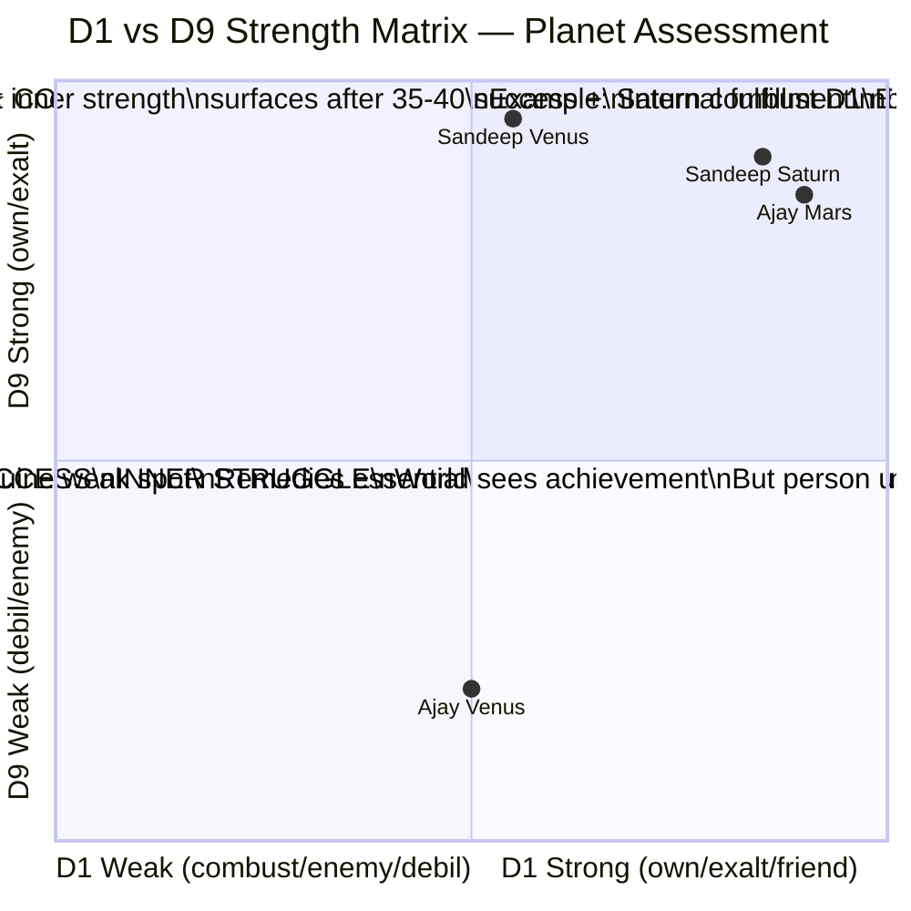
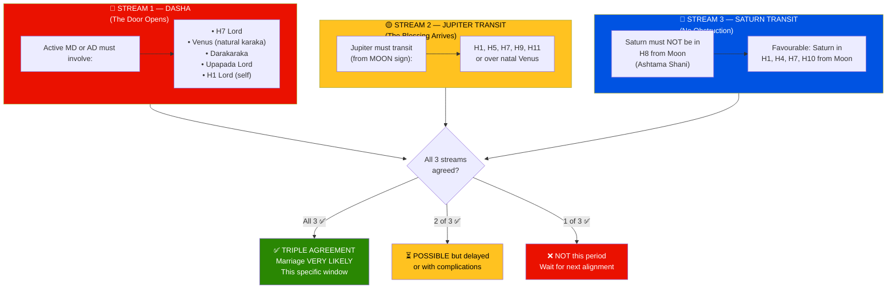
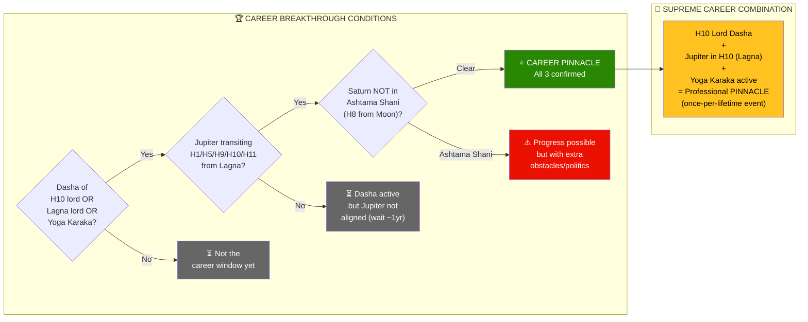
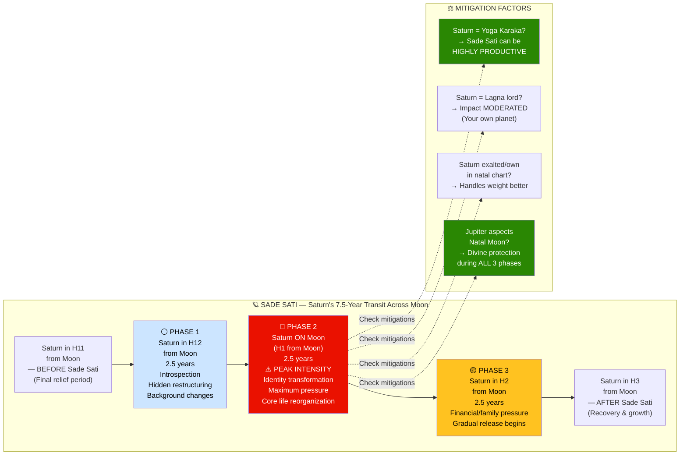

# 🎓 Jyotisha Vidyā — Complete Learning Guide
## Part 3 of 5 — Interpretation: Simple Rules → Complex Synthesis

> **Goal**: Learn to READ a chart, progressing from single-planet rules to
> multi-layered synthesis. Each level builds on the previous.

📂 **Navigation**
- [← Part 1 — Structure](Jyotish_Learning_Part1_Structure.md)
- [← Part 2 — Calculations](Jyotish_Learning_Part2_Calculations.md)
- ▶ Part 3 — Interpretation ← *You are here*
- [Part 4 — Worked Examples →](Jyotish_Learning_Part4_Examples.md)
- [Part 5 — Diagrams & Cheat Sheets →](Jyotish_Learning_Part5_Reference.md)

---

## 🎯 The Interpretation Ladder

```
Level 1: Single Planet → Sign → One sentence
Level 2: Planet → House → Lordship → Paragraph
Level 3: Planet + Aspects + Conjunctions → Multi-factor
Level 4: Yoga Detection → Pattern recognition
Level 5: D1 + D9 Cross-Reference → Soul-level reading
Level 6: Dasha + Transit → Timing predictions
Level 7: Full 10-Layer Synthesis → Complete life narrative
```



---

## LEVEL 1 — Single Planet, Single Statement

> **Skill**: Given a planet and its sign, produce ONE interpretive sentence.
> **Source**: Saravali Ch.17–37 (planet-in-sign effects)

### Rule 1.1 — Planet in Sign (Rāśi Phala)

```
📐 RULE: Each planet has a natural quality. Each sign modifies it.
📖 SOURCE: Saravali Ch.17–37; Brihat Jataka Ch.3

FORMULA: [Planet's nature] + [Sign's modification] = One statement

Planet natures:
  Sun    = authority, ego, father, vitality
  Moon   = mind, emotions, mother, comfort
  Mars   = courage, energy, aggression, siblings
  Mercury= intellect, speech, analysis, business
  Jupiter= wisdom, expansion, fortune, children
  Venus  = love, beauty, pleasure, spouse
  Saturn = discipline, restriction, service, longevity
```

**Practice Examples**:
```
"Sun in Capricorn" →
  Sun (authority) + Capricorn (disciplined, structured) =
  "Authority expressed through disciplined, structured effort."

"Moon in Aquarius" →
  Moon (mind/emotions) + Aquarius (detached, humanitarian) =
  "Emotions are processed logically; a detached, humanitarian mind."

"Mars in Libra" →
  Mars (action/energy) + Libra (balanced, diplomatic) =
  "Energy directed through balanced, diplomatic channels; refined action."
```

> **Beginner exercise**: For all 9 planets × 12 signs = 108 combinations,
> write one sentence each. This builds your interpretive vocabulary.

---

## LEVEL 2 — Planet + House + Lordship

> **Skill**: Add house context and lordship to deepen interpretation.
> **Source**: BPHS Ch.24 (lords in houses); Phaladeepika Ch.7

### Rule 2.1 — Planet in House (Bhāva Phala)

```
📐 RULE: A planet's HOUSE placement determines WHERE its effects manifest.
📖 SOURCE: BPHS Ch.24

FORMULAPlanet's nature] manifests in [House's domain]

Example: "Sun in H1"
  Sun (authority, vitality) → H1 (self, body, personality)
  = "The native has a commanding, authoritative personality with strong vitality."

Example: "Moon in H2"
  Moon (emotions, mind) → H2 (wealth, speech, family)
  = "Emotional security is tied to wealth and family; speech is soft and nurturing."
```

### Rule 2.2 — House Lord in Another House

```
📐 RULE: The lord of House X sitting in House Y CONNECTS the themes of X and Y.
📖 SOURCE: BPHS Ch.24 — exhaustive rules for each lord in each house

FORMULA: "The affairs of House X are influenced by/played out in House Y"

Example: "H7 lord (Moon) in H2"
  H7 = marriage, spouse
  H2 = wealth, family, speech
  Connection: "Marriage is connected to wealth; spouse contributes to finances;
               the partner's voice/speech is important to the native."

Example: "H9 lord (Mercury) in H1"
  H9 = fortune, dharma, higher education
  H1 = self, personality
  Connection: "Fortune is embedded in the personality itself; the native IS
               their good luck; wisdom and dharmic conduct are second nature."
```

### Rule 2.3 — Functional Benefic vs Malefic

```
📐 RULE: A planet's benefic/malefic status CHANGES based on which houses it rules.
📖 SOURCE: BPHS Ch.34; Uttara Kalamrita Ch.3

KEY PRINCIPLE: Same planet, different Lagna = different functional role!

For Capricorn Lagna:
  Venus = H5+H10 lord = YOGA KARAKA (sreme benefic) ⭐
  Jupiter = H3+H12 lord = mild functional malefic ⚠️
  Saturn = H1+H2 lord = personal planet (benefic for self)

For Scorpio Lagna:
  Venus = H7+H12 lord = Maraka + Vyaya lord = functional malefic ⚠️
  Jupiter = H2+H5 lord = Trikona lord (H5) = BENEFIC ⭐
  Saturn = H3+H4 lord = neutral (Kendradhipati Dosha)

INSIGHT: This is the SINGLE MOST IMPORTANT rule in Parashari Jyotish.
  Natural quality ≠ Functional quality. Jupiter is naturally benefic
  but can be functionally malefic. Saturn is naturally malefic but
  can be the Yoga Karaka (the BEST planet in the chart).
```



---

## LEVEL 3 — Multi-Factor Analysis (Conjunction + Aspect)

> **Skill**: Read planets in context of what touches them.
> **Source**: BPHS Ch.26 (aspects); Saravali Ch.45 (conjunctions)

### Rule 3.1 — Conjunction (Same Sign)

```
📐 RULE: Planets in the SAME SIGN influence each other permanently.
📖 SOURCE: Saravali Ch.45

FORMULA: [Planet A's nature] + [Planet B's nature] = blended effect

Friends conjunct = mutual enhancement
  Sun + Jupiter = wisdom-guided authority; dharmic leadership
  Moon + Jupiter = Gaja-Kesari Yoga; emotional wisdom; popular

Enemies conjunct = tension and compromise
  Sun + Saturn = father-authority tension; delayed recognition
  Jupiter + Rahu = Guru-Chandala; unconventional wisdom; cross-cultural

Neutral conjunct = contextual blend
  Mars + Saturn = disciplined energy; can be destructive OR extremely productive
  depending on sign, house, and aspects received
```

### Rule 3.2 — Aspect (Drishti)

```
📐 RULE: Aspects are "gazes" — a planet projects its influence onto distant houses.
📖 SOURCE: BPHS Ch.26

KEY ASPECT RULES:
  All planets     → 7th aspect (opposite house)
  Mars only       → 4th and 8th aspects
  Jupiter only    → 5th and 9th aspects
  Saturn only     → 3rd and 10th aspects

Interpretation pattern:
  BENEFIC aspect on a house = protection, grace, growth for that house
  MALEFIC aspect on a house = pressure, challenge, harshness for that house
  EXALTED planet's aspect = VERY powerful influence (like a king looking at you)

Example: "Jupiter in H12 aspects H4 (5th aspect), H6 (7th), H8 (9th)"
  H4: Jupiter blesses home, mother, education → protective
  H6: Jupiter overcomes enemies → wisdom defeats opposition
  H8: Jupiter protects longevity → long life indicator

Example: "Saturn in H10 aspects H12 (3rd), H4 (7th), H7 (10th)"
  H12: Saturn structures foreign/institutional matters
  H4: Saturn disciplines home life → delay but stability
  H7: Saturn governs marriage → delayed but enduring marriage
```



### Rule 3.3 — Aspect on a Planet vs Aspect on a House

```
When a planet aspects a HOUSE:
  → The THEMES of that house are affected

When a planet aspects ANOTHER PLANET (in a house):
  → Both the house themes AND the aspected planet's own themes are affected

Example: Jupiter aspects Mars in H10
  → H10 themes (career) receive Jupiter's blessing AND
  → Mars's own qualities (energy, drive) are refined by Jupiter's wisdom
  → Result: Wise, dharmic career drive; guided ambition
```

---

## LEVEL 4 — Yoga Detection (Pattern Recognition)

> **Skill**: Recognize planetary PATTERNS that create effects greater than the sum of parts.

### Rule 4.1 — Pancha Mahapurusha Yoga (The Big Five)

```
📐 RULE: Mars/Mercury/Jupiter/Venus/Saturn in OWN or EXALTATION sign
         AND in a Kendra house (H1, H4, H7, H10).
📖 SOURCE: BPHS Ch.35; Phaladeepika Ch.6

IF planet_in_own_or_exalt AND planet_in_kendra:
  Mars    → RUCHAKA YOGA  = warrior, leader, military authority
  Mercury → BHADRA YOGA   = scholar, analyst, communicator
  Jupiter → HAMSA YOGA    = noble guru, wise, fortunate
  Venus   → MALAVYA YOGA  = artistic, wealthy, sensual
  Saturn  → SASHA YOGA    = disciplined authority, institution-builder

STRENGTH MODIFIERS:
  + Planet not combust           = Full strength
  + Planet receives benefic aspect = Enhanced
  + Planet in same D9 (Vargottama) = Maximum
  - Planet combust               = Weakened yoga
  - Planet in enemy D9 sign      = Reduced inner quality
```



### Rule 4.2 — Raja Yoga (Royal Combination)

```
📐 RULE: Connection between Kendra lord (H1/4/7/10) and Trikona lord (H1/5/9).
📖 SOURCE: BPHS Ch.36

"Connection" means any of:
  a) Conjunction (same sign)
  b) Mutual aspect
  c) Kendra lord in Trikona house
  d) Trikona lord in Kendra house
  e) Mutual exchange (Parivartana)

GRADING:
  ⭐⭐⭐: Both planets in dignity + in Kendra/Trikona
  ⭐⭐:  One planet dignified; both in angular relationship
  ⭐:    Connection exists but one planet is weak (combust/enemy sign)
```

### Rule 4.3 — Viparita Raja Yoga (Reversal of Fortune)

```
📐 RULE: Lord of H6, H8, or H12 placed IN another dusthana (H6/H8/H12).
📖 SOURCE: BPHS Ch.41

Three types:
  HARSHA: H6 lord in H8 or H12
  SARALA: H8 lord in H6 or H12
  VIMALA: H12 lord in H6 or H8 OR H12 lord in H12 (own house!)

Effect: "Bad lord in bad house = double negative = positive."
  Obstacles destroy obstacles. Losses prevent larger losses.
  The native gains THROUGH adversity, not despite it.
```

### Rule 4.4 — Budha-Aditya Yoga

```
📐 RULE: Sun + Mercury in same sign.
📖 SOURCE: BPHS Ch.36

CRITICAL CHECK: Is Mercury combust? (within 14° of Sun)
  If combust: Yoga EXISTS but Mercury's independent voice is suppressed.
    → Intelligence is there but struggles to express distinctly from ego.
  If NOT combust: Full Budha-Aditya → brilliant, authoritative intelligence.
```

---

## LEVEL 5 — D1 + D9 Cross-Reference

> **Skill**: Compare a planet's status in the birth chart (D1) with its
> Navamsha (D9) status to determine the FULL picture.

### Rule 5.1 — The D1-D9 Matrix

```
📐 RULE: D1 = what the world sees. D9 = what the soul experiences.
📖 SOURCE: BPHS Ch.6

Reading the combination:

  D1 STRONG + D9 STRONG = ⭐⭐⭐ Complete strength
    → Planet delivers fully on every level. No gap between
      external success and internal fulfillment.
    Example: Saturn exalted in both D1 and D9 = iron-willed
      discipline at both surface and soul level.

  D1 STRONG + D9 WEAK = ⭐⭐ External success, internal struggle
    → The world sees achievement but the person feels unfulfilled
      in that area. Success brings no joy.
    Example: Venus strong in D1 but debilitated in D9 = outwardly
      good marriage but internally unsatisfying relationship.

  D1 WEAK + D9 STRONG = ⭐⭐ Late-blooming strength
    → Early life challenges in that area, but with age the inner
      strength surfaces. Results improve dramatically after 30–40.
    Example: Saturn combust in D1 but exalted in D9 = career
      struggles early but extraordinary authority in later life.

  D1 WEAK + D9 WEAK = ⚠️ Double vulnerability
    → This is the chart's genuine weak spot. Remedies essential.
    Example: Mercury combust in D1 + debilitated in D9 =
      persistent communication challenges requiring active work.

  VARGOTTAMA (same sign in D1 and D9) = Maximum purity
    → Planet operates at undiluted strength. What you see = what you get.
    → If Vargottama in own sign = SUPREME.
    → If Vargottama in debilitation = genuinely weak on all levels.
```



### Rule 5.2 — D9 for Marriage Specifically

```
📐 RULE: D9 is THE chart for marriage assessment.
📖 SOURCE: BPHS Ch.6 — "Navāṃśam sarvadā paśyet — vivāha-phalam viśeṣataḥ"

Check in D9:
  1. D9 Lagna sign → the soul's fundamental nature in relationships
  2. Venus in D9    → the quality of love and attraction
  3. Jupiter in D9  → dharma in marriage; male chart = wife indicator
  4. D9 H7          → the marriage house at soul level
  5. D9 H7 lord     → partner's soul-level qualities

KEY RULE: Venus in own sign or exalted in D9 = marriage is blessed.
          Venus debilitated in D9 = marriage needs conscious work.
```

---

## LEVEL 6 — Timing (Dasha + Transit → Prediction)

> **Skill**: Determine WHEN chart promises manifest.

### Rule 6.1 — The 5-Layer Dasha Reading

```
📐 RULE: Read every Dasha lord through 5 lenses.
📖 SOURCE: BPHS Ch.46; synthesized from multiple chapters

For any active MD/AD lord:
  LAYER 1: HOUSES OWNED → those house themes ACTIVATE
  LAYER 2: HOUSE OCCUPIED → WHERE events play out
  LAYER 3: DIGNITY → how powerfully; exalted = full, combust = reduced
  LAYER 4: ASPECTS → support (benefic) or challenge (malefic)
  LAYER 5: D9 STATUS → inner quality of the period's results

COMBINATION:
  MD sets the THEME (broad life area)
  AD triggers the EVENT (specific manifestation)
  Together they create the period's story.
```

### Rule 6.2 — Marriage Timing Framework

```
📐 RULE: Marriage occurs when 3 streams agree.
📖 SOURCE: BPHS Ch.18, Ch.46; Jataka Parijata Ch.9

Stream 1 — DASHA:
  MD or AD must involve one of:
  • H7 lord
  • Venus (natural marriage karaka)
  • Darakaraka (Jaimini spouse significator)
  • UL lord (Upapada lord)
  • H1 lord (self in context of partnership)

Stream 2 — JUPITER TRANSIT:
  Jupiter must transit:
  • H1, H5, H7, H9, or H11 from Moon OR
  • H1, H7 from Lagna OR
  • Over natal Venus

Stream 3 — SATURN TRANSIT:
  Saturn must transit:
  • H1, H4, H7, H10 from Moon OR
  • Not be in Ashtama Shani (H8 from Moon)

TRIPLE AGREEMENT = near-certain marriage timing.
```



### Rule 6.3 — Career Timing Framework

```
📐 RULE: Career breakthroughs when Dasha + Transit activate H10/H1.
📖 SOURCE: BPHS Ch.46; Sarvartha Chintamani

Career breakthrough when ALL of:
  1. Dasha of H10 lord, or Lagna lord, or Yoga Karaka
  2. Jupiter transiting H1, H5, H9, H10, or H11 from Lagna
  3. Saturn NOT in Ashtama Shani

STRONGEST career period:
  Dasha of H10 lord + Jupiter transiting H10 from Lagna
  = "Jupiter in career house during career-lord's Dasha"
  = near-guaranteed professional pinnacle
```



### Rule 6.4 — The Sade Sati Interpretation

```
📐 RULE: Saturn in H12/H1/H2 from natal Moon = Sade Sati (~7.5 years).
📖 SOURCE: Muhurta Chintamani; Sarvartha Chintamani

NUANCE (beyond basic "Sade Sati = bad"):
  Phase 1 (H12 from Moon): Introspection, restructuring, hidden changes
  Phase 2 (H1 = ON Moon): PEAK intensity — identity transformation
  Phase 3 (H2 from Moon): Financial/family pressure, then release

MITIGATING FACTORS (Sade Sati is NOT equally bad for everyone):
  • Saturn as Yoga Karaka → Sade Sati can be PRODUCTIVE
  • Saturn as Lagna lord → Sade Sati is MODERATED
  • Strong natal Saturn (exalted/own sign) → handles transit weight
  • Jupiter aspect on natal Moon → divine protection during Sade Sati
  • Strong Moon (waxing, benefic sign) → emotional resilience
```



---

## LEVEL 7 — Full 10-Layer Synthesis

> **Skill**: Weave ALL data into a single coherent life narrative.

### The 10 Layers (summary — see Process Guide Part 4 for details)

```
Layer  1: CHART VITALITY — Strong or weak overall?
Layer  2: LAGNA LORD — Where does life's energy flow?
Layer  3: PLANET HIERARCHY — Who dominates? Who's weakest?
Layer  4: YOGAS — What gifts and burdens exist?
Layer  5: DUSTHANA REVIEW — Where are the karmic debts?
Layer  6: HOUSE-BY-HOUSE — Verdict on each life area
Layer  7: D9 CROSS-CHECK — Does D9 confirm or deny D1 promises?
Layer  8: DASHA TIMELINE — What activates when?
Layer  9: TRANSIT OVERLAY — What's happening NOW?
Layer 10: FINAL VERDICT — The single unifying life narrative
```



```mermaid
flowchart TD
    L1["🌡️ LAYER 1 — CHART VITALITY\nCount exalted/own planets vs\ncombust/debilitated\n→ Is the engine strong?"]
    L2["🧭 LAYER 2 — LAGNA LORD\nWhere does life's energy flow?\n→ Sets primary life direction"]
    L3["🏆 LAYER 3 — PLANET HIERARCHY\nWho is strongest? Who weakest?\n→ Chart's power structure"]
    L4["✨ LAYER 4 — YOGA ASSESSMENT\nWhat gifts & patterns exist?\n→ The chart's promises"]
    L5["⚠️ LAYER 5 — DUSTHANA REVIEW\nH6/H8/H12 planets\n→ Where are karmic debts?"]
    L6["🏠 LAYER 6 — HOUSE-BY-HOUSE\nVerdict on each life area\n→ Career / marriage / wealth / health"]
    L7["🔮 LAYER 7 — D9 CROSS-CHECK\nDoes D9 confirm D1?\n→ The soul's deeper truth"]
    L8["⏱️ LAYER 8 — DASHA TIMELINE\nWhat activates when?\n→ The life movie's chapters"]
    L9["🔭 LAYER 9 — TRANSIT OVERLAY\nWhat's triggering NOW?\n→ Jupiter + Saturn positions"]
    L10["📖 LAYER 10 — FINAL VERDICT\nThe ONE unifying life narrative\nSignature + Timing + Guidance"]

    L1 --> L2 --> L3 --> L4 --> L5 --> L6 --> L7 --> L8 --> L9 --> L10

    style L1 fill:#cce5ff,color:#000
    style L2 fill:#cce5ff,color:#000
    style L3 fill:#d4edda,color:#000
    style L4 fill:#d4edda,color:#000
    style L5 fill:#ffc220,color:#000
    style L6 fill:#ffc220,color:#000
    style L7 fill:#0053e2,color:#fff
    style L8 fill:#0053e2,color:#fff
    style L9 fill:#ea1100,color:#fff
    style L10 fill:#000,color:#fff
```

### Rule 7.1 — Finding the Chart's "Signature"

```
Every chart has ONE dominant theme — the "signature."
Finding it is the mark of an expert.

PROCESS:
  1. What's the STRONGEST planet? (own sign, exalted, Kendra/Trikona)
  2. What YOGA dominates? (strongest confirmed yoga)
  3. Where do they CONVERGE? (which house/life area)

Example — Sandeep:
  Strongest planet: Saturn (exalted H10, Shasha Yoga)
  Strongest yoga: Shasha Mahapurusha
  Convergence: H10 (career)
  SIGNATURE: "The Institution-Builder"
  Everything in Sandeep's chart points to career authority,
  disciplined achievement, and lasting organizational structures.

Example — Ajay Kumar:
  Strongest planet: Mars (own sign H1, Ruchaka Yoga, D9 exalted)
  Strongest yoga: Ruchaka
  Convergence: H1 (self)
  SIGNATURE: "The Self-Built Warrior"
  Life energy flows through personal transformation, courage,
  and leadership-by-being.
```

### Rule 7.2 — Resolving Contradictions

```
Charts always have contradictions. The expert doesn't ignore them —
they RESOLVE them through hierarchy.

HIERARCHY OF RESOLUTION:
  1. Lagna lord's condition trumps everything else for personality
  2. Yoga Karaka's condition determines overall fortune trajectory
  3. D9 resolves D1 ambiguity (D9 is "deeper truth")
  4. Dasha timing determines WHEN contradictions manifest
  5. Stronger planet's signification dominates the weaker's

Example — "Jupiter in H12 — is this good or bad?"
  For Capricorn Lagna: Jupiter rules H3+H12 (both are challenging).
    BUT Jupiter is in own sign → VIMALA YOGA → H12 becomes positive.
    Resolution: H12 Jupiter IS positive, but specifically through
    foreign, institutional, or spiritual channels — NOT through
    conventional domestic routes.
```

---

## 🎯 Interpretation Complexity Ladder — Summary

| Level | What You Read | How Many Factors | Example Output |
|-------|-------------|-----------------|----------------|
| 1 | Planet + Sign | 2 | "Disciplined authority" |
| 2 | + House + Lordship | 4 | "Career lord exalted in H10 = exceptional career" |
| 3 | + Aspects + Conjunctions | 6-8 | "Saturn exalted in H10 aspecting H7 = structured marriage" |
| 4 | + Yoga patterns | 8-12 | "Shasha Yoga + Mars conjunction = leadership institution" |
| 5 | + D9 cross-reference | 12-16 | "D1+D9 Saturn both exalted = lifetime discipline" |
| 6 | + Dasha timing | 16-20 | "Shasha Yoga peaks in Saturn MD (1993-2012) and Mer/Sat AD (2026-29)" |
| 7 | Full synthesis | 20+ | Complete life narrative with timing |

---

📌 **End of Part 3**

**Next**: [Part 4 — Worked Examples Across Multiple Charts →](Jyotish_Learning_Part4_Examples.md)

---
*Jyotisha Vidyā Learning Guide · Part 3 of 5 · Created April 2026*
