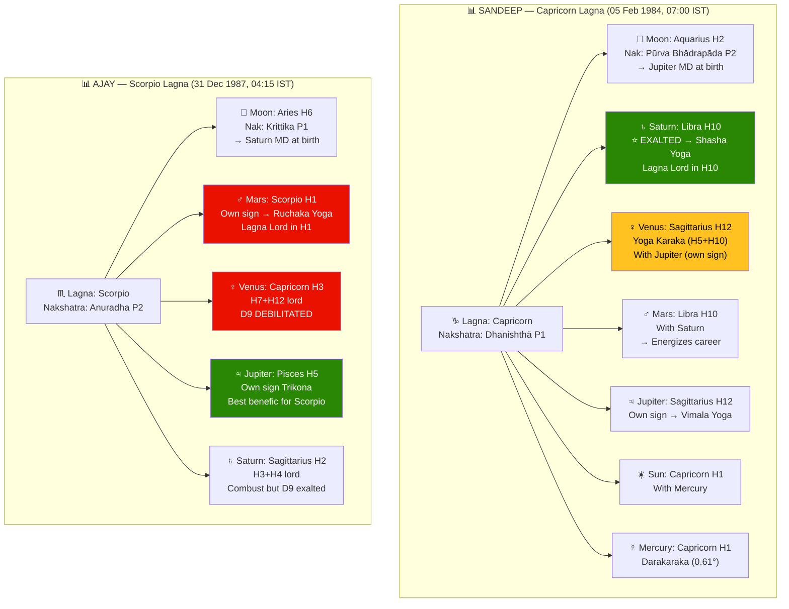
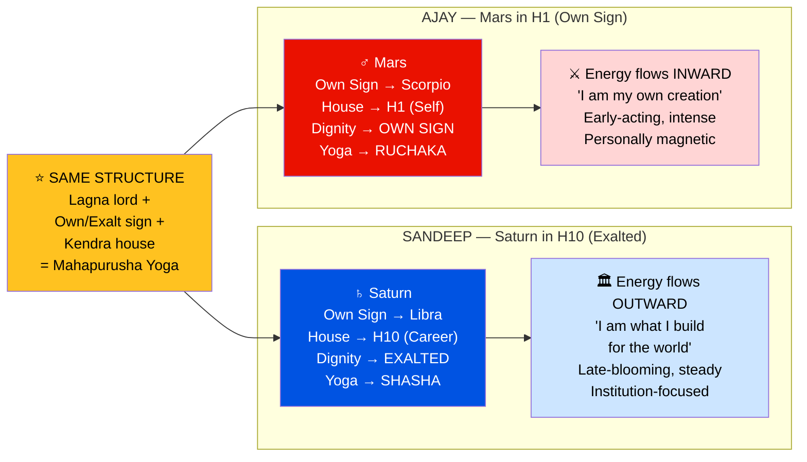
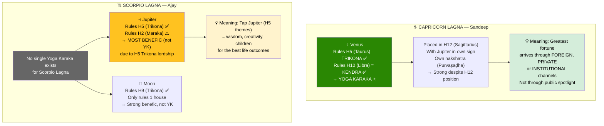
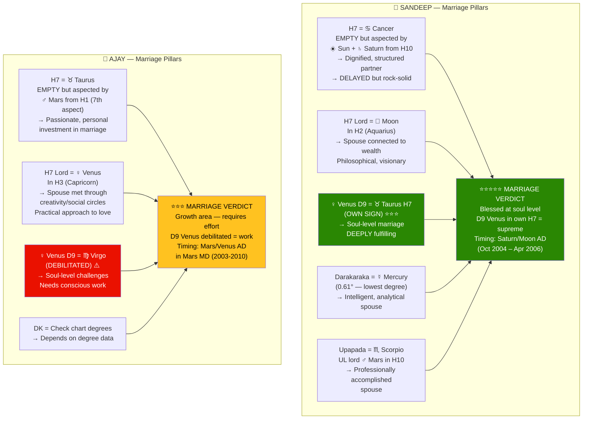
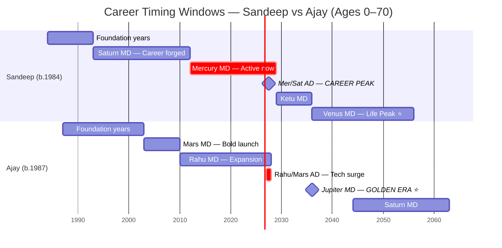
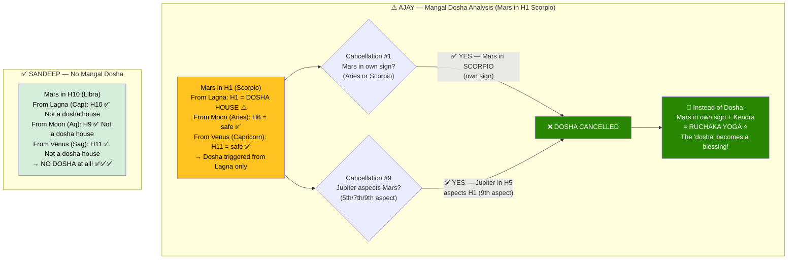
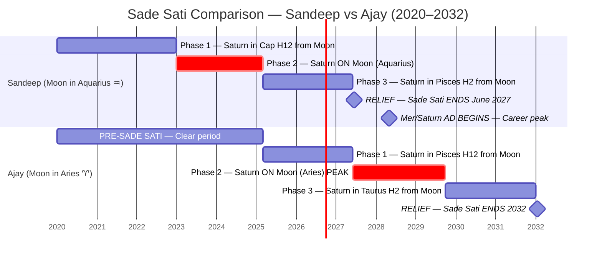

# 🎓 Jyotisha Vidyā — Complete Learning Guide
## Part 4 of 5 — Worked Examples Across Multiple Charts

> **Goal**: Apply every rule from Parts 2-3 using REAL charts from this project.
> Compare how the SAME rule produces DIFFERENT results for different people.

📂 **Navigation**
- [← Part 1 — Structure](Jyotish_Learning_Part1_Structure.md)
- [← Part 2 — Calculations](Jyotish_Learning_Part2_Calculations.md)
- [← Part 3 — Interpretation](Jyotish_Learning_Part3_Interpretations.md)
- ▶ Part 4 — Worked Examples ← *You are here*
- [Part 5 — Diagrams & Cheat Sheets →](Jyotish_Learning_Part5_Reference.md)

---

## 📊 Chart Comparison Data — 4 Charts

| Field | **Sandeep** | **Ajay K** | **Swaroop** | **Sumanth** |
|-------|-------------|-----------|-------------|-------------|
| DOB | 05 Feb 1984 | 31 Dec 1987 | Chart data | Chart data |
| Time | 07:00 IST | 04:15 IST | from files | from files |
| Lagna | **Capricorn** (Makara) | **Scorpio** (Vrischika) | from file | from file |
| Lagna Nak | Dhanishthā P1 | Anuradha P2 | — | — |
| Moon Sign | Aquarius | Aries | — | — |
| Moon Nak | P.Bhadra P2 | Krittika P1 | — | — |

> **Note**: This section focuses primarily on Sandeep and Ajay as running examples
> because their full calculation data is available. Readers should apply the same
> rules to Swaroop's and Sumanth's charts as practice exercises.



---

## EXAMPLE 1 — Lagna Lord Analysis (Level 2)

> **Rule**: The Lagna lord's house placement = where life's energy is primarily invested.

### Sandeep — Saturn as Lagna Lord (Capricorn Lagna)

```
Lagna Lord: Saturn
Saturn's Position: Libra (H10) — EXALTED
Saturn's Nakshatra: Vishakha Pada 1 (Jupiter sub-lord)

LEVEL 2 INTERPRETATION:
  ┌─────────────────────────────────────────────────────────────┐
  │ RULE: H1 lord in H10 = "Self IS career"                   │
  │ SOURCE: BPHS Ch.24 — "Lagnādhipe daśame — karma-priyaḥ"   │
  │                                                             │
  │ Saturn (discipline, structure) → H10 (career, public life)  │
  │ + EXALTED (maximum strength)                                │
  │ = Identity is INSEPARABLE from professional achievement.    │
  │   Sandeep IS his career. His reputation IS his personality. │
  │   Discipline, patience, and institutional authority are not  │
  │   traits he cultivates — they ARE him.                      │
  │                                                             │
  │ YOGA: Saturn exalted in Kendra = SHASHA MAHAPURUSHA YOGA   │
  │ This elevates the Lagna lord reading from "strong career"   │
  │ to "great person — commanding institutional authority."     │
  └─────────────────────────────────────────────────────────────┘
```

### Ajay Kumar — Mars as Lagna Lord (Scorpio Lagna)

```
Lagna Lord: Mars
Mars's Position: Scorpio (H1) — OWN SIGN
Mars's Nakshatra: Vishakha Pada 4 (Rahu sub-lord)

LEVEL 2 INTERPRETATION:
  ┌─────────────────────────────────────────────────────────────┐
  │ RULE: H1 lord in H1 = "Self in self" — maximum personal    │
  │ SOURCE: BPHS Ch.24 — "Lagnādhipe lagne — svayam balavān"   │
  │                                                             │
  │ Mars (courage, intensity) → H1 (self, body, personality)    │
  │ + OWN SIGN (Scorpio — Mars rules Scorpio)                   │
  │ = Life force flows directly INTO the self.                  │
  │   Everything is personal: personal ambition, personal       │
  │   courage, personal transformation.                         │
  │   Ajay is a self-built person. External support comes       │
  │   to him BECAUSE of who he is, not the other way around.   │
  │                                                             │
  │ YOGA: Mars own sign in Kendra = RUCHAKA YOGA               │
  │ The warrior fully empowered — leadership through being.     │
  └─────────────────────────────────────────────────────────────┘
```

### COMPARISON — Same Rule, Different Charts

```
Both have: Lagna lord in Kendra, in dignity → Mahapurusha Yoga ✅

Sandeep (Saturn in H10):
  → Energy flows OUTWARD to career/public stage
  → "I am what I build for the world"
  → Late-blooming, steady, institution-focused

Ajay (Mars in H1):
  → Energy flows INWARD to self/body/personality
  → "I am my own creation"
  → Early-acting, intense, personally magnetic

LESSON: Same STRUCTURAL pattern (Lagna lord + own/exalt + Kendra)
  produces fundamentally different EXPRESSIONS because of the
  specific planet and house involved.
```



---

## EXAMPLE 2 — Yoga Karaka Identification (Level 3)

> **Rule**: The Yoga Karaka is the planet that lords BOTH a Kendra AND a Trikona.

### Capricorn Lagna (Sandeep) — Venus is Yoga Karaka

```
Venus lords:
  H5 (Taurus) → TRIKONA ✅
  H10 (Libra) → KENDRA ✅
  Both conditions met → YOGA KARAKA ⭐

Where is Venus?
  H12 (Sagittarius) in Pūrvaṣāḍhā (own nakshatra)
  With Jupiter (in own sign) — Vimala Yoga planet

MULTI-FACTOR ANALYSIS (Level 3):
  Venus as YK in H12:
    + Own nakshatra = intrinsic strength despite H12 placement
    + Jupiter conjunction in own sign = uplifting support
    + Saturn's 3rd aspect from H10 = career lord empowers YK
    - H12 is a dusthana = career/creative fruits arrive through
      FOREIGN, INSTITUTIONAL, or PRIVATE channels, not conventional

  NET READING: The most powerful career/fortune planet operates
  through behind-the-scenes, foreign, or institutional channels.
  Sandeep's biggest successes come NOT from public spotlight but
  from international connections, institutional work, and
  private/strategic endeavors.
```

### Scorpio Lagna (Ajay) — No Single Yoga Karaka

```
For Scorpio Lagna:
  No single planet owns both Kendra + Trikona simultaneously.
  
  Jupiter owns H5 (Trikona) + H2 (Dhana/Maraka)
    → Not Yoga Karaka but MOST BENEFIC due to H5 Trikona lordship
  Moon owns H9 (Trikona) only
    → Strong benefic but not YK

LESSON: Not every Lagna has a Yoga Karaka.
  Scorpio, Gemini, Pisces, Sagittarius, Cancer, Virgo — none of
  these have a Yoga Karaka. For these Lagnas, the MOST BENEFIC
  planet is the one with the strongest Trikona lordship (H5 or H9).
```



---

## EXAMPLE 3 — Marriage Analysis Across Charts (Level 5-6)

> **Rule**: Marriage involves H7, H7 lord, Venus, Darakaraka, UL lord, and D9 H7.

### Sandeep — Capricorn Lagna

```
PILLAR-BY-PILLAR:

  1. H7 SIGN = Cancer (nurturing, emotional, home-loving spouse)
     H7 is EMPTY — no planet occupies it directly
     BUT H7 receives aspects: Sun (7th) + Saturn (10th) from H10
     → Marriage partner is dignified (Sun) and structured (Saturn)
     → Delay in marriage but extreme stability once established

  2. H7 LORD = Moon → sits in H2 (Aquarius)
     → Spouse connected to wealth/family themes
     → Emotionally invested in financial security
     → Moon in P.Bhadrapada = philosophical, visionary spouse

  3. VENUS (natural karaka) = H12 (own nakshatra)
     → D9 Venus = TAURUS (OWN SIGN) in H7!!! ⭐⭐⭐
     → Soul-level marriage is deeply fulfilling
     → Marriage is THE spiritual anchor of the life

  4. DARAKARAKA = Mercury (lowest degree: 0.61°)
     → Spouse = intelligent, communicative, analytical

  5. UPAPADA = Scorpio → UL lord Mars in H10
     → Spouse is professionally accomplished

  TIMING (Level 6):
    Saturn/Moon AD (Oct 2004 – Apr 2006, ages 20-22) = PRIMARY window
    H7 lord Moon activated during Lagna lord Saturn's MD
    = Most classical marriage timing

  D9 CROSS-CHECK (Level 5):
    D9 Venus in Taurus H7 (OWN SIGN) → CONFIRMS strong marriage
    D9 Saturn exalted in Libra → discipline confirmed at soul level
    VERDICT: D9 STRONGLY CONFIRMS marriage promise ✅
```

### Ajay Kumar — Scorpio Lagna

```
PILLAR-BY-PILLAR:

  1. H7 SIGN = Taurus (stable, sensual, beauty-oriented spouse)
     H7 is EMPTY — no planet occupies it
     BUT Mars (Lagna lord, H1) aspects H7 via 7th aspect
     → Lagna lord directly protects/energizes the marriage house
     → Strong personal investment in partnership

  2. H7 LORD = Venus → sits in H3 (Capricorn)
     → Spouse connected to communication, creativity, short travel
     → Met through creative or social circles
     → Venus in Capricorn = practical, structured approach to love

  3. VENUS (natural karaka) = H3 (neutral)
     → D9 Venus = VIRGO (DEBILITATED) ⚠️
     → Soul-level marriage challenges — needs conscious work
     → The marriage IS the area requiring active investment

  4. DARAKARAKA = (check degrees for Ajay's chart)
     → Dependent on specific degree data

  TIMING:
    Mars MD (2003-2010) relevant — Lagna lord with H7 aspect
    Best sub-windows: Mars/Venus AD (Venus = H7 lord)

  D9 CROSS-CHECK:
    D9 Venus DEBILITATED → contradicts some D1 promise
    → Marriage exists but the INNER experience needs nurturing
    → Practical steps: conscious communication, emotional investment
```

### COMPARISON — Same Life Area, Different Charts

```
┌─────────────────────────────────────────────────────────────────┐
│              MARRIAGE COMPARISON: SANDEEP vs AJAY              │
├────────────────────────┬───────────────────────────────────────┤
│ Sandeep                │ Ajay                                  │
├────────────────────────┼───────────────────────────────────────┤
│ D9 Venus = EXALTED     │ D9 Venus = DEBILITATED               │
│ (Taurus, own sign H7)  │ (Virgo, weak in D9)                   │
│ Marriage = soul anchor  │ Marriage = growth area                │
│                        │                                       │
│ H7 aspected by Saturn  │ H7 aspected by Mars                   │
│ → delayed but rock-    │ → passionate but needs                │
│   solid stability      │   emotional patience                  │
│                        │                                       │
│ DK = Mercury (talker)  │ DK = (varies)                         │
│ UL = Scorpio (intense) │ H7 lord Venus in H3 (creative)       │
│                        │                                       │
│ PROGNOSIS: ⭐⭐⭐⭐⭐      │ PROGNOSIS: ⭐⭐⭐ (with work)          │
└────────────────────────┴───────────────────────────────────────┘

LESSON: D9 Venus is the SINGLE MOST IMPORTANT marriage indicator.
  Sandeep's D9 Venus own sign in H7 = marriage blessed at soul level.
  Ajay's D9 Venus debilitated = marriage requires conscious effort.
  Same natural karaka. Completely different D9 dignity. Different outcome.
```



---

## EXAMPLE 4 — Career Timing (Level 6)

> **Rule**: Career peaks when H10 lord Dasha + Jupiter transit align.

### Sandeep — When Does Shasha Yoga Peak?

```
Shasha Yoga planet = Saturn (exalted H10, Lagna lord)

Saturn operates during:
  1. SATURN MD (Oct 1993 – Oct 2012) → Ages 9.7 – 28.7
     → The foundational career-building period
     → This is when the career IDENTITY was forged

  2. Mer/Saturn AD (Dec 2026 – Oct 2029) → Ages 42 – 45
     → Shasha Yoga REACTIVATED within Mercury MD
     → Mercury (H9 fortune lord) + Saturn (exalted career)
     → CAREER PINNACLE of the current life phase

  3. Ven/Saturn AD (Nov 2049 – Jan 2053) → Ages 65 – 69
     → Yoga Karaka Venus MD + Shasha Saturn AD
     → The SUPREME combination for Capricorn Lagna

TRANSIT CONFIRMATION for Mer/Saturn AD (2026-2029):
  ✅ Sade Sati ends June 2027 → Saturn relief
  ✅ Jupiter in Virgo (H9) 2027-28 → Fortune house transit
  ✅ Jupiter in Libra (H10) 2028-29 → Career house transit!
  Triple agreement: Dasha + Jupiter transit + Saturn relief = ⭐⭐⭐⭐⭐

VERDICT: Dec 2026 – Oct 2029 is the career peak of this decade.
  2028-2029 specifically: Jupiter in H10 during Shasha AD = maximum.
```

### Ajay Kumar — When Does Ruchaka Yoga Peak?

```
Ruchaka Yoga planet = Mars (own sign H1)

Mars operates during:
  1. MARS MD (May 2003 – May 2010) → Ages 15.4 – 22.4
     → The foundational self-building period
     → Bold career launch; physical peak; courage surge

  2. Rahu/Mars AD (May 2027 – May 2028) → Ages 39 – 40
     → Mars reactivated within Rahu MD
     → Rahu amplifies Mars = foreign/tech career drive

  3. JUPITER MD (May 2028 – May 2044) → Ages 40 – 56
     → Jupiter aspects Mars (9th aspect on H1)
     → The wisdom-guided warrior phase
     → Ruchaka Yoga channeled through Jupiterian wisdom = PEAK

TRANSIT CONFIRMATION for Jupiter MD (2028-2044):
  ✅ Jupiter starts own MD — maximum Jupiter activation
  ✅ Jupiter in own sign Pisces (H5) periodically
  ✅ Jupiter's natural aspect on Mars (H1) continuously active

VERDICT: Jupiter MD (May 2028 – May 2044) = Ajay's GOLDEN ERA.
  Mars Ruchaka gifts GUIDED by Jupiter's wisdom = ages 40-56.
```



---

## EXAMPLE 5 — Dosha Analysis Comparison (Level 4)

### Mangal Dosha — Sandeep vs Ajay

```
SANDEEP:
  Mars in H10 (Libra)
    From Lagna (Capricorn): H10 — NOT a dosha house ✅
    From Moon (Aquarius):   H9  — NOT a dosha house ✅
    From Venus (Sagittarius): H11 — NOT a dosha house ✅
  VERDICT: NO Mangal Dosha ✅✅✅

AJAY:
  Mars in H1 (Scorpio)
    From Lagna (Scorpio): H1 — DOSHA HOUSE ⚠️
    From Moon (Aries):    H6 — NOT a dosha house ✅
    From Venus (Capricorn): H11 — NOT a dosha house ✅

  CANCELLATION CHECK:
    ✔️ Condition #1: Mars in OWN SIGN (Scorpio) → CANCELLED
    ✔️ Condition #9: Jupiter aspects Mars (9th aspect from H5) → CANCELLED
  VERDICT: Mangal Dosha TRIGGERED from Lagna but CANCELLED by TWO conditions.
           Net: Mars in H1 own sign = Ruchaka Yoga, NOT a dosha.

LESSON: The SAME Mars placement (H1) that TRIGGERS Mangal Dosha
  can ALSO form Ruchaka Yoga. Whether it's a dosha or a blessing
  depends entirely on cancellation conditions and dignity.
  This is why systematic dosha analysis is critical — never diagnose
  a dosha without checking ALL cancellation rules.
```



---

## EXAMPLE 6 — Vimala Yoga Detection (Level 4)

> **Rule**: H12 lord in H12 = Vimala Yoga (BPHS Ch.35)

### Sandeep — Vimala Yoga Confirmed

```
H12 = Sagittarius → H12 lord = Jupiter
Jupiter's position = H12 (Sagittarius) — IN OWN SIGN!

STEP A: H12 lord identified → Jupiter ✅
STEP B: Jupiter in H12 → meets condition ✅
STEP C: Jupiter in OWN SIGN → strong dignity ✅
STEP D: Jupiter not combust (42° from Sun) ✅
STEP E: Venus (Yoga Karaka) conjuncts Jupiter → benefic support ✅
STEP F: No cancellation counter-conditions ✅
STEP G: STRONG grade (own sign + benefic conjunction)
STEP H: Timing → Jupiter AD periods; Venus MD (2036-2056)

RESULT:
  "Expenses become investments. Losses transform into gains.
   Foreign connections yield domestic fruit.
   Spiritual pursuits generate material returns."

  Practical meaning: Every rupee Sandeep spends on foreign travel,
  institutional connections, or spiritual development comes back
  multiplied. H12 is not a "loss house" for Sandeep — it's a
  strategic investment house.
```

### Ajay Kumar — No Vimala Yoga

```
H12 = Libra → H12 lord = Venus
Venus's position = H3 (Capricorn) — NOT in H12

VERDICT: Vimala Yoga NOT formed ❌
  Venus in H3 = H12 lord in H3 — expenses (H12) relate to
  communication, travel, and creative pursuits (H3).
  Not negative, not specially positive.

LESSON: Vimala Yoga requires the H12 lord to be IN H12 itself.
  The lord sitting elsewhere doesn't qualify, even if the lord is
  in a good position.
```

---

## EXAMPLE 7 — Sade Sati Comparison (Level 6)

```
SANDEEP (Moon in Aquarius, Capricorn Lagna):
  Sade Sati: Saturn through Capricorn (2020) → Aquarius (2023) → Pisces (2025-27)
  Current phase: FINAL (Phase 3, Saturn in Pisces)
  MITIGATION:
    Saturn = Lagna lord (OWN planet for Capricorn)
    Saturn EXALTED in natal chart
    → Sade Sati is MODERATED. The weight is real but manageable.
    Ends June 2027 → RELIEF coincides with Mer/Saturn AD start!

AJAY (Moon in Aries, Scorpio Lagna):
  Sade Sati: Saturn through Pisces (2025) → Aries (2027) → Taurus (2029-31)
  Current phase: Phase 1 (Saturn in Pisces = H12 from Aries Moon)
  MITIGATION:
    Saturn = H3+H4 lord (neutral, not strongly benefic)
    Saturn combust in natal chart BUT D9 exalted
    → Sade Sati is MODERATE. Phase 2 (2027-2029) will be peak intensity.
    → D9 Saturn exalted = inner resilience available despite outer pressure.

COMPARISON:
  Both are in Sade Sati simultaneously!
  But Sandeep's is ENDING (Phase 3, Jun 2027)
  While Ajay's is BEGINNING (Phase 1, just started)
  → Sandeep enters relief + Mer/Saturn peak JUST AS
     Ajay enters Sade Sati peak + Rahu/Moon AD.
  → Same planetary transit, completely different life chapters.
```



---

## 🎯 Practice Exercises

### Exercise 1 — Level 2 Practice
For each person's chart, write the Lagna lord analysis:
- [ ] Swaroop (from Swaroop_Jyotish_Part1.md)
- [ ] Sumanth (from Sumanth_Jyotish_Part1.md)
- [ ] Shubhanshu (from Shubhanshu_Jyotish_Part1.md)

### Exercise 2 — Level 4 Yoga Hunt
Open each chart and systematically check for:
- [ ] Pancha Mahapurusha Yogas (5 checks per chart)
- [ ] Budha-Aditya Yoga
- [ ] Gaja-Kesari Yoga
- [ ] Viparita Raja Yoga
- [ ] Mangal Dosha (with ALL cancellation conditions)

### Exercise 3 — Level 6 Timing
For each chart, identify:
- [ ] Current Dasha/Antardasha
- [ ] Next major career window (H10 lord or Yoga Karaka AD)
- [ ] Sade Sati status and phase

### Exercise 4 — Level 7 Signature
For each chart, determine the ONE-WORD SIGNATURE:
```
Sandeep  → "Institution-Builder"  (Saturn exalted H10)
Ajay     → "Self-Built Warrior"   (Mars own sign H1)
Swaroop  → ???
Sumanth  → ???
Shubhanshu → ???
```

---

📌 **End of Part 4**

**Next**: [Part 5 — Mermaid Diagrams, Cheat Sheets & Quick Reference →](Jyotish_Learning_Part5_Reference.md)

---
*Jyotisha Vidyā Learning Guide · Part 4 of 5 · Created April 2026*
