# 🎓 Jyotisha Vidyā — Complete Learning Guide
## Part 5 of 5 — Mermaid Diagrams, Cheat Sheets & Quick Reference

> **Goal**: Visual learning aids, quick-lookup tables, and diagrams
> that you can print, pin to your wall, or pull up during practice.

📂 **Navigation**
- [← Part 1 — Structure](Jyotish_Learning_Part1_Structure.md)
- [← Part 2 — Calculations](Jyotish_Learning_Part2_Calculations.md)
- [← Part 3 — Interpretation](Jyotish_Learning_Part3_Interpretations.md)
- [← Part 4 — Worked Examples](Jyotish_Learning_Part4_Examples.md)
- ▶ Part 5 — Diagrams & Cheat Sheets ← *You are here*

---

## 📊 MERMAID DIAGRAM 1 — The Complete Jyotish Reading Pipeline

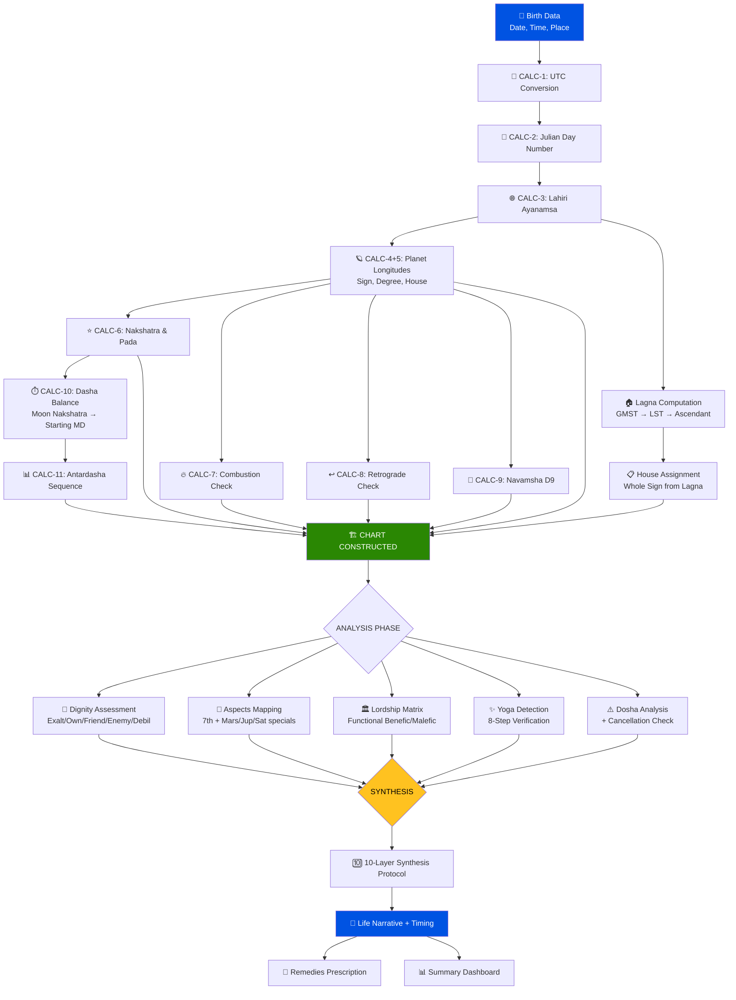

---

## 📊 MERMAID DIAGRAM 2 — Planet Strength Assessment Tree

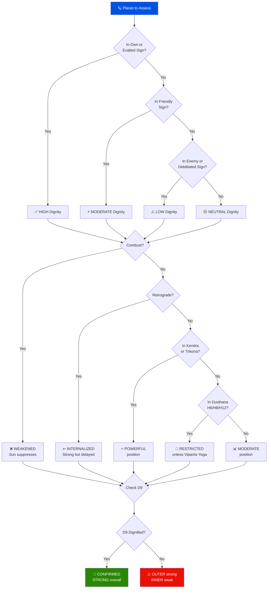

---

## 📊 MERMAID DIAGRAM 3 — Marriage Timing Decision Tree

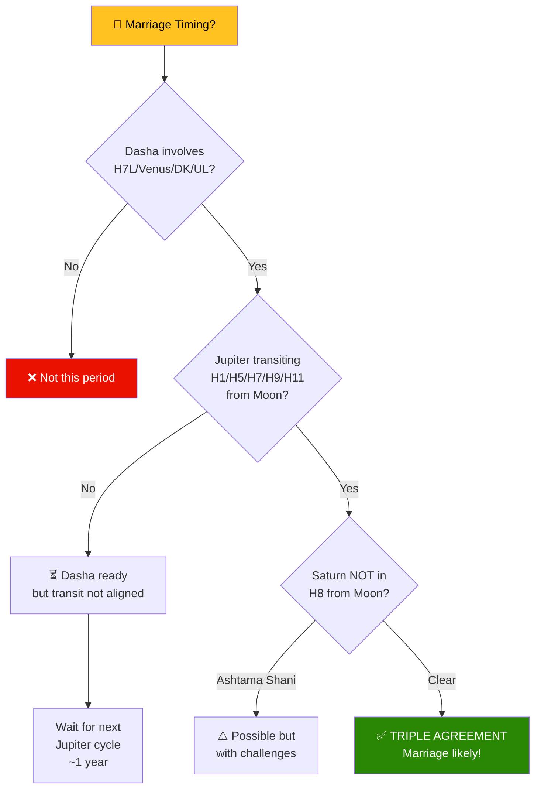

---

## 📊 MERMAID DIAGRAM 4 — Learning Progression Map


---

## 📊 MERMAID DIAGRAM 5 — Yoga Karaka by Lagna

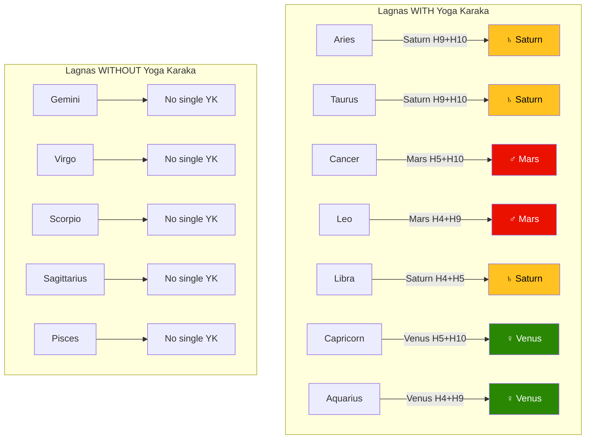

---

## 📊 MERMAID DIAGRAM 8 — Planetary Dignity at a Glance

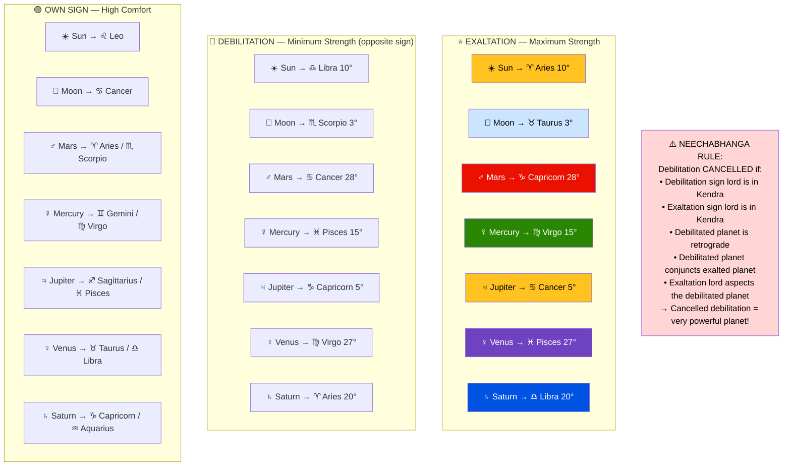

---

## 📋 CHEAT SHEET 1 — The 12 Signs at a Glance

| # | Sign | Element | Mode | Lord | Exalts | Debilitates | Body |
|---|------|---------|------|------|--------|-------------|------|
| 1 | Aries ♈ | Fire | Movable | Mars | Sun 10° | Saturn 20° | Head |
| 2 | Taurus ♉ | Earth | Fixed | Venus | Moon 3° | — | Face/Throat |
| 3 | Gemini ♊ | Air | Dual | Mercury | Rahu* | — | Shoulders |
| 4 | Cancer ♋ | Water | Movable | Moon | Jupiter 5° | Mars 28° | Chest |
| 5 | Leo ♌ | Fire | Fixed | Sun | — | — | Heart/Spine |
| 6 | Virgo ♍ | Earth | Dual | Mercury | Mercury 15° | Venus 27° | Intestines |
| 7 | Libra ♎ | Air | Movable | Venus | Saturn 20° | Sun 10° | Kidneys |
| 8 | Scorpio ♏ | Water | Fixed | Mars | — | Moon 3° | Reproductive |
| 9 | Sagitt. ♐ | Fire | Dual | Jupiter | Ketu* | — | Thighs |
| 10 | Capricorn ♑ | Earth | Movable | Saturn | Mars 28° | Jupiter 5° | Knees |
| 11 | Aquarius ♒ | Air | Fixed | Saturn | — | — | Ankles |
| 12 | Pisces ♓ | Water | Dual | Jupiter | Venus 27° | Mercury 15° | Feet |

*Rahu/Ketu exaltation: schools differ. Gemini/Sagittarius per BPHS Ch.3.

---

## 📋 CHEAT SHEET 2 — Natural Friendships

```
         FRIENDS           NEUTRAL          ENEMIES
Sun    : Mo, Ma, Ju      | Me              | Ve, Sa
Moon   : Su, Me          | Ma, Ju, Ve, Sa  | (none)
Mars   : Su, Mo, Ju      | Ve, Sa          | Me
Mercury: Su, Ve          | Ma, Ju, Sa      | Mo
Jupiter: Su, Mo, Ma      | Sa              | Me, Ve
Venus  : Me, Sa          | Ma, Ju          | Su, Mo
Saturn : Me, Ve          | Ju              | Su, Mo, Ma
```

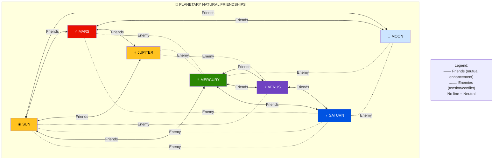

---

## 📋 CHEAT SHEET 3 — House Classifications

```
KENDRA (Angular):    H1   H4   H7   H10    ← Power houses
TRIKONA (Trine):     H1   H5   H9          ← Lakshmi's seats
UPACHAYA (Growing):  H3   H6   H10  H11    ← Malefics do well
DUSTHANA (Difficult):H6   H8   H12         ← Challenge houses
MARAKA (Death):      H2   H7               ← Longevity-sensitive

H1 = BOTH Kendra AND Trikona → doubly auspicious!
H10 = BOTH Kendra AND Upachaya → career planets thrive here
```

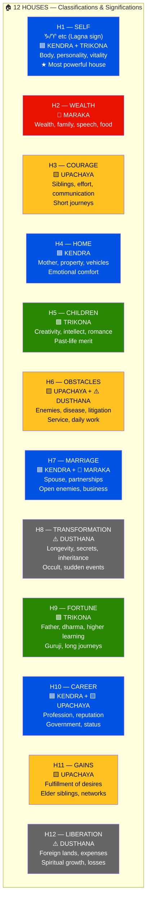

---

## 📋 CHEAT SHEET 4 — Vimshottari Dasha Quick Ref

```
PLANET   YEARS   NAKSHATRA LORDS (starting dashas)
Ketu      7      Ashwini(1), Magha(10), Mula(19)
Venus    20      Bharani(2), P.Phalguni(11), P.Ashadha(20)
Sun       6      Krittika(3), U.Phalguni(12), U.Ashadha(21)
Moon     10      Rohini(4), Hasta(13), Shravana(22)
Mars      7      Mrigashira(5), Chitra(14), Dhanishtha(23)
Rahu     18      Ardra(6), Swati(15), Shatabhisha(24)
Jupiter  16      Punarvasu(7), Vishakha(16), P.Bhadrapada(25)
Saturn   19      Pushya(8), Anuradha(17), U.Bhadrapada(26)
Mercury  17      Ashlesha(9), Jyeshtha(18), Revati(27)

TOTAL = 120 YEARS

SEQUENCE: Ke → Ve → Su → Mo → Ma → Ra → Ju → Sa → Me → (repeat)

AD FORMULA: AD_years = (AD_lord_years / 120) × MD_lord_years
```

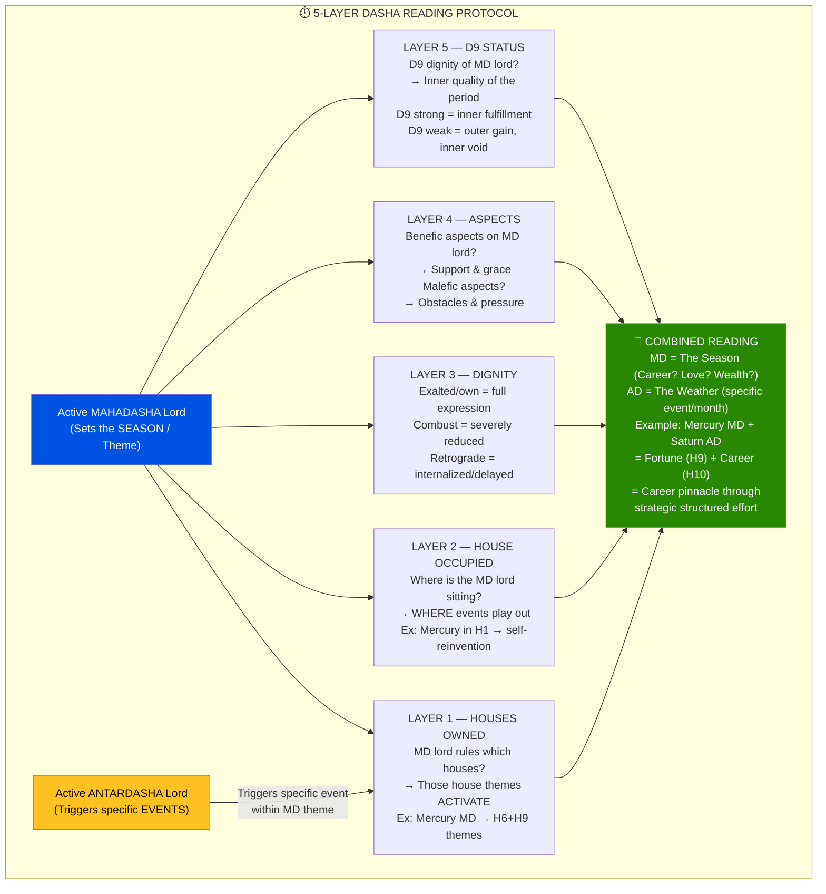

---

## 📋 CHEAT SHEET 5 — Aspect Quick Reference

```
PLANET        ASPECTS HOUSES (from its position)
─────────────────────────────────────────────────
Sun           7th
Moon          7th
MARS          4th,  7th,  8th      ← 3 aspects!
Mercury       7th
JUPITER       5th,  7th,  9th      ← 3 aspects!
Venus         7th
SATURN        3rd,  7th,  10th     ← 3 aspects!
Rahu/Ketu     7th (standard view)

MEMORY AID:
  Mars    = "forward warrior" → 4, 7, 8 (aggressive reach)
  Jupiter = "wise teacher"   → 5, 7, 9 (trikona reach = grace)
  Saturn  = "slow builder"   → 3, 7, 10 (upachaya reach = structure)
```

---

## 📋 CHEAT SHEET 6 — Combustion Orbs

```
PLANET     ORB (degrees from Sun)    RETROGRADE ORB
Moon       12°                       (never retrograde)
Mercury    14°                       13°
Venus      10°                       8°
Mars       17°                       17°
Jupiter    11°                       11°
Saturn     15°                       15°
Rahu/Ketu  CANNOT be combust (mathematical points)

FORMULA: |Planet° − Sun°| < Orb → COMBUST
  Use circular distance: if diff > 180°, use 360° − diff
```

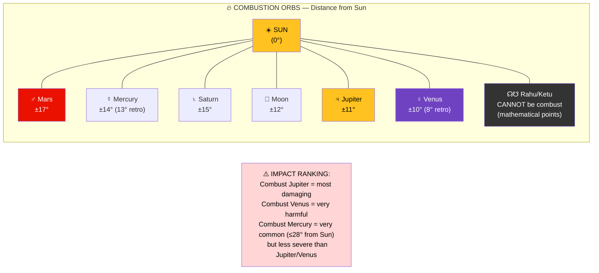

---

## 📋 CHEAT SHEET 7 — Mangal Dosha + Cancellations

```
DOSHA HOUSES for Mars: H1, H2, H4, H7, H8, H12
CHECK FROM: Lagna, Moon, Venus (all three!)

CANCELLATIONS (any ONE = cancelled):
  ✅ Mars in own sign (Aries/Scorpio)
  ✅ Mars in exaltation (Capricorn)
  ✅ Jupiter aspects Mars
  ✅ Mars conjunct Jupiter or waxing Moon
  ✅ Mars in H1 for Aries/Leo/Sagittarius Lagna
  ✅ Mars in H2 for Gemini/Virgo Lagna
  ✅ Mars in H4 for Scorpio/Cancer Lagna
  ✅ Mars in H7 for Cancer/Capricorn Lagna
  ✅ Mars in H8 for Sagittarius/Pisces Lagna
  ✅ Mars in H12 for Taurus/Libra Lagna
  ✅ Partner also Manglik
```

---

## 📋 CHEAT SHEET 8 — Yoga Karaka by Lagna

```
LAGNA       YOGA KARAKA    HOUSES OWNED    WHY
Aries       Saturn         H10 + H11...   wait, H9+H10 ✓ Kendra+Trikona
Taurus      Saturn         H9 + H10       Trikona + Kendra
Cancer      Mars           H5 + H10       Trikona + Kendra
Leo         Mars           H4 + H9        Kendra + Trikona
Libra       Saturn         H4 + H5        Kendra + Trikona
Capricorn   Venus          H5 + H10       Trikona + Kendra
Aquarius    Venus          H4 + H9        Kendra + Trikona

NO YOGA KARAKA: Gemini, Virgo, Scorpio, Sagittarius, Pisces
  For these: identify the MOST BENEFIC by Trikona lordship (H5 or H9 lord)
```

---

## 📋 CHEAT SHEET 9 — Navamsha (D9) Start Signs

```
D1 SIGN TYPE       D9 STARTS FROM
Movable (1,4,7,10) → Aries      (Cardinal: Ar/Ca/Li/Cp)
Fixed   (2,5,8,11) → Capricorn  (Stable: Ta/Le/Sc/Aq)
Dual    (3,6,9,12) → Libra      (Mutable: Ge/Vi/Sg/Pi)

FORMULA:
  pada_index = FLOOR(degree_in_sign / 3.3333)   [0–8]
  D9_sign = (start_index + pada_index) MOD 12
  Map: 0=Ar, 1=Ta, 2=Ge, 3=Ca, 4=Le, 5=Vi, 6=Li, 7=Sc, 8=Sg, 9=Cp, 10=Aq, 11=Pi
```

---

## 📝 ROUGH NOTES — Expert Rules to Internalize

### The "Golden Rules" — Memorize These

```
1. "Exalted ≠ always good. Exalted in H6/H8/H12 = restricted."
2. "Debilitated ≠ always bad. Debilitated + retrograde ≈ exalted."
3. "Combust = #1 strength-reducer. Always check before declaring yogas."
4. "Natural benefic as Kendra-ONLY lord = Kendradhipati Dosha."
5. "H1 is BOTH Kendra AND Trikona — the single most powerful house."
6. "Trikona lordship overrides Maraka/Dusthana lordship."
7. "D9 is the tiebreaker — when D1 is ambiguous, D9 resolves."
8. "Dasha of a planet in H6/H8/H12 ≠ bad IF it also rules a Trikona."
9. "Jupiter's 5th and 9th aspects protect everything they touch."
10. "Saturn's 10th aspect structures and delays but doesn't destroy."
```

### The "Trap Rules" — Things That Catch Experts Too

```
1. "Yoga exists on paper ≠ yoga manifests."
   → Check: Is the yoga planet's Dasha within the native's lifetime?
   → Venus MD starting at age 85 = theoretical, not practical.

2. "Functional malefic in dusthana CAN be good (Viparita Raja Yoga)."
   → H8 lord in H12 = losses prevent death = PROTECTION.

3. "Retrograde planet in D9 exaltation = extraordinary inner resources."
   → Saturn retrograde + D9 exalted = invincible inner discipline.

4. "Parivartana (sign exchange) = planets act as if in own sign."
   → H9 lord in H10 + H10 lord in H9 = SUPREME Raja Yoga.

5. "Moon sign matters more for transits than Lagna."
   → All Gochara predictions START from Moon, then confirm from Lagna.
```

### The "Sequence of Importance" — What to Read First

```
PRIORITY ORDER in chart reading:
  1st: Lagna lord — sets the life direction
  2nd: Moon sign + nakshatra — emotional and mental foundation
  3rd: Yoga Karaka planet — the fortune-engine
  4th: Strongest yoga — the chart's gift
  5th: Weakest planet / area — the chart's challenge
  6th: Current Dasha — what's happening NOW
  7th: D9 Venus — marriage truth
  8th: Transits — what's triggering events

If you only have 5 minutes, read #1 through #5.
If you have 30 minutes, cover all 8.
```

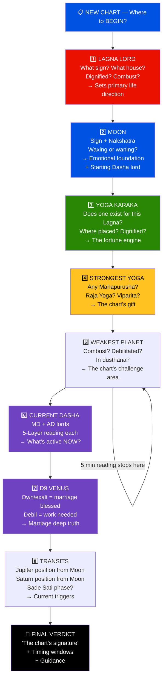

---

## 📊 MERMAID DIAGRAM 6 — House Lordship for Capricorn Lagna

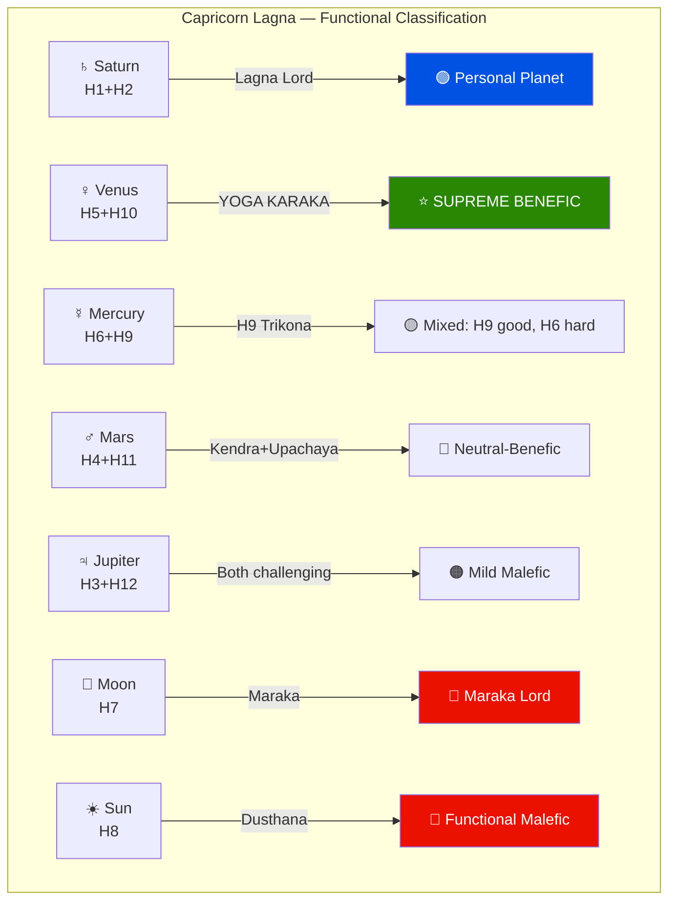

---

## 📊 MERMAID DIAGRAM 7 — The 3 Lenses of Prediction

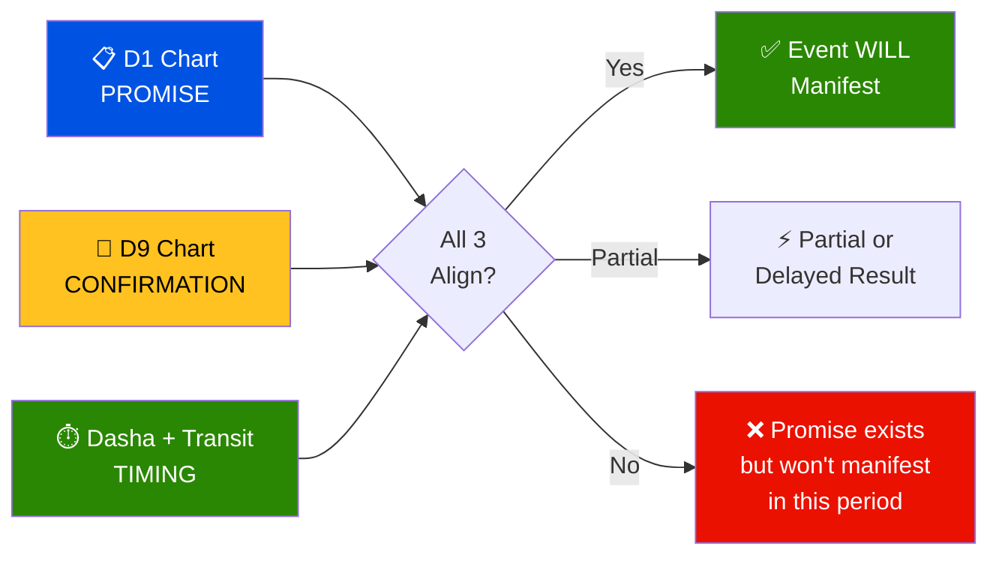

---

## 🗓️ STUDY PLANNER — 12-Week Curriculum

| Week | Focus | Read | Practice |
|------|-------|------|----------|
| 1 | Big picture + signs | Part 1 + Cheat Sheet 1 | Memorize 12 signs, lords, elements |
| 2 | Birth data + JD + Ayanamsa | Part 2 (CALC 1-3) | Calculate JD for 3 people |
| 3 | Lagna + Planets + Houses | Part 2 (CALC 4-6) | Assign houses for 2 charts |
| 4 | Nakshatras + Combustion | Part 2 (CALC 6-8) | Find nakshatra for each planet |
| 5 | Dignity + Relationships | Part 3 (Level 1-2) | Write 1-sentence for all planets |
| 6 | Aspects + Conjunctions | Part 3 (Level 3) | Map all aspects for 1 chart |
| 7 | Lordship + Yoga Karaka | Part 3 (Level 3) | Classify all planets for 3 Lagnas |
| 8 | Yoga detection | Part 3 (Level 4) | Find yogas in 2 charts |
| 9 | D9 cross-reference | Part 3 (Level 5) | Compare D1 vs D9 for all planets |
| 10 | Dasha + Timing | Part 3 (Level 6) | Calculate dasha balance for 2 charts |
| 11 | Full synthesis | Part 3 (Level 7) + Part 4 | Write full reading for 1 chart |
| 12 | Comparison + Review | Part 4 (all examples) | Compare 2 charts side-by-side |

---

📌 **End of Part 5 — Learning Guide Complete!**

**Full Learning Guide Index**:
| Part | Title | Focus |
|------|-------|-------|
| [Part 1](Jyotish_Learning_Part1_Structure.md) | Curriculum Structure | Big picture, modules, milestones, axioms |
| [Part 2](Jyotish_Learning_Part2_Calculations.md) | Calculation Engine | 15 calc steps with I/O and formulas |
| [Part 3](Jyotish_Learning_Part3_Interpretations.md) | Interpretation | 7 levels from simple to synthesis |
| [Part 4](Jyotish_Learning_Part4_Examples.md) | Worked Examples | Multi-chart comparisons + exercises |
| **Part 5** | **Reference** | **Mermaid diagrams, cheat sheets, study plan** |

---
*Jyotisha Vidyā Learning Guide · Part 5 of 5 · Created April 2026*
*"Jyotiṣam eka-cakṣuḥ Vedānām" — Astrology is the single eye of the Vedas*
