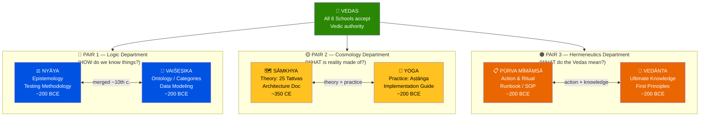
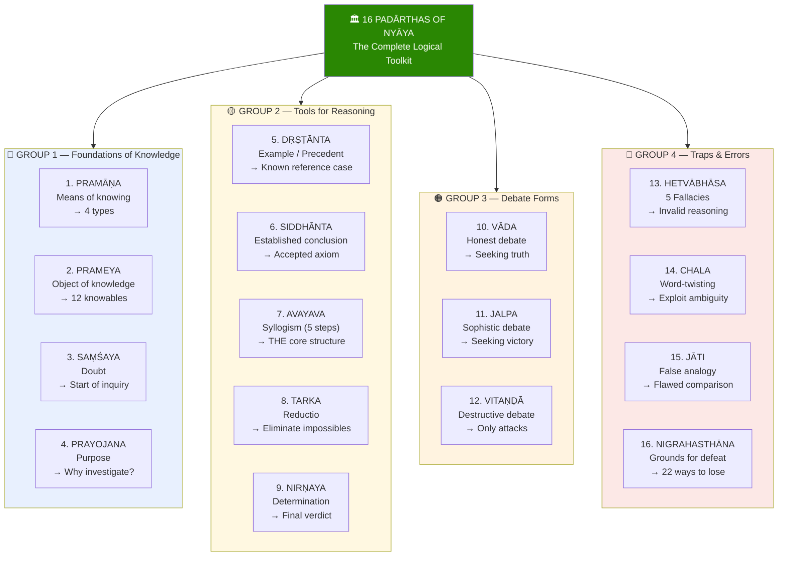
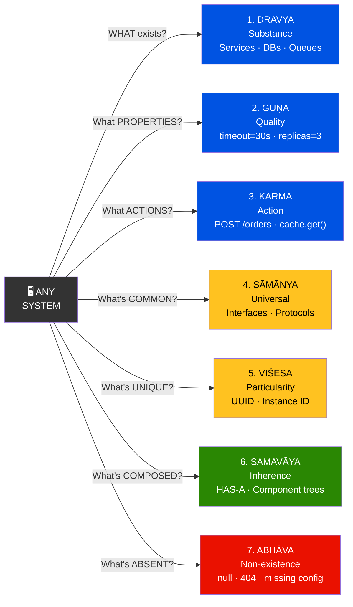
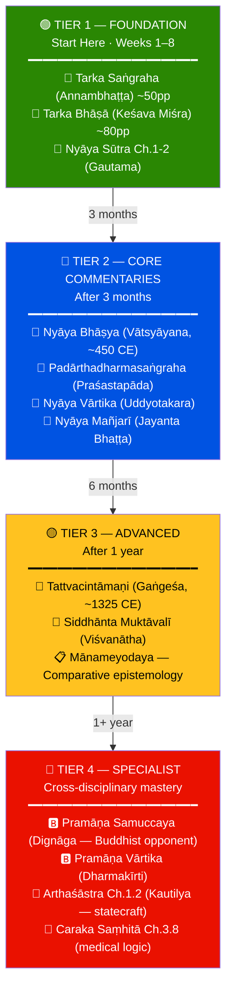
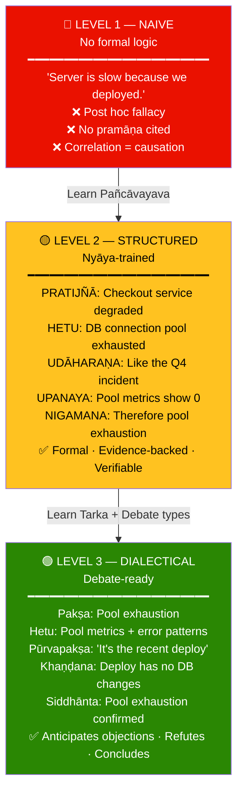
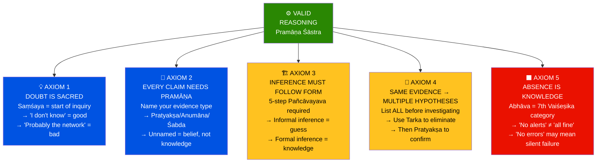

# 🏛️ Ṣaḍ Darśana — Six Schools of Vedic Philosophy
## Part 1 of 3 — Foundations, Framework & The Logic Schools

> *"Anvīkṣikī pradīpaḥ sarva-vidyānām"*
> — **Kautilya, Arthaśāstra 1.2** *(Logic is the lamp of all sciences)*

📂 **Navigation**
- ▶ Part 1 — Foundations & Framework ← *You are here*
- [Part 2 — The Logic Engine: Pramāṇa, Syllogism, Fallacies & Debate](Shad_Darshana_Part2_Logic_Engine.md)
- [Part 3 — Applied Logic: IT Engineering, Learning Path & Exercises](Shad_Darshana_Part3_Applied_Logic.md)

---

## 🎯 What This Guide Covers

```
NOT a surface-level philosophy overview.
THIS IS a deep, practical training in:

  1. How ancient Indian logicians THOUGHT — their mental frameworks
  2. The formal rules of valid reasoning (Pramāṇa Śāstra)
  3. The 5-step Indian syllogism vs Aristotelian 3-step
  4. How to DETECT logical fallacies (Hetvābhāsa)
  5. Three types of debate and when to use each
  6. Direct application to IT: debugging, system design, code review,
     architecture decisions, incident post-mortems, and technical arguments
```

---

## 📚 The Ṣaḍ Darśana — Overview of All Six Schools

> *"Ṣaḍ darśanāni — ṣaṇṇām ṛṣīṇāṃ dṛṣṭayaḥ"*
> — The six "viewpoints" — six sages' ways of seeing reality.

### The Big Picture — How They Fit Together

```
All six schools ACCEPT the Vedas as authoritative (āstika).
They disagree on HOW to understand reality, not WHETHER the Vedas matter.

Think of them as 6 departments in a university:

  LOGIC DEPT:        Nyāya + Vaiśeṣika     (HOW do we know things?)
  COSMOLOGY DEPT:    Sāṃkhya + Yoga         (WHAT is reality made of?)
  HERMENEUTICS DEPT: Mīmāṃsā + Vedānta     (WHAT do the Vedas mean?)
```

### The Six Schools — Quick Reference

| # | School | Founder | Key Text | Core Question | One-Line Answer |
|---|--------|---------|----------|---------------|-----------------|
| 1 | **Nyāya** | Gautama (Akṣapāda) | Nyāya Sūtra (~200 BCE) | How do we KNOW anything? | Through 4 valid means of knowledge (pramāṇa) |
| 2 | **Vaiśeṣika** | Kaṇāda | Vaiśeṣika Sūtra (~200 BCE) | What EXISTS? | 6 categories (padārtha) including atoms |
| 3 | **Sāṃkhya** | Kapila | Sāṃkhya Kārikā (Īśvara Kṛṣṇa, ~350 CE) | What is reality MADE of? | 25 tattvas: Puruṣa (consciousness) + Prakṛti (matter) |
| 4 | **Yoga** | Patañjali | Yoga Sūtra (~200 BCE) | How do we EXPERIENCE truth? | 8-limbed practice (aṣṭāṅga) for citta-vṛtti-nirodha |
| 5 | **Pūrva Mīmāṃsā** | Jaimini | Mīmāṃsā Sūtra (~200 BCE) | What should we DO? | Perform dharmic action (karma) as prescribed by Veda |
| 6 | **Uttara Mīmāṃsā** (Vedānta) | Bādarāyaṇa | Brahma Sūtra (~200 BCE) | What is the ULTIMATE? | Brahman alone is real; world is appearance |

### Why They Come in Pairs

```
PAIR 1: Nyāya + Vaiśeṣika  →  MERGED by ~10th century
  Nyāya  = epistemology (HOW we know)
  Vaiśeṣika = ontology (WHAT exists)
  Together = complete theory of knowledge + reality
  IT PARALLEL: Nyāya = testing methodology; Vaiśeṣika = data modeling

PAIR 2: Sāṃkhya + Yoga  →  Theory + Practice
  Sāṃkhya = the MAP of consciousness and matter
  Yoga     = the JOURNEY using that map
  IT PARALLEL: Sāṃkhya = architecture doc; Yoga = implementation guide

PAIR 3: Mīmāṃsā + Vedānta  →  Action + Knowledge
  Mīmāṃsā = focus on ritual ACTION and textual interpretation
  Vedānta  = focus on ultimate KNOWLEDGE and liberation
  IT PARALLEL: Mīmāṃsā = runbook/SOP; Vedānta = first-principles thinking
```



---

## 🔍 DEEP DIVE: Nyāya — The Science of Logic

> *"Pramāṇa-prameya-saṃśaya-prayojana-dṛṣṭānta-siddhānta-avayava-tarka-
> nirṇaya-vāda-jalpa-vitaṇḍā-hetvābhāsa-chala-jāti-nigrahasthānānām
> samyag-jñānāt niḥśreyasādhigamaḥ"*
> — **Nyāya Sūtra 1.1.1** (Gautama)
>
> *(Through correct knowledge of the 16 categories — means of knowledge,
> objects, doubt, purpose, example, established conclusion, members of
> syllogism, reasoning, determination, debate, sophistry, cavil, fallacy,
> quibble, false analogy, and grounds for defeat — one attains the highest good.)*

### The 16 Padārthas (Categories) of Nyāya

This is the **complete toolkit** for logical thinking. Memorize these.

```
GROUP 1 — FOUNDATIONS OF KNOWLEDGE (What and How)
  ┌──────────────────────────────────────────────────────────────┐
  │ 1. PRAMĀṆA (प्रमाण) — Means of valid knowledge             │
  │    → 4 types: Perception, Inference, Analogy, Testimony      │
  │    → "How do I KNOW this is true?"                           │
  │    IT: What's your evidence? Log file? Metric? User report?  │
  │                                                              │
  │ 2. PRAMEYA (प्रमेय) — Object of knowledge                    │
  │    → The 12 knowable things: ātman, body, senses, objects...  │
  │    → "WHAT am I trying to understand?"                       │
  │    IT: What's the system under investigation?                │
  │                                                              │
  │ 3. SAṂŚAYA (संशय) — Doubt                                    │
  │    → The starting point of all inquiry                       │
  │    → "I'm not sure if X is true or Y is true"               │
  │    IT: "Is this a network issue or an app issue?"            │
  │                                                              │
  │ 4. PRAYOJANA (प्रयोजन) — Purpose                             │
  │    → Why are we investigating? What's the motivation?        │
  │    → Without purpose, inquiry is aimless                     │
  │    IT: "What business problem does this solve?"              │
  └──────────────────────────────────────────────────────────────┘

GROUP 2 — TOOLS FOR REASONING
  ┌──────────────────────────────────────────────────────────────┐
  │ 5. DṚṢṬĀNTA (दृष्टान्त) — Example / Precedent               │
  │    → A well-known case that everyone accepts                 │
  │    → "Like smoke on a mountain means fire"                   │
  │    IT: "We saw this same pattern in the Q4 outage"           │
  │                                                              │
  │ 6. SIDDHĀNTA (सिद्धान्त) — Established Conclusion            │
  │    → An accepted principle that guides reasoning             │
  │    → Not to be re-proven every time                         │
  │    IT: "Immutable data is easier to reason about" (axiom)    │
  │                                                              │
  │ 7. AVAYAVA (अवयव) — Members of Syllogism (5 steps)          │
  │    → The formal argument structure — THE CORE OF NYĀYA      │
  │    → Pratijñā, Hetu, Udāharaṇa, Upanaya, Nigamana          │
  │    IT: The structure of a well-formed technical argument     │
  │                                                              │
  │ 8. TARKA (तर्क) — Hypothetical Reasoning / Reductio          │
  │    → "If X were NOT true, then absurdity Y would follow"     │
  │    → Eliminates wrong options; supports the right one        │
  │    IT: "If the DB were fine, we wouldn't see these timeouts" │
  │                                                              │
  │ 9. NIRṆAYA (निर्णय) — Determination / Conclusion             │
  │    → The settled judgment after reasoning                    │
  │    → Doubt → Investigation → Determination                  │
  │    IT: "Root cause confirmed: connection pool exhaustion"    │
  └──────────────────────────────────────────────────────────────┘

GROUP 3 — DEBATE FORMS (How to Argue)
  ┌──────────────────────────────────────────────────────────────┐
  │ 10. VĀDA (वाद) — Honest Debate (seeking truth)              │
  │     → Both sides genuinely want to find truth                │
  │     → Rules: valid pramāṇa only, no personal attacks        │
  │     IT: Architecture review, design discussion, RFC          │
  │                                                              │
  │ 11. JALPA (जल्प) — Sophistic Debate (to WIN)                │
  │     → Uses tricks, misdirection, emotional appeals           │
  │     → Not about truth, about victory                         │
  │     IT: Political meetings, vendor negotiations              │
  │                                                              │
  │ 12. VITAṆḌĀ (वितण्डा) — Destructive Debate (to DESTROY)     │
  │     → Only attacks, never presents own position              │
  │     → Pure criticism without constructive alternative        │
  │     IT: "That'll never work" without suggesting alternatives │
  └──────────────────────────────────────────────────────────────┘

GROUP 4 — TRAPS AND ERRORS (What Goes Wrong)
  ┌──────────────────────────────────────────────────────────────┐
  │ 13. HETVĀBHĀSA (हेत्वाभास) — Fallacies                       │
  │     → 5 types of reasoning errors (detailed in Part 2)       │
  │     IT: Correlation ≠ causation in metrics analysis          │
  │                                                              │
  │ 14. CHALA (छल) — Quibble / Word-Twisting                     │
  │     → Deliberately misinterpreting someone's words           │
  │     IT: "You said 'fast' — how fast exactly? Define fast."   │
  │                                                              │
  │ 15. JĀTI (जाति) — False Analogy                              │
  │     → Arguing by analogy when the analogy doesn't hold       │
  │     IT: "We should do microservices because Netflix does"     │
  │                                                              │
  │ 16. NIGRAHASTHĀNA (निग्रहस्थान) — Grounds for Defeat         │
  │     → When a debater has LOST — contradicts self, shifts     │
  │       goalposts, fails to respond, or gives up               │
  │     IT: "Wait, I thought you said it CAN'T scale — now       │
  │          you're saying it already handles 10K TPS?"          │
  └──────────────────────────────────────────────────────────────┘
```



### Fascinating Example — The 16 Categories in a Real Incident

```
SCENARIO: Production is down. API returning 500 errors.

  1. PRAMĀṆA  → Evidence: Grafana dashboard, error logs, user reports
  2. PRAMEYA   → Object: The checkout API service
  3. SAṂŚAYA   → Doubt: "Is it the DB, the app, or the network?"
  4. PRAYOJANA → Purpose: "Restore service; prevent revenue loss"

  5. DṚṢṬĀNTA → "Last month, similar 500s were caused by DB locks"
  6. SIDDHĀNTA → "Connection pools exhaust when queries exceed 30s"
  7. AVAYAVA   → Formal argument (see 5-step syllogism below)
  8. TARKA     → "IF the DB were fine, the health check would pass. It's failing."
  9. NIRṆAYA  → "Root cause: PostgreSQL connection pool exhaustion due to
                  long-running analytics query on production replica"

  10. VĀDA     → Team discusses: "Should we kill the query or failover?"
  11. JALPA    → PM argues: "We MUST go live by midnight" (irrelevant pressure)
  12. VITAṆḌĀ  → Junior dev: "This whole architecture is broken" (no fix proposed)

  13. HETVĀBHĀSA → "Deploys always cause outages" (false generalization)
  14. CHALA      → "You said 'database issue' — but which database?" (word-twisting)
  15. JĀTI       → "Google uses Spanner, so we should too" (false analogy)
  16. NIGRAHASTHĀNA → Senior admits: "I approved the analytics query on prod. My bad."
```

---

## 🔍 DEEP DIVE: Vaiśeṣika — The Science of Categories

> *"Dharma-viśeṣa-prasūtād dravya-guṇa-karma-sāmānya-viśeṣa-samavāyānāṃ
> padārthānāṃ sādharmya-vaidharmyābhyāṃ tattvajñānam"*
> — **Vaiśeṣika Sūtra 1.1.4** (Kaṇāda)
>
> *(Knowledge of truth arises from understanding the similarities and
> differences among the six categories: substance, quality, action,
> universality, particularity, and inherence.)*

### The 7 Padārthas (Categories of All Existence)

```
Vaiśeṣika asks: "What KINDS of things exist?"
Answer: EVERYTHING that exists falls into 7 categories.

  ┌──────────────────────────────────────────────────────────────┐
  │ 1. DRAVYA (द्रव्य) — Substance                              │
  │    The 9 substances: Earth, Water, Fire, Air, Ether,         │
  │    Space, Time, Soul (ātman), Mind (manas)                   │
  │    → The THINGS that exist independently                    │
  │    IT: Entities, Objects, Services, Resources                │
  │                                                              │
  │ 2. GUṆA (गुण) — Quality / Attribute                          │
  │    24 qualities: color, taste, smell, touch, number, size,   │
  │    separateness, conjunction, disjunction, priority,         │
  │    posteriority, knowledge, pleasure, pain, desire, aversion,│
  │    effort, heaviness, fluidity, viscidity, tendency,         │
  │    merit, demerit, sound                                     │
  │    → Properties that DESCRIBE substances                    │
  │    IT: Fields, attributes, properties, metadata              │
  │                                                              │
  │ 3. KARMA (कर्म) — Action / Activity                           │
  │    5 types: upward, downward, contraction, expansion, motion │
  │    → What substances DO (verbs, not nouns)                  │
  │    IT: Methods, functions, API operations, state transitions │
  │                                                              │
  │ 4. SĀMĀNYA (सामान्य) — Universality / Commonality            │
  │    → What makes a cow a "cow" — the cow-ness (gotva)        │
  │    → Shared properties that define a CLASS                  │
  │    IT: Interfaces, abstract classes, type hierarchies       │
  │                                                              │
  │ 5. VIŚEṢA (विशेष) — Particularity / Uniqueness               │
  │    → What makes THIS cow different from THAT cow             │
  │    → The ultimate individuality of each atom                │
  │    IT: Instance identity, UUID, primary keys, object refs    │
  │                                                              │
  │ 6. SAMAVĀYA (समवाय) — Inherence / Inseparable Relation        │
  │    → The relation between a whole and its parts              │
  │    → Thread and cloth; atoms and molecule; quality and thing │
  │    IT: Composition, HAS-A relationships, component trees     │
  │                                                              │
  │ 7. ABHĀVA (अभाव) — Non-existence / Absence                   │
  │    Added later by Navya-Nyāya school                         │
  │    4 types: prior absence, posterior absence,                │
  │    absolute absence, mutual absence                          │
  │    IT: Null, undefined, 404 Not Found, empty sets            │
  └──────────────────────────────────────────────────────────────┘
```



### Kaṇāda's Atomic Theory — 2,500 Years Before Dalton

```
📖 SOURCE: Vaiśeṣika Sūtra 4.1.1–4.1.6

Kaṇāda argued:
  1. Matter is made of ATOMS (paramāṇu) — indivisible, eternal
  2. Atoms combine in PAIRS (dvyaṇuka) to form molecules
  3. Molecules combine in TRIADS (tryaṇuka) to form visible matter
  4. Different substances arise from different COMBINATIONS of atoms
  5. Each atom has a VIŚEṢA — a unique particular identity

This is strikingly similar to:
  • Dalton's atomic theory (1803)
  • Object composition in OOP
  • Microservice composition in distributed systems

THE INSIGHT FOR IT:
  Complex systems are built from SIMPLE, INDIVISIBLE units.
  Each unit has unique identity (viśeṣa = UUID).
  Units compose through defined relationships (samavāya).
  The behavior of the whole emerges from the composition of parts.
```

### Fascinating Example — Vaiśeṣika Categories as Data Model

```
SCENARIO: Model a "User" in a system using Vaiśeṣika categories.

  DRAVYA (Substance):    User entity — the thing itself
  GUṆA (Quality):        name="Ajay", email="ajay@walmart.com", role="engineer"
  KARMA (Action):         login(), checkout(), submitReview()
  SĀMĀNYA (Universal):   UserInterface — the abstract "user-ness"
  VIŚEṢA (Particular):   user_id=UUID("a0b1803") — unique identity
  SAMAVĀYA (Inherence):   User HAS-A Cart, User HAS-A Profile
  ABHĀVA (Non-existence): user.phone = null (prior absence — not yet provided)

  This maps EXACTLY to object-oriented design:
    class User(UserInterface):           # sāmānya → interface
        id: UUID                         # viśeṣa → uniqueness
        name: str                        # guṇa → attribute
        email: str                       # guṇa → attribute
        cart: Cart                       # samavāya → composition
        phone: Optional[str] = None      # abhāva → nullable

        def login(self): ...             # karma → action
        def checkout(self): ...          # karma → action
```

---

## 📚 Canonical Text Hierarchy — What to Study & When

### Tier 1 — Foundation Texts (Start Here)

| Text | Author | Era | Pages | Why Start Here |
|------|--------|-----|-------|----------------|
| **Tarka Saṅgraha** | Annambhaṭṭa | ~17th c. | ~50 | THE beginner text. Concise intro to Nyāya-Vaiśeṣika. Every student starts here. |
| **Tarka Bhāṣā** | Keśava Miśra | ~13th c. | ~80 | Slightly more detailed than Tarka Sangraha. Great second read. |
| **Nyāya Sūtra** (Ch.1-2 only) | Gautama | ~200 BCE | ~40 | The root text. Ch.1 = pramāṇa theory. Ch.2 = prameya. |

### Tier 2 — Core Commentaries (After 3 months)

| Text | Author | Era | Focus |
|------|--------|-----|-------|
| **Nyāya Bhāṣya** | Vātsyāyana | ~450 CE | First major commentary on Nyāya Sūtra — essential |
| **Padārthadharmasaṅgraha** | Praśastapāda | ~500 CE | Definitive Vaiśeṣika text — expands Kaṇāda's categories |
| **Nyāya Vārtika** | Uddyotakara | ~600 CE | Defends Nyāya against Buddhist logicians |
| **Nyāya Mañjarī** | Jayanta Bhaṭṭa | ~900 CE | Brilliant, literary — the most "readable" advanced text |

### Tier 3 — Advanced (After 1 year)

| Text | Author | Era | Focus |
|------|--------|-----|-------|
| **Tattvacintāmaṇi** | Gaṅgeśa Upādhyāya | ~1325 CE | Founder of Navya-Nyāya (New Logic). The advanced standard. |
| **Siddhānta Muktāvalī** | Viśvanātha | ~1630 CE | Commentary on Kārikāvalī — Navya-Nyāya essentials |
| **Mānameyodaya** | Nārāyaṇa/Meghanādāri | ~17th c. | Comparative epistemology across all schools |

### Tier 4 — Specialist & Cross-Disciplinary

| Text | Author | Focus |
|------|--------|-------|
| **Pramāṇa Samuccaya** | Dignāga (Buddhist) | Buddhist logic — the main opponent of Nyāya |
| **Pramāṇa Vārtika** | Dharmakīrti (Buddhist) | Advanced Buddhist epistemology — read for counter-arguments |
| **Arthāśāstra** (Ch.1.2) | Kautilya | Logic (ānvīkṣikī) as foundation of statecraft |
| **Caraka Saṃhitā** (Ch.3.8) | Caraka | Logic applied to medical diagnosis — fascinating parallel |



---

## 🧠 The Expert's Mental Model — How Indian Logicians Think

### Three Levels of Logical Maturity

```
LEVEL 1 — NAIVE (No formal logic)
  "The server is slow because we deployed yesterday."
  → Post hoc ergo propter hoc fallacy
  → No formal pramāṇa cited
  → Conclusion jumps from correlation to causation

LEVEL 2 — STRUCTURED (Nyāya-trained)
  PRATIJÑĀ: "The checkout service has degraded performance."
  HETU:     "Because the database connection pool is exhausted."
  UDĀHARAṆA: "Wherever connection pools exhaust, latency spikes — like the Q4 incident."
  UPANAYA:  "In this case, the pool metrics show 0 available connections."
  NIGAMANA: "Therefore, the checkout degradation is due to pool exhaustion."
  → Formal structure, evidence-backed, verifiable

LEVEL 3 — DIALECTICAL (Debate-ready)
  "My position (pakṣa) is pool exhaustion.
   The evidence (hetu) is pool metrics + error patterns.
   The counterargument (pūrvapakṣa) is 'it's the recent deploy.'
   I refute this (khaṇḍana): the deploy contains no DB-touching changes.
   Therefore (siddhānta): pool exhaustion stands as root cause."
  → Anticipates objections, refutes them, establishes conclusion
```



### The 4 Types of Knowledge (Pramāṇa) Applied to IT

```
1. PRATYAKṢA (Perception) — Direct observation
   → You SAW the error in the log file
   → You MEASURED the latency spike on the dashboard
   → STRONGEST evidence. Always prefer this.
   IT: Logs, metrics, traces, screenshots, screen recordings

2. ANUMĀNA (Inference) — Logical deduction from evidence
   → "If pool is exhausted AND queries are stuck, THEN new requests fail"
   → SECOND strongest. Valid when pratyakṣa is unavailable.
   → Must follow valid syllogistic form (avayava)
   IT: Root cause analysis, debugging by elimination, profiling

3. UPAMĀNA (Analogy/Comparison) — Knowledge from similarity
   → "This timeout pattern looks like the Black Friday issue"
   → USEFUL but dangerous. Analogy can mislead if contexts differ.
   → Always verify: "Is the CAUSE similar, not just the SYMPTOMS?"
   IT: Pattern matching from past incidents, architectural precedents

4. ŚABDA (Testimony) — Reliable verbal authority
   → The DBA says: "I see lock contention on the orders table"
   → Valid ONLY from a qualified, trustworthy source (āpta)
   → "That random Slack message" ≠ śabda. "The DBA's diagnosis" = śabda.
   IT: Expert opinions, vendor documentation, RFC authors, senior architects
```

```mermaid
flowchart LR
    subgraph STRONG["⬆️ Strongest Evidence"]
        PR["👁️ PRATYAKṢA<br/>Direct Perception<br/>━━━━━━━━━━━━━━━━━<br/>Logs · Metrics · Traces<br/>Screenshots · Heap dumps<br/><i>Use FIRST — always</i>"]
    end

    subgraph INFER[""]
        AN["🧠 ANUMĀNA<br/>Inference<br/>━━━━━━━━━━━━━━━━━<br/>RCA · Elimination<br/>Profiling · Correlation<br/><i>When direct obs impossible</i>"]
    end

    subgraph ANAL[""]
        UP["🔄 UPAMĀNA<br/>Analogy<br/>━━━━━━━━━━━━━━━━━<br/>Past incidents<br/>Industry patterns<br/><i>Use with caution</i>"]
    end

    subgraph WEAK["⬇️ Weakest — verify!"]
        SH["📖 ŚABDA<br/>Expert Testimony<br/>━━━━━━━━━━━━━━━━━<br/>DBA · Architect<br/>Vendor docs · RFC authors<br/><i>Only from āpta sources</i>"]
    end

    PR -->|"use when<br/>Pratyakṣa<br/>unavailable"| AN
    AN -->|"use with<br/>caution"| UP
    UP -->|"verify with<br/>Pratyakṣa"| SH

    style PR fill:#2a8703,color:#fff
    style AN fill:#0053e2,color:#fff
    style UP fill:#ffc220,color:#000
    style SH fill:#ea1100,color:#fff
```

---

## 🔑 Core Principles — The Axioms of Indian Logic

### Axiom 1: Doubt is Sacred

```
📖 SOURCE: Nyāya Sūtra 1.1.23
"Saṃśaya" (doubt) is NOT a weakness — it is the BEGINNING of knowledge.

"Without doubt, there is no inquiry.
 Without inquiry, there is no investigation.
 Without investigation, there is no conclusion."

IT APPLICATION:
  "I don't know why this is failing" = GOOD STARTING POINT.
  "Oh, it's probably the network" (without checking) = DANGEROUS.
  Cultivate the habit of saying "I'm not sure yet — let me investigate."
```

### Axiom 2: Every Claim Needs a Pramāṇa

```
📖 SOURCE: Nyāya Sūtra 1.1.1
No claim is valid without specifying HOW you know it.

BAD:  "The service is overloaded."
GOOD: "The service is overloaded — I see 95th percentile latency at 8s
       on the Grafana dashboard (pratyakṣa), and the CPU metrics confirm
       sustained 98% utilization (pratyakṣa)."

RULE: If you can't name the pramāṇa, you don't actually KNOW it — you BELIEVE it.
```

### Axiom 3: Inference Must Follow Form

```
📖 SOURCE: Nyāya Sūtra 1.1.5
Anumāna (inference) is ONLY valid when it follows the 5-step structure.

An inference without proper form is just a GUESS, not knowledge.
(Detailed in Part 2)
```

### Axiom 4: The Same Evidence Can Support Multiple Hypotheses

```
📖 SOURCE: Nyāya Sūtra 1.1.23 (saṃśaya arises from multiple possibilities)

"Slow API" could be:
  Hypothesis A: Database bottleneck
  Hypothesis B: Network latency
  Hypothesis C: Memory pressure / GC pauses
  Hypothesis D: Upstream dependency timeout

RULE: List ALL plausible hypotheses BEFORE investigating.
      Then use TARKA (reductio) to eliminate impossibilities.
      Then use PRATYAKṢA (direct evidence) to confirm the survivor.
```

### Axiom 5: Absence is Also Knowledge

```
📖 SOURCE: Vaiśeṣika — Abhāva (non-existence) as 7th category

The ABSENCE of something is informative:
  "There are NO error logs"        → The error is silent (scariest kind)
  "There is NO config change"      → Don't chase the deployment rabbit hole
  "There is NO network packet loss" → Network team is cleared

In Vaiśeṣika, there are 4 types of absence:
  PRĀGABHĀVA:    Prior absence ("The feature didn't exist before v2.3")
  PRADHVAṂSĀBHĀVA: Posterior absence ("The data was deleted after migration")
  ATYANTĀBHĀVA:  Absolute absence ("There is no such API endpoint, period")
  ANYONYĀBHĀVA:  Mutual absence ("A jar is not a cloth; a cloth is not a jar")

IT APPLICATION:
  404 Not Found          = atyantābhāva (absolute absence)
  null / undefined       = prāgabhāva (prior absence — never set)
  Deleted record         = pradhvaṃsābhāva (posterior absence — was, then wasn't)
  Type mismatch          = anyonyābhāva (mutual absence — string is not integer)
```



---

## 🏆 Key Debates in History — Logic in Action

### Debate 1: Nyāya vs Buddhist Logicians (The Great Epistemological War)

```
PERIOD: 5th–12th century CE
NYĀYA POSITION: 4 pramāṇas are valid (perception, inference, analogy, testimony)
BUDDHIST POSITION (Dignāga/Dharmakīrti): Only 2 — perception and inference

KEY ARGUMENT (Buddhist): "Testimony reduces to inference. When you hear
  the Guru say X, you INFER that X is true based on the Guru's reliability.
  Therefore, testimony is just a special case of inference."

NYĀYA COUNTER (Uddyotakara): "No — inference requires a REASON (hetu).
  When the Guru speaks, you don't formulate a syllogism. You directly
  ACCEPT the words of a qualified authority. This is a DISTINCT mode
  of knowing, not reducible to inference."

IT PARALLEL:
  When the DBA says "the index is corrupted" — do you:
  (a) Accept it directly? (śabda — Nyāya position) ✅ Faster
  (b) Derive it yourself from evidence? (anumāna — Buddhist position) ✅ Safer

  PRACTICAL ANSWER: Accept śabda from QUALIFIED sources (āpta) but
  VERIFY with pratyakṣa for critical decisions.
  → "Trust but verify" IS the Nyāya compromise.
```

### Debate 2: Does Absence Need Perception? (Kumārila vs Prabhākara)

```
KUMĀRILA BHAṬṬA: "When I look at an empty table and say 'there is no jar,'
  I am PERCEIVING the absence. Absence is directly perceived."

PRABHĀKARA: "No — you perceive the TABLE. You INFER the absence of the jar
  from NOT perceiving it. Absence is known through non-perception (anupalabdhi),
  which is a SEPARATE pramāṇa."

IT PARALLEL:
  When your monitoring says "no alerts" — is that:
  (a) Direct perception of "everything is fine"? (Kumārila)
  (b) Inference from the ABSENCE of alerts? (Prabhākara)

  PRACTICAL INSIGHT: The absence of alerts ≠ absence of problems.
  Your monitoring might be broken. Prabhākara's caution is wise:
  "No alerts" is inference from non-perception, NOT direct proof of health.
  → This is why you need POSITIVE health checks, not just alert absence.
```

---

📌 **End of Part 1**

**Next**: [Part 2 — The Logic Engine: Pramāṇa, Syllogism, Fallacies & Debate →](Shad_Darshana_Part2_Logic_Engine.md)

---
*Ṣaḍ Darśana Learning Guide · Part 1 of 3 · Created April 2026*
*"Ānvīkṣikī trayī vārtā daṇḍa-nītiś ca — iti vidyāḥ" — Kautilya*
