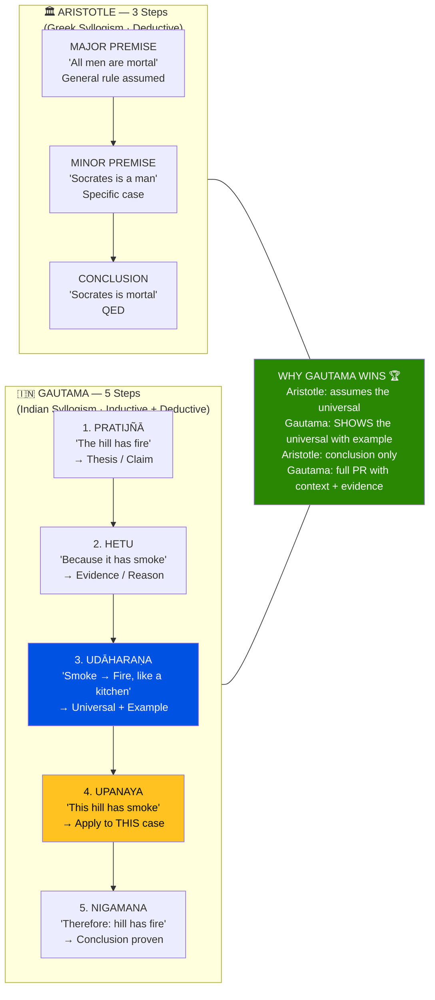
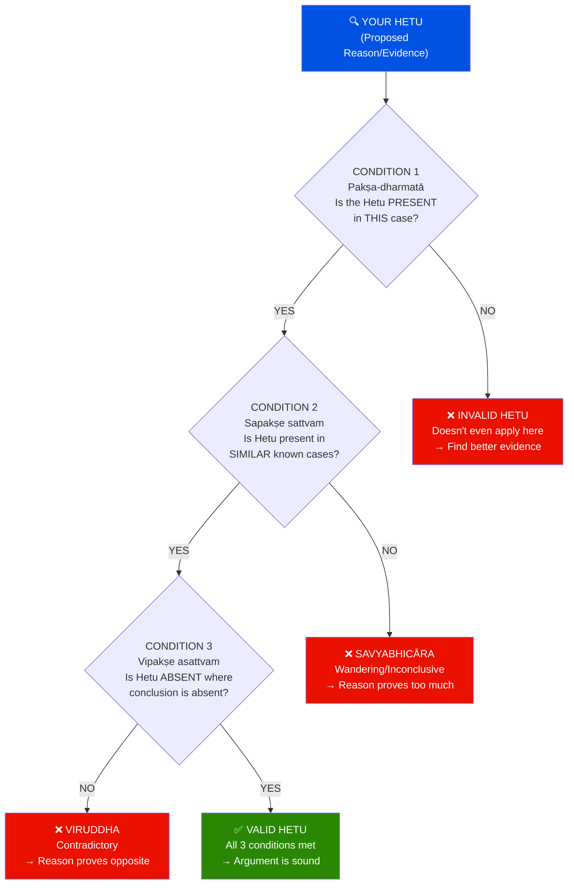
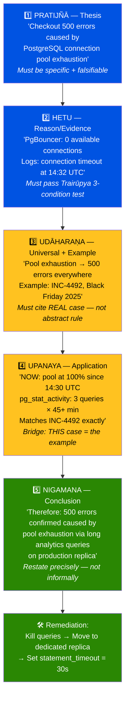
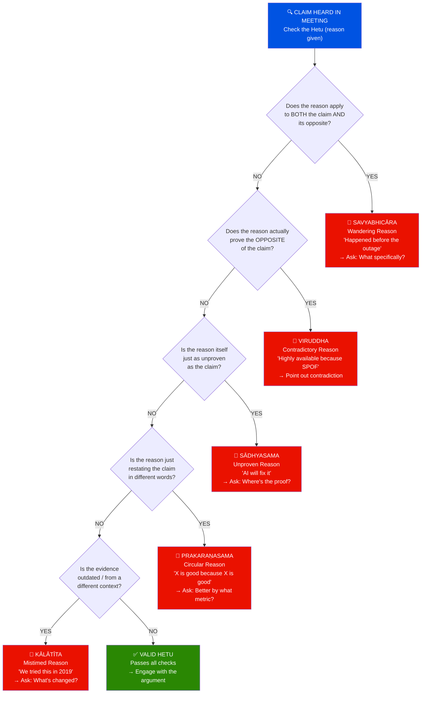
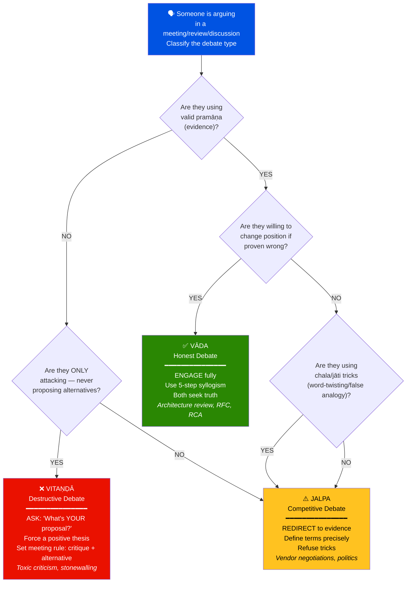
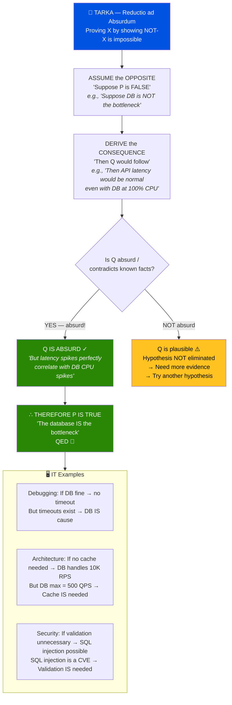
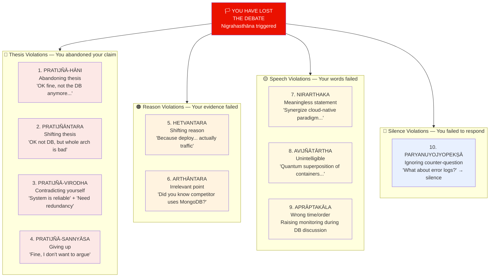

# 🏛️ Ṣaḍ Darśana — Six Schools of Vedic Philosophy
## Part 2 of 3 — The Logic Engine: Syllogism, Fallacies & Debate

> *"Sādhya-sādhana-viṣayam anumānam"*
> — **Nyāya Sūtra 1.1.5** *(Inference is the knowledge of the target through the reason)*

📂 **Navigation**
- [← Part 1 — Foundations & Framework](Shad_Darshana_Part1_Foundations.md)
- ▶ Part 2 — The Logic Engine ← *You are here*
- [Part 3 — Applied Logic: IT Engineering & Learning Path →](Shad_Darshana_Part3_Applied_Logic.md)

---

## 🔥 The Pañcāvayava — Indian 5-Step Syllogism

> This is THE core logical tool. Master this and you can construct
> unassailable arguments in any domain.

### Aristotle (3 steps) vs Gautama (5 steps)

```
ARISTOTLE (Greek syllogism — 3 steps):
  Major premise:  "All men are mortal"
  Minor premise:  "Socrates is a man"
  Conclusion:     "Therefore Socrates is mortal"
  → DEDUCTIVE: General → Specific → Conclusion

GAUTAMA (Indian syllogism — 5 steps):
  1. Pratijñā (Thesis):      "The hill has fire"
  2. Hetu (Reason):          "Because it has smoke"
  3. Udāharaṇa (Example):   "Wherever there is smoke, there is fire — like a kitchen"
  4. Upanaya (Application):  "This hill has smoke"
  5. Nigamana (Conclusion):  "Therefore, this hill has fire"
  → INDUCTIVE + DEDUCTIVE: Claim → Reason → Universal → Application → Conclusion

WHY 5 > 3?
  Aristotle assumes the universal premise ("all men are mortal") is already known.
  Gautama SHOWS how you arrive at the universal through an EXAMPLE (udāharaṇa).
  The Indian syllogism is MORE COMPLETE because it includes:
    • The CLAIM you're defending (pratijñā)
    • The grounding EXAMPLE (udāharaṇa) — empirical evidence
    • The APPLICATION step connecting universal to particular (upanaya)

  In IT terms: Aristotle gives you the CONCLUSION. Gautama gives you
  the complete PULL REQUEST with context, evidence, and reasoning.
```



### The 5 Steps — Detailed Rules

```
STEP 1: PRATIJÑĀ (प्रतिज्ञा) — The Thesis / Claim
━━━━━━━━━━━━━━━━━━━━━━━━━━━━━━━━━━━━━━━━━━━━━━━
  WHAT: The proposition to be proven.
  FORM: "X has property Y"     (pakṣa has sādhya)
  RULE: Must be specific, falsifiable, and non-obvious.

  ✅ GOOD: "The checkout API latency spike is caused by DB connection exhaustion"
  ❌ BAD:  "Something is wrong with the system" (too vague)
  ❌ BAD:  "The sun rises in the east" (obvious — no one disputes this)

  TERMS:
    PAKṢA  (पक्ष) = the subject ("the hill" / "the checkout API")
    SĀDHYA (साध्य) = the property to be proven ("has fire" / "has DB exhaustion")


STEP 2: HETU (हेतु) — The Reason / Evidence
━━━━━━━━━━━━━━━━━━━━━━━━━━━━━━━━━━━━━
  WHAT: The reason WHY the thesis is true.
  FORM: "Because X has Z" (Z is the mark/sign that indicates Y)
  RULE: Must be PRESENT in the pakṣa. Must NECESSARILY lead to sādhya.
        Must NOT be present where sādhya is ABSENT.

  ✅ GOOD: "Because the pool metrics show 0 available connections"
  ❌ BAD:  "Because we deployed yesterday" (coincidence, not causation)
  ❌ BAD:  "Because I feel it's the DB" (feeling ≠ evidence)

  The HETU is the engine of the argument. A bad hetu = entire argument collapses.

  THREE CONDITIONS FOR VALID HETU (Trairūpya — Dignāga's refinement):
    a) Pakṣa-dharmatā: The hetu must be PRESENT in the pakṣa
       → "Pool metrics show 0 connections" — YES, we observe this ✅
    b) Sapakṣe sattvam: The hetu must be present in SIMILAR cases
       → "In past incidents with 0 connections, latency spiked" — YES ✅
    c) Vipakṣe asattvam: The hetu must be ABSENT where sādhya is absent
       → "When latency is normal, pool metrics show available connections" — YES ✅



STEP 3: UDĀHARAṆA (उदाहरण) — The Example / Universal Rule + Instance
━━━━━━━━━━━━━━━━━━━━━━━━━━━━━━━━━━━━━━━━━━━━━━━━━━━━━━━━━━━━━━━━━━━━
  WHAT: A universal rule illustrated by a well-known example.
  FORM: "Wherever Z is present, Y is present — like in case C"

  Two sub-types:
    ANVAYA (positive): "Wherever there is smoke, there is fire — like a kitchen"
    VYATIREKA (negative): "Wherever there is NO fire, there is no smoke — like a lake"

  ✅ GOOD: "Wherever connection pools hit zero, API latency degrades —
            as we saw in the Q4-2025 Black Friday incident (INC-4492)"
  ❌ BAD:  "It's obvious that DB issues cause latency" (no specific example)

  THE POWER OF UDĀHARAṆA:
    This is what makes Indian logic EMPIRICAL, not purely abstract.
    You must SHOW a real-world case. You can't argue from pure abstraction.
    In IT: always cite a specific past incident, benchmark, or documented case.


STEP 4: UPANAYA (उपनय) — The Application / Connecting the Dots
━━━━━━━━━━━━━━━━━━━━━━━━━━━━━━━━━━━━━━━━━━━━━━━━━━━━━━━━━━━━━
  WHAT: Show that the current case (pakṣa) has the same hetu.
  FORM: "THIS case also has Z — just like the example"

  ✅ GOOD: "Right now, the checkout API's pool metrics show 0 available
            connections, exactly as in the Q4 incident"
  ❌ BAD:  (Skipping this step — jumping from example to conclusion)

  WHY THIS STEP MATTERS:
    Without upanaya, you have a universal rule and an example but
    NO CONNECTION to the current case. It's the step that says:
    "Yes, this universal applies HERE, NOW, to THIS specific situation."


STEP 5: NIGAMANA (निगमन) — The Conclusion
━━━━━━━━━━━━━━━━━━━━━━━━━━━━━━━━━━━━━━━━━
  WHAT: Restate the thesis, now PROVEN.
  FORM: "Therefore, X has Y"

  ✅ GOOD: "Therefore, the checkout API latency spike is confirmed to be
            caused by DB connection pool exhaustion"
  ❌ BAD:  "So yeah, it's the DB" (too informal, doesn't restate precisely)
```

### Complete IT Example — 5-Step Syllogism in Production

```
SCENARIO: E-commerce checkout failing during peak traffic.

  1. PRATIJÑĀ (Thesis):
     "The checkout API's 500 errors are caused by PostgreSQL connection
      pool exhaustion."

  2. HETU (Reason):
     "Because PgBouncer metrics show 0 available connections in the
      'checkout' pool, and application logs show 'connection timeout'
      errors starting at 14:32 UTC."

  3. UDĀHARAṆA (Example + Universal):
     "Wherever PgBouncer connection pools are exhausted, downstream
      API calls fail with 500 errors — as documented in INC-4492
      (Black Friday 2025), where identical symptoms were traced to
      pool exhaustion caused by long-running analytics queries."

  4. UPANAYA (Application):
     "In the current incident, PgBouncer pool utilization graph shows
      100% from 14:30 UTC, and pg_stat_activity reveals 3 analytics
      queries running for 45+ minutes on the production replica,
      matching the INC-4492 pattern exactly."

  5. NIGAMANA (Conclusion):
     "Therefore, the checkout API 500 errors are confirmed to be caused
      by PostgreSQL connection pool exhaustion due to long-running
      analytics queries on the production replica."

  REMEDIATION follows naturally:
    → Kill the analytics queries (immediate)
    → Move analytics to dedicated replica (permanent)
    → Set statement_timeout = 30s on production pools (safeguard)
```



---

## ⚠️ The 5 Hetvābhāsas — Logical Fallacies

> *"Hetvābhāsāḥ pañca"* — **Nyāya Sūtra 1.2.4**
> *(There are five fallacies of reasoning)*

```
These are the 5 ways a HETU (reason) can be INVALID.
Learn these and you can dismantle any bad argument.

━━━━━━━━━━━━━━━━━━━━━━━━━━━━━━━━━━━━━━━━━━━━━━━━━━━━━━━━━━━━━━
1. SAVYABHICĀRA (सव्यभिचार) — The Wandering / Inconclusive Reason
━━━━━━━━━━━━━━━━━━━━━━━━━━━━━━━━━━━━━━━━━━━━━━━━━━━━━━━━━━━━━━

  WHAT: The reason exists in BOTH the target case AND its opposite.
        It proves too much — applies everywhere.

  CLASSIC: "The hill has fire because it is knowable."
           → Everything is knowable. This proves nothing about fire.

  IT EXAMPLE:
    "The deployment caused the outage because it happened before the outage."
    → EVERYTHING that happened before the outage "happened before the outage."
    → Lunch break happened before the outage too. Did lunch cause it?
    → This is classic POST HOC ERGO PROPTER HOC — the most common IT fallacy.

  DETECTION: Ask "Does this reason ALSO apply to cases where the
             conclusion is FALSE?" If yes → savyabhicāra.


━━━━━━━━━━━━━━━━━━━━━━━━━━━━━━━━━━━━━━━━━━━━━━━━━━━━━━━━━━━━━━
2. VIRUDDHA (विरुद्ध) — The Contradictory Reason
━━━━━━━━━━━━━━━━━━━━━━━━━━━━━━━━━━━━━━━━━━━━━━━━━━━━━━━━━━━━━━

  WHAT: The reason actually proves the OPPOSITE of the thesis.

  CLASSIC: "Sound is eternal because it is produced."
           → Produced things are NOT eternal — they're created!
           → The reason proves sound is NOT eternal.

  IT EXAMPLE:
    "Our system is highly available because we have a single point of failure."
    → A SPOF proves the system is NOT highly available.

    "We don't need monitoring because the system never fails."
    → If it never fails, you can't KNOW that without monitoring.
    → The claim contradicts the evidence needed to support it.

  DETECTION: Ask "If I accept this reason, does it lead to the OPPOSITE
             of what's being claimed?" If yes → viruddha.


━━━━━━━━━━━━━━━━━━━━━━━━━━━━━━━━━━━━━━━━━━━━━━━━━━━━━━━━━━━━━━
3. PRAKARAṆASAMA (प्रकरणसम) — The Circular / Begging-the-Question
━━━━━━━━━━━━━━━━━━━━━━━━━━━━━━━━━━━━━━━━━━━━━━━━━━━━━━━━━━━━━━

  WHAT: The reason is just as unproven as the thesis itself.
        It begs the question — assumes what it needs to prove.

  CLASSIC: "The soul exists because consciousness requires a substrate."
           → "Consciousness requires a substrate" is itself unproven.

  IT EXAMPLE:
    "Microservices are better because they scale better."
    → "They scale better" is ITSELF the claim needing proof!
    → This is circular: "X is good because X is good."

    "We should use Kafka because it's the industry standard."
    → "Industry standard" is the claim, not the proof.
    → WHERE is it standard? For WHAT use case? With what EVIDENCE?

  DETECTION: Ask "Is the reason itself something that needs to be
             independently proven?" If yes → prakaraṇasama.


━━━━━━━━━━━━━━━━━━━━━━━━━━━━━━━━━━━━━━━━━━━━━━━━━━━━━━━━━━━━━━
4. SĀDHYASAMA (साध्यसम) — The Unproven Reason
━━━━━━━━━━━━━━━━━━━━━━━━━━━━━━━━━━━━━━━━━━━━━━━━━━━━━━━━━━━━━━

  WHAT: The reason is as doubtful as the thesis.
        Neither is established — it's speculation proving speculation.

  CLASSIC: "Shadows have substance because they move."
           → "Shadows move" is observable, but "move" implies agency,
              which is itself questionable for shadows.

  IT EXAMPLE:
    "The new framework will reduce bugs because it uses AI."
    → "AI reduces bugs" is itself unproven in this context.
    → You're using one speculation to support another.

    "NoSQL will be faster because our data is unstructured."
    → Is the data ACTUALLY unstructured? Have you measured?
    → Have you benchmarked NoSQL vs SQL for YOUR workload?

  DETECTION: Ask "Can the reason ITSELF be demonstrated with direct
             evidence?" If not → sādhyasama.


━━━━━━━━━━━━━━━━━━━━━━━━━━━━━━━━━━━━━━━━━━━━━━━━━━━━━━━━━━━━━━
5. KĀLĀTĪTA (कालातीत) — The Mistimed / Outdated Reason
━━━━━━━━━━━━━━━━━━━━━━━━━━━━━━━━━━━━━━━━━━━━━━━━━━━━━━━━━━━━━━

  WHAT: The reason was valid at some point but is no longer applicable.
        The evidence has expired.

  CLASSIC: "The hill has fire because it had smoke yesterday."
           → Yesterday's smoke doesn't prove today's fire.

  IT EXAMPLE:
    "Java is too slow for real-time" (citing 2005 JVM benchmarks).
    → Modern JVM with JIT/GraalVM is completely different.

    "We can't use containers because they have security issues."
    → Citing 2016 Docker CVEs while ignoring modern hardened runtimes.

    "The load test from 6 months ago showed 5K TPS — we're fine."
    → 6 months of feature additions may have changed everything.

  DETECTION: Ask "Is this evidence CURRENT? Does it apply to the
             PRESENT context?" If outdated → kālātīta.
```

### Fallacy Detection Cheat Sheet for Meetings

```
┌─────────────────────────────────────────────────────────────────┐
│  🚨 FALLACY DETECTOR — What to Listen For in Meetings          │
├──────────────┬──────────────────────────────────────────────────┤
│ They say...  │ Fallacy type                                    │
├──────────────┼──────────────────────────────────────────────────┤
│ "It happened │ SAVYABHICĀRA (wandering)                        │
│  right after │ Correlation ≠ causation.                        │
│  the deploy" │ Ask: "What specific change could cause this?"   │
├──────────────┼──────────────────────────────────────────────────┤
│ "It's fast   │ VIRUDDHA (contradictory)                        │
│  because we  │ Removing safeguards ≠ speed.                    │
│  skip tests" │ Ask: "Fast now, but what about regressions?"    │
├──────────────┼──────────────────────────────────────────────────┤
│ "X is better │ PRAKARAṆASAMA (circular)                        │
│  because X   │ The claim IS the reason.                        │
│  is modern"  │ Ask: "Better by WHAT metric?"                   │
├──────────────┼──────────────────────────────────────────────────┤
│ "AI will     │ SĀDHYASAMA (unproven reason)                    │
│  fix it"     │ Speculation supporting speculation.             │
│              │ Ask: "Where has AI fixed THIS type of problem?" │
├──────────────┼──────────────────────────────────────────────────┤
│ "We tried    │ KĀLĀTĪTA (mistimed)                             │
│  that in     │ 2019 context ≠ 2026 context.                   │
│  2019"       │ Ask: "What's changed since then?"               │
└──────────────┴──────────────────────────────────────────────────┘
```



---

## ⚔️ The Three Types of Debate — Vāda, Jalpa, Vitaṇḍā

> *"Vāda-jalpa-vitaṇḍā kathā-trairavayam"*
> — **Nyāya Sūtra 1.2.1–3** *(Debate has three forms)*

### VĀDA — Honest Debate (for Truth)

```
📖 SOURCE: Nyāya Sūtra 1.2.1
"Pramāṇa-tarka-sādhanopālambhaḥ siddhānta-aviruddhaḥ
pañcāvayavopapannaḥ vādaḥ"

RULES:
  ✅ Both sides MUST use valid pramāṇa (evidence)
  ✅ Arguments MUST follow 5-step syllogistic form
  ✅ Both sides MUST be willing to change their position if proven wrong
  ✅ No personal attacks, emotional manipulation, or authority pulling
  ✅ The goal is TRUTH, not victory

WHEN TO USE IN IT:
  → Architecture design reviews
  → RFC (Request for Comments) discussions
  → Code review disagreements
  → "Should we use X vs Y?" technical discussions
  → Post-mortem root cause analysis

EXAMPLE:
  Engineer A: "We should use event sourcing for the order service."
    (States thesis with reasons)
  Engineer B: "I disagree — CRUD is sufficient for our volume."
    (States counter-thesis with reasons)
  Both examine evidence: throughput requirements, team expertise, complexity.
  OUTCOME: The better-evidenced position wins. Loser learns.

THE IDEAL: Every technical meeting should be a vāda.
```

### JALPA — Competitive Debate (to Win)

```
📖 SOURCE: Nyāya Sūtra 1.2.2
"Yathā-uktopapannaḥ chala-jāti-nigrahasthāna-sādhana-upālambhaḥ jalpaḥ"

RULES:
  ⚠️ Uses valid arguments BUT ALSO tricks (chala, jāti)
  ⚠️ Goal is VICTORY, not truth
  ⚠️ Word-twisting, false analogies, and gotcha tactics are allowed
  ⚠️ Both sides try to find the OTHER's "defeat point" (nigrahasthāna)

WHEN THIS HAPPENS IN IT (recognize it!):
  → Vendor sales pitches ("Our tool is 10x faster!" — than what?)
  → Political meetings where budget/headcount is at stake
  → Cross-team blame games during outages
  → "We need to go live by Friday" pressure (emotional, not logical)

HOW TO HANDLE:
  → Recognize it's jalpa, not vāda
  → Don't engage with the tricks — redirect to evidence (pramāṇa)
  → Call out chala: "Let's define our terms precisely"
  → Call out jāti: "That analogy doesn't apply because..."
  → Refuse to play: "Let's focus on the data, not the rhetoric"
```

### VITAṆḌĀ — Destructive Criticism (to Demolish)

```
📖 SOURCE: Nyāya Sūtra 1.2.3
"Sā pratipakṣa-sthāpanā-hīnā vitaṇḍā"

RULES:
  ❌ Only ATTACKS the opponent's position
  ❌ NEVER offers its own alternative
  ❌ Pure destruction without construction
  ❌ The debater takes no positive stance

WHEN THIS HAPPENS IN IT:
  → "That design is terrible" (with no alternative proposed)
  → "Microservices are over-engineered" (OK, but what DO you suggest?)
  → "This code is unreadable" (without showing how to improve it)
  → Chronic critics who never build anything

HOW TO HANDLE:
  → Ask: "What's YOUR proposal?" (forces them into vāda)
  → Rule: "In this meeting, criticism must come with an alternative"
  → Recognize: Vitaṇḍā is considered the LOWEST form of debate in Nyāya.
    It's intellectually dishonest because it avoids the risk of being wrong.

GAUTAMA'S VERDICT:
  Vāda = honorable (the sage's way)
  Jalpa = acceptable in adversarial contexts (the strategist's way)
  Vitaṇḍā = shameful (the coward's way)
```



---

## 🧪 Tarka — The Art of Hypothetical Reasoning

```
📖 SOURCE: Nyāya Sūtra 1.1.40
"Avijñāta-tattve arthe karaṇair upapanna-pradarśanam tarkaḥ"

WHAT: "If X were NOT true, then absurd consequence Y would follow.
       Y is clearly absurd. Therefore X must be true."

This is REDUCTIO AD ABSURDUM — proof by contradiction.
Indian logicians formalized this 2,000+ years ago.

FORM:
  "Suppose P is false."
  "Then Q would follow."
  "But Q is absurd/impossible/contradicts known facts."
  "Therefore, P must be true."

IT EXAMPLE 1 — Debugging:
  "Suppose the database is NOT the bottleneck."
  "Then API latency would be normal even with DB at 100% CPU."
  "But API latency spikes perfectly correlate with DB CPU spikes."
  "Therefore, the database IS the bottleneck."

IT EXAMPLE 2 — Architecture:
  "Suppose we DON'T need a cache."
  "Then 10K requests/sec would all hit the DB directly."
  "But the DB can only handle 500 QPS."
  "Therefore, we DO need a cache." (QED 🎤)

IT EXAMPLE 3 — Security:
  "Suppose input validation is unnecessary."
  "Then any user input would go directly to SQL queries."
  "But that allows SQL injection — a known vulnerability."
  "Therefore, input validation IS necessary."
```



---

## 🏆 The Nigrahasthāna — 22 Grounds for Defeat in Debate

> When has someone LOST the argument? Nyāya defines 22 specific conditions.

### The Top 10 Most Relevant for IT Conversations

```
📖 SOURCE: Nyāya Sūtra 5.2.1–5.2.22

 1. PRATIJÑĀ-HĀNI — Abandoning your thesis
    "OK fine, I'm not saying it's the DB anymore... but still..."
    → You changed your position. You lost.

 2. PRATIJÑĀNTARA — Shifting the thesis
    "OK it's not the DB, but the whole architecture is bad."
    → You moved the goalpost. You lost.

 3. PRATIJÑĀ-VIRODHA — Contradicting your own thesis
    "The system is reliable" → "But we DO need more redundancy"
    → You contradicted yourself. You lost.

 4. PRATIJÑĀ-SANNYĀSA — Giving up the thesis
    "Fine, I don't want to argue about this anymore."
    → Surrendering = losing.

 5. HETVANTARA — Shifting the reason
    "It's because of the deploy... well actually it's because of traffic"
    → Your original reason failed and you substituted another. That's defeat.

 6. ARTHĀNTARA — Bringing in an irrelevant point
    "The DB might be slow, but did you know our competitor uses MongoDB?"
    → Irrelevant. Stay on topic or lose.

 7. NIRARTHAKA — Making a meaningless statement
    "We need to synergize our microservice paradigm for cloud-native scalability"
    → Meaningless jargon ≠ argument. Defeat.

 8. AVIJÑĀTĀRTHA — Making an unintelligible statement
    "The quantum superposition of our container orchestration..."
    → If no one can understand you, you haven't communicated. Defeat.

 9. APRĀPTAKĀLA — Arguing at the wrong time / out of order
    "But what about monitoring?" (during a discussion about data models)
    → Valid concern, wrong time. Sequence matters.

10. PARYANUYOJYOPEKṢĀ — Ignoring a legitimate counter-question
    "But what about the error logs?" → *silence*
    → Ignoring a valid challenge = acknowledging you can't answer it. Defeat.
```



---

## 🔬 Navya-Nyāya — The "New Logic" (Advanced)

```
📖 ERA: 12th century onwards. Founded by Gaṅgeśa Upādhyāya in Mithila.

WHAT CHANGED:
  Old Nyāya: Natural language arguments, informal structure
  Navya-Nyāya: FORMAL technical language with precise notation

  Navya-Nyāya invented a FORMAL METALANGUAGE for logic —
  a symbolic system for expressing logical relations,
  800 years before Frege's Begriffsschrift (1879).

KEY INNOVATIONS:
  1. AVACCHEDAKATĀ (limiter) — precise scope of a property
     → "Fire-ness limited to the hill" (not fire in general)
     → IT: Generic<T> — type parameter that limits scope

  2. NIRŪPYA-NIRŪPAKA (conditioned-conditioner) — mutual dependency
     → "Father-ness is conditioned by son-ness and vice versa"
     → IT: Bidirectional foreign key. Interface-Implementation pair.

  3. ABHĀVA with precision — 4 types of absence (see Part 1)
     → IT: null vs undefined vs NOT_FOUND vs DELETED

  4. ANUGAMA (co-variation) — tracking what varies with what
     → IT: Correlation analysis in observability

WHY IT MATTERS:
  Navya-Nyāya proves that Indian logicians developed formal logic
  independently and with extraordinary sophistication. The precision
  of their language rivals modern predicate logic.
```

---

## 📋 Quick Reference — The Complete Logical Toolkit

```
PRAMĀṆA (How I Know):
  ├── Pratyakṣa   → I saw/measured it directly
  ├── Anumāna     → I inferred it from evidence + valid reasoning
  ├── Upamāna     → I recognized it by analogy to a known case
  └── Śabda       → A qualified expert told me

AVAYAVA (How I Argue):
  ├── 1. Pratijñā  → Here's my claim
  ├── 2. Hetu      → Here's the reason/evidence
  ├── 3. Udāharaṇa → Here's a universal rule + example
  ├── 4. Upanaya   → Here's how it applies to THIS case
  └── 5. Nigamana  → Therefore, my claim is proven

HETVĀBHĀSA (What Goes Wrong):
  ├── 1. Savyabhicāra  → Reason proves too much (wandering)
  ├── 2. Viruddha      → Reason proves the opposite (contradictory)
  ├── 3. Prakaraṇasama → Reason is circular (begging the question)
  ├── 4. Sādhyasama    → Reason is itself unproven (speculation)
  └── 5. Kālātīta      → Reason is outdated (mistimed)

KATHĀ (How I Debate):
  ├── Vāda      → Honest, for truth (design review)
  ├── Jalpa     → Competitive, for victory (negotiations)
  └── Vitaṇḍā   → Destructive, for demolition (toxic criticism)

TARKA (How I Eliminate):
  └── Reductio ad absurdum — if NOT X, then absurdity, therefore X
```

---

📌 **End of Part 2**

**Next**: [Part 3 — Applied Logic: IT Engineering, Learning Path & Exercises →](Shad_Darshana_Part3_Applied_Logic.md)

---
*Ṣaḍ Darśana Learning Guide · Part 2 of 3 · Created April 2026*
*"Hetunā yo'numīyate sa liṅgam" — That which is inferred through a reason is the mark.*
