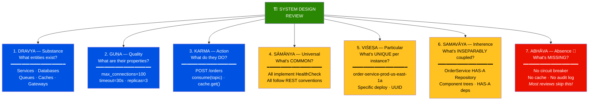
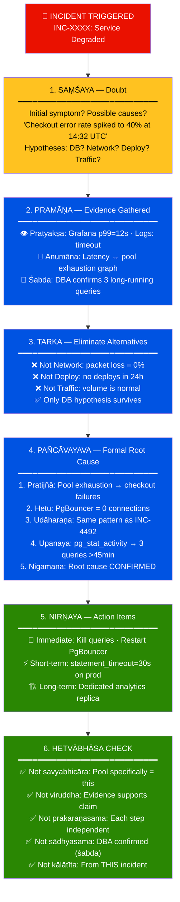
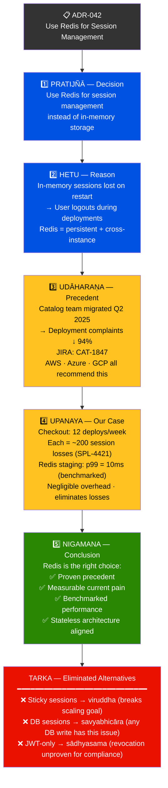
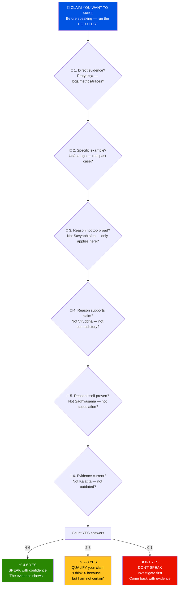
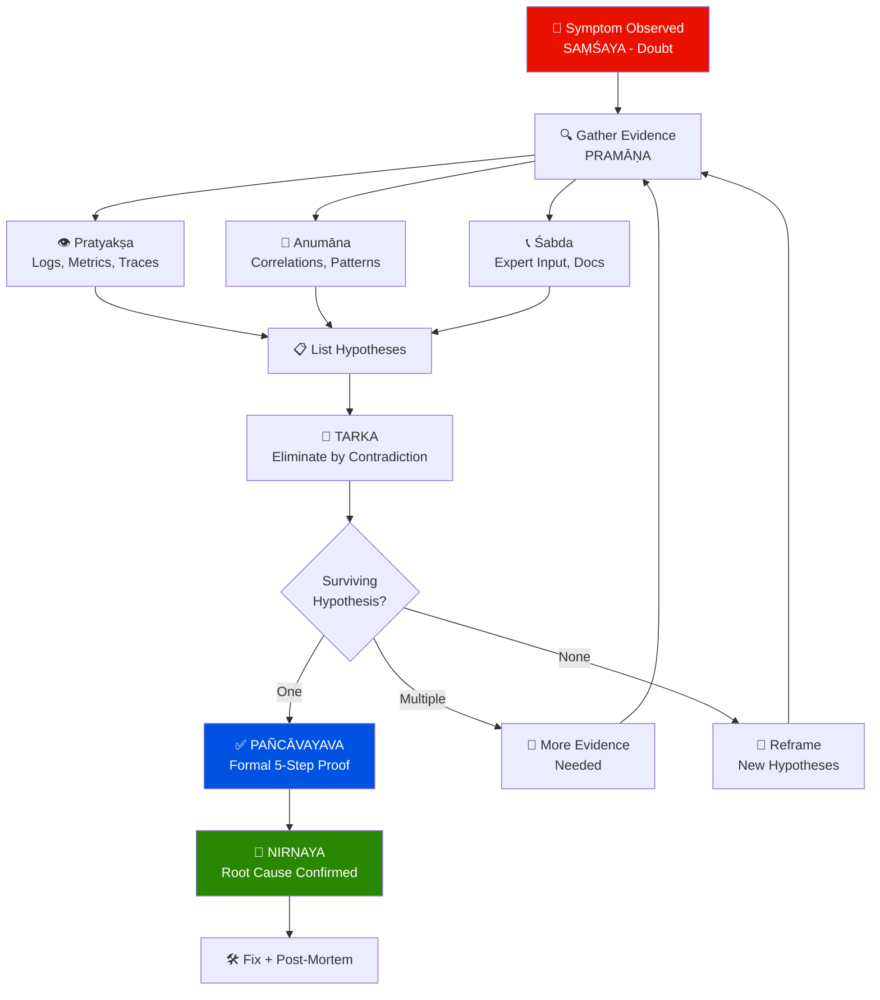
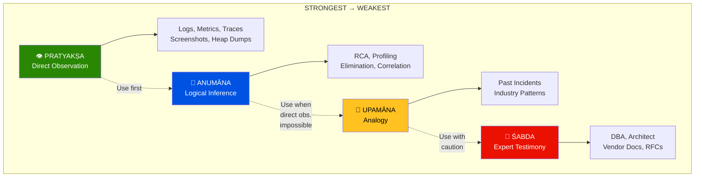
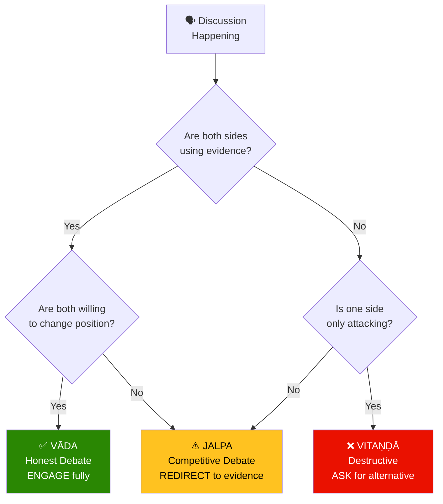
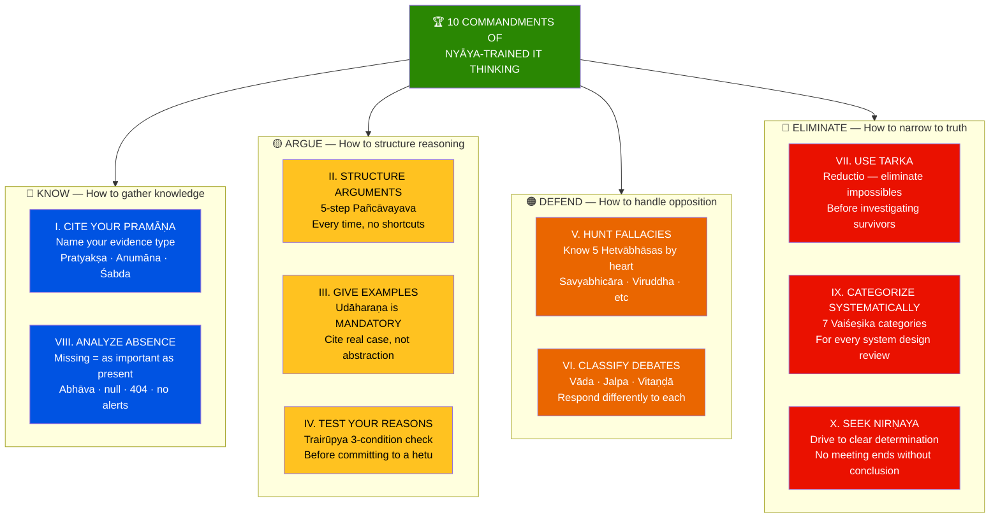

# 🏛️ Ṣaḍ Darśana — Six Schools of Vedic Philosophy
## Part 3 of 3 — Applied Logic: IT Engineering, Learning Path & Exercises

> *"Ānvīkṣikī pradīpaḥ sarva-vidyānām, upāyaḥ sarva-karmāṇām,
> āśrayaḥ sarva-dharmāṇām"*
> — **Kautilya, Arthaśāstra 1.2** *(Logic is the lamp of all sciences,
> the means of all actions, the refuge of all dharmas)*

📂 **Navigation**
- [← Part 1 — Foundations & Framework](Shad_Darshana_Part1_Foundations.md)
- [← Part 2 — The Logic Engine](Shad_Darshana_Part2_Logic_Engine.md)
- ▶ Part 3 — Applied Logic & Learning Path ← *You are here*

---

## 🖥️ SECTION A — Nyāya Logic Applied to IT Engineering

### A1. Debugging as Anumāna (Inference)

```
Every debugging session IS a Nyāya inference session.
You have a SYMPTOM (smoke). You need to find the CAUSE (fire).

THE DEBUGGING PAÑCĀVAYAVA:

  1. PRATIJÑĀ (Thesis):
     "The system failure is caused by [specific root cause]"
     → This is your HYPOTHESIS — the RCA candidate

  2. HETU (Reason):
     "Because [specific evidence observed]"
     → Error logs, metrics, traces, user reports

  3. UDĀHARAṆA (Example):
     "This pattern is consistent with [known failure mode]"
     → Past incidents, documented failure patterns, vendor docs

  4. UPANAYA (Application):
     "In this case, [current evidence matches the pattern]"
     → Connecting the dots — showing THIS case fits the pattern

  5. NIGAMANA (Conclusion):
     "Therefore, the root cause is [confirmed]"
     → Only reached after steps 1-4 are verified

REAL EXAMPLE — Memory Leak:
  1. "The payment service OOM-kills are caused by a memory leak
      in the transaction cache."
  2. "Because heap usage grows linearly by 50MB/hour with no GC recovery,
      and the growth correlates exactly with transaction volume."
  3. "Linear heap growth without GC recovery indicates a strong reference
      preventing collection — as documented in PERF-2891 where the
      session cache had the same pattern."
  4. "Heap dump analysis shows TransactionCache holding 2.3M entries
      with strong references, matching the PERF-2891 pattern."
  5. "Therefore, the OOM-kills are caused by unbounded growth in
      TransactionCache due to missing eviction policy."
```

### A2. Code Review as Vāda (Honest Debate)

```
THE IDEAL CODE REVIEW = A VĀDA SESSION

Reviewer and author are BOTH seeking the best code.
Neither is trying to "win" — both want truth (quality).

RULES FOR NYĀYA-STYLE CODE REVIEW:

  RULE 1: CITE YOUR PRAMĀṆA
    ❌ "This is bad code."
    ✅ "This violates the Single Responsibility Principle (SOLID, Martin 2000).
        The UserService class handles authentication, authorization, AND
        profile management — 3 separate concerns."

  RULE 2: USE UDĀHARAṆA (EXAMPLE)
    ❌ "This won't scale."
    ✅ "In the catalog service, a similar N+1 query pattern caused
        P99 latency to hit 12s at 5K RPM (INC-3847). This query
        has the same pattern — SELECT inside a loop."

  RULE 3: FOLLOW THE 5-STEP STRUCTURE
    1. Pratijñā: "This function should be refactored"
    2. Hetu: "Because it does 4 unrelated things in 200 lines"
    3. Udāharaṇa: "Per SOLID SRP and our team's 50-line guideline"
    4. Upanaya: "Specifically, lines 45-120 handle validation while
                 lines 121-200 handle persistence — two distinct concerns"
    5. Nigamana: "I suggest splitting into validateOrder() and persistOrder()"

  RULE 4: ACCEPT DEFEAT GRACEFULLY
    If the author provides valid counter-evidence, the reviewer
    should concede. "Good point — I hadn't considered the transaction
    boundary requirement. Approved."
    This is nirṇaya (determination) after proper vāda.

  ANTI-PATTERN — RECOGNIZING JALPA IN CODE REVIEW:
    "This isn't how WE do things" (appeal to authority, not evidence)
    "I don't like this approach" (subjective, no pramāṇa)
    "Can you make this more elegant?" (vague, unfalsifiable)
    → All jalpa tactics. Redirect to specific, evidence-backed feedback.
```

### A3. System Design as Padārtha (Categorical Analysis)

```
Vaiśeṣika's 7 categories map PERFECTLY to system design:

┌──────────────┬───────────────────────────────────────────────────┐
│ PADĀRTHA     │ SYSTEM DESIGN EQUIVALENT                         │
├──────────────┼───────────────────────────────────────────────────┤
│ DRAVYA       │ Services, databases, queues, caches              │
│ (Substance)  │ → "What entities exist in our system?"           │
│              │ → User Service, Order DB, Kafka Topic, Redis     │
├──────────────┼───────────────────────────────────────────────────┤
│ GUṆA         │ Properties and configurations                    │
│ (Quality)    │ → "What attributes do they have?"                │
│              │ → max_connections=100, timeout=30s, replicas=3   │
├──────────────┼───────────────────────────────────────────────────┤
│ KARMA        │ Operations, APIs, methods                        │
│ (Action)     │ → "What do they DO?"                             │
│              │ → POST /orders, consume(topic), cache.get(key)   │
├──────────────┼───────────────────────────────────────────────────┤
│ SĀMĀNYA      │ Interfaces, protocols, contracts                 │
│ (Universal)  │ → "What do they have in COMMON?"                 │
│              │ → All services implement HealthCheck interface    │
│              │ → All APIs follow REST conventions                │
├──────────────┼───────────────────────────────────────────────────┤
│ VIŚEṢA       │ Instance identity, unique configuration          │
│ (Particular) │ → "What makes THIS one unique?"                  │
│              │ → order-service-prod-us-east-1a (specific deploy) │
├──────────────┼───────────────────────────────────────────────────┤
│ SAMAVĀYA     │ Composition, dependency relationships            │
│ (Inherence)  │ → "What's inseparably connected?"                │
│              │ → OrderService HAS-A OrderRepository (can't exist │
│              │   without it — inherent relationship)             │
├──────────────┼───────────────────────────────────────────────────┤
│ ABHĀVA       │ Missing components, null states, 404s            │
│ (Absence)    │ → "What's NOT there that should be?"             │
│              │ → No circuit breaker (prāgabhāva — never added)  │
│              │ → Deleted audit logs (pradhvaṃsābhāva)           │
└──────────────┴───────────────────────────────────────────────────┘

THE DESIGN REVIEW FRAMEWORK:
  For any system design, systematically ask all 7 questions:
  1. What THINGS exist?           (dravya)
  2. What PROPERTIES do they have? (guṇa)
  3. What ACTIONS can they perform? (karma)
  4. What COMMON patterns do they share? (sāmānya)
  5. What makes EACH one unique?   (viśeṣa)
  6. What's INSEPARABLY connected? (samavāya)
  7. What's MISSING or ABSENT?     (abhāva) ← Most reviews skip this!
```



### A4. Incident Post-Mortem as Complete Nyāya Session

```
THE NYĀYA POST-MORTEM TEMPLATE:

┌─────────────────────────────────────────────────────────────────┐
│ INCIDENT POST-MORTEM: INC-XXXX                                  │
│ Using Nyāya Logical Framework                                  │
├─────────────────────────────────────────────────────────────────┤
│                                                                 │
│ 1. SAṂŚAYA (Doubt / Initial Confusion):                        │
│    What was the initial symptom? What were the possible causes? │
│    "At 14:32 UTC, checkout error rate spiked to 40%."          │
│    Hypotheses: DB? Network? Deploy? Traffic spike?              │
│                                                                 │
│ 2. PRAMĀṆA (Evidence Gathered):                                │
│    a) Pratyakṣa (direct observation):                          │
│       - Grafana: p99 latency = 12s (normally 200ms)            │
│       - Logs: "connection timeout after 30000ms"               │
│    b) Anumāna (inference):                                     │
│       - Latency spike correlates with pool exhaustion graph     │
│    c) Śabda (expert testimony):                                │
│       - DBA confirmed: 3 long-running queries on prod replica  │
│                                                                 │
│ 3. TARKA (Elimination of Alternatives):                        │
│    - If NOT DB: "Network metrics show 0 packet loss" → Ruled out│
│    - If NOT Deploy: "No deploys in 24 hours" → Ruled out       │
│    - If NOT Traffic: "Request volume is normal" → Ruled out    │
│    → Only DB hypothesis survives tarka.                        │
│                                                                 │
│ 4. PAÑCĀVAYAVA (Formal Root Cause Argument):                   │
│    1. Pratijñā: "Checkout failures caused by pool exhaustion"   │
│    2. Hetu: "PgBouncer shows 0 available connections"          │
│    3. Udāharaṇa: "Same pattern as INC-4492 (Black Friday)"    │
│    4. Upanaya: "pg_stat_activity shows 3 analytics queries >45m"│
│    5. Nigamana: "Root cause confirmed: analytics on prod replica"│
│                                                                 │
│ 5. NIRṆAYA (Determination / Action Items):                     │
│    - Immediate: Kill analytics queries; restart PgBouncer       │
│    - Short-term: statement_timeout = 30s on prod pools         │
│    - Long-term: Dedicated analytics replica; query governance   │
│                                                                 │
│ 6. HETVĀBHĀSA CHECK (Did We Avoid Fallacies?):                 │
│    ✅ Not savyabhicāra: Pool exhaustion SPECIFICALLY causes this │
│    ✅ Not viruddha: Evidence supports, not contradicts          │
│    ✅ Not prakaraṇasama: Each step is independently verified    │
│    ✅ Not sādhyasama: DBA confirmed queries (śabda)            │
│    ✅ Not kālātīta: Evidence is from this incident, not past   │
└─────────────────────────────────────────────────────────────────┘
```



### A5. Technical Arguments — Architecture Decision Records

```
AN ADR USING PAÑCĀVAYAVA:

  TITLE: ADR-042: Use Redis for Session Management

  1. PRATIJÑĀ (Decision):
     "We should use Redis for session management instead of
      in-memory session storage."

  2. HETU (Reason):
     "Because in-memory sessions are lost on service restart,
      causing user logouts during deployments. Redis provides
      persistence and sharing across instances."

  3. UDĀHARAṆA (Precedent):
     "The catalog team migrated to Redis sessions in Q2 2025,
      reducing deployment-related user complaints by 94%
      (JIRA: CAT-1847). Industry practice confirms: AWS, Azure,
      and GCP all recommend external session stores for
      stateless service architectures."

  4. UPANAYA (Application to Our Case):
     "Our checkout service currently averages 12 deploys/week,
      each causing ~200 session losses (Splunk query: SPL-4421).
      Redis with 10ms p99 latency (benchmarked in staging) adds
      negligible overhead while eliminating all session losses."

  5. NIGAMANA (Conclusion):
     "Therefore, Redis for session management is the right choice:
      proven precedent, measurable current pain, benchmarked performance,
      and alignment with stateless architecture principles."

  ALTERNATIVES CONSIDERED (Tarka — elimination):
     - Sticky sessions: Breaks horizontal scaling (viruddha — contradicts
       our scalability goal)
     - Database sessions: Adds unnecessary DB load for ephemeral data
       (savyabhicāra — the reason applies to any DB write)
     - JWT-only: Cannot revoke sessions server-side (sādhyasama —
       "stateless auth is sufficient" is itself unproven for our
       compliance requirements)
```



---

## 🖥️ SECTION B — Nyāya for Everyday IT Conversations

### B1. The "HETU Test" — Before You Speak in a Meeting

```
Before making ANY claim in a meeting, run the HETU TEST:

  ┌─────────────────────────────────────────────────────────┐
  │ CLAIM I want to make: "________________"                │
  │                                                         │
  │ HETU TEST:                                              │
  │ □ 1. Do I have direct evidence (pratyakṣa)?            │
  │ □ 2. Can I cite a specific example (udāharaṇa)?        │
  │ □ 3. Does my reason ONLY apply to my thesis?            │
  │      (Not savyabhicāra — not too broad?)                │
  │ □ 4. Does my reason actually SUPPORT my thesis?          │
  │      (Not viruddha — not contradictory?)                │
  │ □ 5. Is my reason itself proven, not speculative?       │
  │      (Not sādhyasama — not unproven?)                   │
  │ □ 6. Is my evidence current?                            │
  │      (Not kālātīta — not outdated?)                     │
  │                                                         │
  │ If 4+ checks pass → SPEAK with confidence              │
  │ If 2-3 checks pass → Qualify: "I THINK X because..."   │
  │ If 0-1 checks pass → DON'T SPEAK. Investigate first.   │
  └─────────────────────────────────────────────────────────┘
```



### B2. Handling Difficult People — Using Debate Classification

```
SCENARIO: Someone in the meeting is being difficult.

STEP 1: CLASSIFY THE DEBATE TYPE
  Is this person engaged in:
    VĀDA? → They disagree but with evidence. ENGAGE honestly.
    JALPA? → They're trying to "win." REDIRECT to evidence.
    VITAṆḌĀ? → They're just attacking. ASK for their alternative.

STEP 2: RESPOND APPROPRIATELY

  FOR JALPA (tricks, emotional pressure):
    THEM: "We NEED to ship by Friday. There's no other option."
    YOU:  "I hear the urgency. Let me share the data: [evidence].
           Given [evidence], here are 3 options with tradeoffs..."
    → Acknowledge emotion, redirect to pramāṇa.

  FOR VITAṆḌĀ (pure criticism):
    THEM: "This whole approach is wrong."
    YOU:  "That's a strong position. What approach do YOU recommend?"
    → Force them to commit to a positive thesis.
    → In Nyāya, a debater who can't state a thesis has LOST.

  FOR CHALA (word-twisting):
    THEM: "You said 'fast enough' — define 'enough.' See, you can't!"
    YOU:  "Sure — P99 under 200ms at 10K RPM, as defined in our SLO."
    → Pin down terms precisely. Don't let them exploit ambiguity.
```

### B3. Elevator Pitch — 5-Step Syllogism in 60 Seconds

```
You have 60 seconds with a VP. Structure it as Pañcāvayava:

  PRATIJÑĀ (5 sec): "We need to invest in observability for the checkout platform."
  HETU (15 sec):    "Because we've had 3 severity-1 incidents this quarter with
                     mean time to DETECT of 45 minutes — double our SLO."
  UDĀHARAṆA (15s):  "Teams that invested in observability, like Catalog, reduced
                     MTTD from 40 minutes to 4 minutes in one quarter."
  UPANAYA (15 sec):  "Our checkout platform has similar complexity and the same
                     monitoring gaps that Catalog had pre-investment."
  NIGAMANA (10 sec): "Therefore, a 2-sprint observability investment will bring us
                     to SLO compliance and prevent ~$2M in quarterly downtime costs."

  TOTAL: 60 seconds. Every second counts. Every sentence has a logical role.
```

---

## 🗺️ SECTION C — The Complete Learning Path

### Path 1 — General Logic Development (12 Weeks)

```
WEEK 1-2: FOUNDATIONS
  📖 Read: Tarka Saṅgraha (Annambhaṭṭa) — THE beginner text
     Available: Translated by Swami Virupakshananda (Ramakrishna Math)
  📝 Exercise: Memorize the 16 padārthas of Nyāya
  📝 Exercise: Identify the 4 pramāṇas in your daily life for 1 week
     "How did I KNOW that? Did I see it? Infer it? Hear it from someone?"

WEEK 3-4: THE SYLLOGISM
  📖 Read: Nyāya Sūtra Ch.1 (with Vātsyāyana Bhāṣya)
     Available: Translated by Ganganatha Jha (Indian Thought Publishers)
  📝 Exercise: Write 5 arguments using the 5-step Pañcāvayava
     Topics: "Why exercise matters" / "Why reading is valuable" / etc.
  📝 Exercise: Convert 5 Aristotelian syllogisms to Indian 5-step form

WEEK 5-6: FALLACIES
  📖 Read: Nyāya Sūtra Ch.5 (Hetvābhāsa section)
  📝 Exercise: Watch 3 YouTube debates (politics, science, any topic)
     → Identify at least 2 fallacies per debate
     → Classify each as one of the 5 hetvābhāsa types
  📝 Exercise: Review your own past arguments — find your fallacies

WEEK 7-8: DEBATE MASTERY
  📖 Read: Nyāya Sūtra Ch.1.2 (Vāda, Jalpa, Vitaṇḍā)
  📝 Exercise: In your next 5 meetings, classify each discussion:
     "Is this Vāda (honest) or Jalpa (competitive) or Vitaṇḍā (destructive)?"
  📝 Exercise: Practice REDIRECTING Jalpa to Vāda:
     → When someone uses emotion, redirect to evidence
     → When someone uses authority, ask for specific data

WEEK 9-10: VAIŚEṢIKA CATEGORIES
  📖 Read: Tarka Saṅgraha (Vaiśeṣika sections)
  📝 Exercise: Analyze 3 everyday objects using the 7 padārthas
     "A chair: dravya=wood, guṇa=brown/hard, karma=supports,
      sāmānya=furniture-ness, viśeṣa=this specific chair,
      samavāya=legs+seat+back compose it, abhāva=no armrests"
  📝 Exercise: Model a software system using the 7 padārthas

WEEK 11-12: SYNTHESIS
  📖 Read: Nyāya Mañjarī Ch.1 (Jayanta Bhaṭṭa) — literary & brilliant
  📝 Exercise: Write a 2-page essay arguing for ANY position
     → Use 5-step syllogism as skeleton
     → Anticipate 3 objections and refute them
     → Cite specific pramāṇa for every claim
  📝 Exercise: Debate a friend on any topic using Vāda rules
```

### Path 2 — IT Engineering Logic (8 Weeks, Parallel with Path 1)

```
WEEK 1-2: DEBUGGING AS INFERENCE
  📝 Exercise: For every bug you fix this sprint:
     → Write the 5-step syllogism AFTER fixing it
     → What was your pratijñā (hypothesis)?
     → What was your hetu (evidence)?
     → Did you use an udāharaṇa (past incident)?
  📝 Template:
     "Bug: [description]
      1. Thesis: [root cause hypothesis]
      2. Reason: [what evidence pointed there]
      3. Precedent: [similar bug from the past]
      4. Application: [how THIS bug matches the pattern]
      5. Conclusion: [confirmed root cause + fix]"

WEEK 3-4: CODE REVIEW AS VĀDA
  📝 Exercise: For every code review comment you write:
     → Include the REASON (hetu), not just the opinion
     → Include an EXAMPLE (udāharaṇa) — link to docs, past PR, or standard
  📝 Exercise: Convert 3 vague code review comments to 5-step arguments
     Before: "This function is too long"
     After:  (Full 5-step structure with SRP reference and concrete suggestion)

WEEK 5-6: ARCHITECTURE DECISIONS AS FORMAL ARGUMENTS
  📝 Exercise: Write an ADR using Pañcāvayava (see Section A5 template)
  📝 Exercise: Take a past architecture decision and:
     → Identify the hetu (was it valid?)
     → Check for hetvābhāsa (was the reasoning fallacious?)
     → Write what a Nyāya logician would say about the argument

WEEK 7-8: MEETINGS & PRESENTATIONS AS DEBATE
  📝 Exercise: Use the HETU TEST (Section B1) before every
     meeting statement for 2 weeks
  📝 Exercise: Structure your next technical presentation as:
     → Pratijñā: "We should do X"
     → Hetu: "Because [measured evidence]"
     → Udāharaṇa: "As proven by [case study]"
     → Upanaya: "Applied to our situation: [specifics]"
     → Nigamana: "Therefore X. Questions?"
  📝 Exercise: After each meeting, journal:
     → "What debate type was this? Vāda/Jalpa/Vitaṇḍā?"
     → "Did anyone commit a hetvābhāsa? Which one?"
     → "How could I have argued more effectively?"
```

---

## 📊 MERMAID DIAGRAMS

### Diagram 1 — The Debugging Inference Pipeline



### Diagram 2 — The 4 Pramāṇas in IT Context



### Diagram 3 — Debate Type Decision Tree



### Diagram 4 — Learning Progression Map


---

## 🧩 PRACTICE EXERCISES — Fascination Through Application

### Exercise 1 — The Ṛṣi Challenge: Daily Pramāṇa Journal

```
For 7 days, keep a "Pramāṇa Journal":

Every time you make a CLAIM or DECISION, write:
  DATE: ____
  CLAIM: "____________________"
  PRAMĀṆA TYPE:
    □ Pratyakṣa (I directly observed it)
    □ Anumāna (I inferred it from evidence)
    □ Upamāna (I recognized it by analogy)
    □ Śabda (Someone trustworthy told me)
    □ NONE! (I was GUESSING! ⚠️)

GOAL: Reduce the "NONE" entries to zero by day 7.
You'll be shocked how often you "know" things without any valid pramāṇa.
```

### Exercise 2 — The Kaṇāda Challenge: Atomic Decomposition

```
Take ANY complex problem and decompose it using Vaiśeṣika categories:

EXAMPLE — "Our API is slow"

  DRAVYA:  Which specific services/components are involved?
           → API Gateway, Auth Service, Product Service, PostgreSQL, Redis
  GUṆA:   What measurable properties are abnormal?
           → P99 latency = 8s, normal = 200ms. CPU = 94%, normal = 40%.
  KARMA:   What operations are affected?
           → GET /products/{id}, POST /cart, GET /recommendations
  SĀMĀNYA: What pattern do the slow operations SHARE?
           → All hit the recommendations engine. That's the commonality!
  VIŚEṢA:  What's UNIQUE about the current situation?
           → Started after marketing campaign pushed 3x normal traffic
  SAMAVĀYA: What are the INSEPARABLE dependencies?
           → Product Service → Recommendations Engine (sync call, no fallback!)
  ABHĀVA:  What's MISSING?
           → No circuit breaker! No cache! No async fallback!

  DIAGNOSIS: The recommendations engine is the bottleneck.
  It's synchronously coupled (samavāya without loose coupling),
  has no circuit breaker (abhāva), and the traffic spike (viśeṣa)
  exposed the shared dependency (sāmānya) across all operations.
```

### Exercise 3 — The Gautama Challenge: Fallacy Hunter

```
Find the fallacy in each argument:

  1. "We should use GraphQL because Facebook uses it."
     FALLACY: __________ (Hint: is Facebook's context yours?)

  2. "The new monitoring tool reduced incidents by 50%"
     (Deployed same week as major infra upgrade)
     FALLACY: __________ (Hint: what ELSE changed?)

  3. "Kubernetes is overkill for us because it's complex."
     FALLACY: __________ (Hint: complexity of tool ≠ inappropriateness)

  4. "We tried microservices in 2019 and it failed, so monolith forever."
     FALLACY: __________ (Hint: what year is it now?)

  5. "Our code is clean because we follow Clean Code principles."
     FALLACY: __________ (Hint: the claim IS the reason)

  ANSWERS:
  1. JĀTI (false analogy) — Facebook's scale/context ≠ yours
  2. SAVYABHICĀRA (wandering) — multiple causes, can't attribute to one
  3. SĀDHYASAMA (unproven) — "complex" ≠ "overkill" without benchmarks
  4. KĀLĀTĪTA (mistimed) — 2019 tooling/team ≠ 2026 tooling/team
  5. PRAKARAṆASAMA (circular) — "clean because clean principles" is circular
```

### Exercise 4 — The Debate Dojo

```
PRACTICE DEBATE: "Should we rewrite the monolith as microservices?"

POSITION A (FOR rewrite):
  Write a 5-step Pañcāvayava argument FOR the rewrite.
  Include specific metrics, precedent, and application.

POSITION B (AGAINST rewrite):
  Write a 5-step Pañcāvayava argument AGAINST the rewrite.
  Include specific metrics, precedent, and application.

TARKA (Elimination):
  For each position, apply reductio:
  "If we DON'T rewrite, what happens in 2 years?"
  "If we DO rewrite, what's the worst case?"

NIRṆAYA (Determination):
  Which argument is STRONGER? By which criteria?
  Did either argument commit a hetvābhāsa?
```

---

## 📚 Recommended Reading Order — The Definitive Path

```
PHASE 1 — TASTE (1 month)
  📖 "Indian Logic" by Vidyabhusana (Dover) — history & overview
  📖 Tarka Saṅgraha of Annambhaṭṭa (translation by Athalye/Bodas)
  🎧 Podcast: "History of Indian Philosophy" (Peter Adamson, King's College)

PHASE 2 — FOUNDATION (2-3 months)
  📖 Nyāya Sūtra with Vātsyāyana Bhāṣya (trans. Ganganatha Jha)
  📖 Vaiśeṣika Sūtra of Kaṇāda (trans. Nandalal Sinha)
  📖 "A History of Indian Logic" by S.C. Vidyabhusana (comprehensive)

PHASE 3 — DEPTH (3-6 months)
  📖 Nyāya Mañjarī of Jayanta Bhaṭṭa (trans. Janaki Vallabha Bhattacharya)
  📖 Padārthadharmasaṅgraha of Praśastapāda (Vaiśeṣika mastery)
  📖 "Epistemology, Logic, and Grammar in Indian Philosophical Analysis"
     by B.K. Matilal (Oxford) — THE modern academic standard

PHASE 4 — MASTERY (ongoing)
  📖 Tattvacintāmaṇi of Gaṅgeśa (Navya-Nyāya — the advanced frontier)
  📖 "The Character of Logic in India" by B.K. Matilal (SUNY Press)
  📖 "Logic and Language in Indian Philosophy" (edited by Daya Krishna)

CROSS-DISCIPLINARY GEMS:
  📖 Arthaśāstra 1.2 (Kautilya on logic as statecraft foundation)
  📖 Caraka Saṃhitā 3.8 (Medical logic — diagnosis as inference)
  📖 Nyāya-Bindu of Dharmakīrti (Buddhist counter-logic — know your opponent)
```

---

## 🎯 Summary — The 10 Commandments of Nyāya-Trained IT Thinking

```
  I.   CITE YOUR PRAMĀṆA — every claim needs evidence type
  II.  STRUCTURE YOUR ARGUMENTS — use the 5-step syllogism
  III. GIVE EXAMPLES — udāharaṇa is not optional, it's mandatory
  IV.  TEST YOUR REASONS — run the Trairūpya 3-condition check
  V.   HUNT FALLACIES — know the 5 hetvābhāsas by heart
  VI.  CLASSIFY DEBATES — know if it's Vāda, Jalpa, or Vitaṇḍā
  VII. USE TARKA — eliminate impossibilities before investigating
  VIII.ANALYZE ABSENCE — what's MISSING is as important as what's present
  IX.  CATEGORIZE SYSTEMATICALLY — Vaiśeṣika's 7 categories for any system
  X.   SEEK NIRṆAYA — drive every discussion to a clear determination
```



---

📌 **End of Part 3 — Ṣaḍ Darśana Learning Guide Complete!**

**Full Guide Index**:
| Part | Title | Focus |
|------|-------|-------|
| [Part 1](Shad_Darshana_Part1_Foundations.md) | Foundations & Framework | 6 schools, Nyāya 16 categories, Vaiśeṣika 7 padārthas |
| [Part 2](Shad_Darshana_Part2_Logic_Engine.md) | The Logic Engine | 5-step syllogism, 5 fallacies, 3 debate types, tarka |
| **Part 3** | **Applied Logic** | **IT applications, learning paths, exercises, diagrams** |

---
*Ṣaḍ Darśana Learning Guide · Part 3 of 3 · Created April 2026*
*"Pramāṇato'rtha-pratipatter arthavat pramāṇam" — Nyāya Sūtra 1.1.3*
*That which enables the correct cognition of an object is a valid means of knowledge.*
