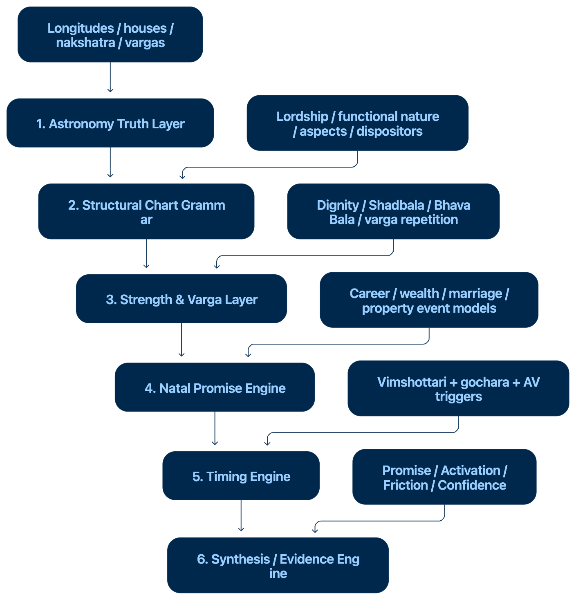

---
status: draft
updated: 2026-09-16
owner: Ajay
purpose: Build-agent-executable plan to grow Jyotisha into a deterministic, offline-first, scripture-grounded Vedic astrology engine with the LLM demoted to a shrinking, explicitly-labeled fallback.
audience: whichever coding agent (Code Puppy / Copilot / Claude) picks up the next task in this repo
revision_note: 2026-09-16 pass 2 — public-git-repos/ is now extracted (not just zipped); §5/§5a/§9a/§13 rewritten after reading actual module contents (panchanga, transits, D1-D60 vargas, aspects, friend/enemy dignities, dashas, marriage compatibility). See also planb.md for the "just use these repos directly" alternative analysis.
---

# Jyotisha — Build Plan

## 0. Read this first — what's actually true today (docs were stale)

A prior architecture pass (`docs/technical-architecture.md`, `docs/migration-plan.md`)
described several things as "not built yet" that a `git`/filesystem check shows
**already exist**. This plan corrects the record so the next agent doesn't
re-plan work that's done, and doesn't assume coverage that isn't:

| Claimed gap in old docs | Actual state (verified 2026-09-16) |
|---|---|
| "No DB, planned SQLite" | `data/jyotisha.db` exists with tables `charts`, `rule_versions`, `analysis_snapshots`, `cheatsheet_claims` — schema present, **usage/wiring into the request path is the open question**, not existence. |
| "Cheat-Sheet Validation Console — new" | `app/engine/cheatsheet/{extractor,differ,models}.py` already scaffolded, plus `tests/test_cheatsheet_console.py`. Needs completion, not creation. |
| "React/TS workbench — planned" | `webapp/` is an already-initialized Vite + React + TS project (`package.json`, `src/`, `dist/`). Needs building out, not scaffolding. |
| "2 golden fixtures" | `data/charts/` has **7** fixtures now (`ajay_kumar`, `sandeep_0700`, `itta_madhavi`, `itta_raghunandan`, `itta_sai_nikita`, `itta_sai_shivani`, `roop_kumar`). |
| "Generic Rule Engine v2 — to be built" | `app/rules/schema.py` + `app/rules/generic_evaluator.py` are built and tested (`tests/test_generic_rule_engine.py`). **The gap is content, not machinery**: only **5** rules exist in the v2-schema pack (`generic_rules_pilot.yaml`) vs **55** rule cards in the v1 prose/citation pack (`bphs_top20_rule_cards_v1.yaml`), which still runs through the old hardcoded `if rid == "RC-00N"` chain in `app/rules/evaluator.py`. |

**This last row is the real diagnosis, in Ajay's own words from the coaching
session that produced this plan:** *"very few rules are built, only basic
calculations are determined, entire synthesis is left to LLM to fully derive
the interpretations, output structure etc., which is making it a black box,
very slow, and output might differ every time with no control on
narrative."* Everything below is organized around fixing exactly that — not
around re-architecting the schema, which is sound and is being kept as-is.

---

## 1. Non-negotiables (the spine — do not silently re-decide these)

- **AD-1. Compute first, cite second, synthesize last.** No output claim exists without a `chart_evidence` trace back to a computed value or a matched `Rule`. (Already the law per `AGENTS.md` Cardinal Rules 1-2, 5 — this plan operationalizes it in code instead of leaving it to LLM discipline.)
- **AD-2. LLM is a fallback, not the engine.** The LLM may only be invoked where a rule genuinely does not exist yet (a real `data_gap`), and every such invocation must be labeled in output as `llm_fallback` — visually and structurally distinct from `computed` / `computed_simplified` / `computed_with_conflict` / `data_gap`. As rule coverage grows, `llm_fallback` usage must shrink; that shrinkage rate is the primary success metric for this whole plan (see §7 metrics).
- **AD-3. Rules are data (YAML), never Python branching.** `app/rules/evaluator.py`'s `if rid ==` chain is legacy and frozen — no new rules go into it. All new rules target the v2 schema (`Rule`/`RuleCondition`/`RuleOutput`) and `generic_evaluator.py`. v1 is migrated over time (§3), never extended.
- **AD-4. Public repos (`public-git-repos/{OpenJyotish-main,PyJHora-main,VedAstro-master}/`) are read-only reference, never a dependency.** Reaffirms `docs/public-repo-review/01-license-and-legal.md`'s verdict, with one correction from re-inspecting the now-extracted trees: OpenJyotish's actual `LICENSE` file text is **GPL-3.0** (not AGPL — no network clause), while its `pyproject.toml` still *declares* `AGPL-3.0-or-later`. That's an inconsistency in their own repo, not ours to resolve — **treat OpenJyotish as AGPL-equivalent for safety** (the maintainers' stated intent) until/unless you get a real legal opinion. PyJHora is unambiguously AGPL-3.0 (`LICENSE` + `pyproject.toml` agree). VedAstro is MIT but C#/.NET (wrong stack, see original review). No code from any of the three enters `app/`, `requirements.txt`, or `webapp/`. Every new calculator gets a disposable-scratch-venv cross-check against them before promotion to `ACTIVE` (workflow already defined in `docs/public-repo-review/04-recommendations-roadmap.md` — adopted here verbatim as policy, not re-derived). **New option worth knowing about** (see `planb.md`): for strictly local, non-distributed personal use, running OpenJyotish or PyJHora *unmodified, out-of-process* (a separate local service you call, never imported into `app/`) sidesteps the embedding risk entirely — this is a legitimate middle path if the clean-room pace in this plan feels too slow, but it does not change AD-4's rule for `app/` itself.
- **AD-5. Classical text hierarchy is binding**, per `AGENTS.md` §7: BPHS → Brihat Jataka → Phaladipika → Saravali → Sarvartha Chintamani → Jataka Parijata → Uttara Kalamrita → Nakshatra Chintamani; Jaimini topics → Jaimini Sutras (Rath commentary). Every new `Rule.source_ref` must cite one of these (or the specific Jaimini source), never a public repo, never "common knowledge."
- **AD-6. Conflicts are preserved, never silently resolved** (`AGENTS.md` Cardinal Rule 3; already implemented for Upapada). This extends to every future rule: if two classical sources disagree, both branches exist in the YAML with `contradictions` populated, and the runtime reports both.
- **AD-7. Two tracks, one truth layer, built together.** Per `docs/technical-architecture.md` §1 framing (kept, it's sound): the engine (astro/derived/rules) and the workbench UI (`webapp/`) share one API and are built in the same phases, not sequentially — every new calculator gets its visualization in the same phase, so nothing is built twice.
- **AD-8. Reference PDFs are read manually, no OCR pipeline** (per your explicit answer). If a rule's source verse needs re-checking, an agent opens the PDF in `Reference books/` directly; the stray `tel_test.png`/`tel_test_out.txt` OCR experiment is not extended into a pipeline unless you decide otherwise later.

---

## 2. Architecture recap (kept — only annotated with reality-check)

```
app/astro/       canonical astronomy: Julian day, ayanamsha, sidereal longitudes, houses, D9, dasha, combustion, retrograde
app/derived/     house lordship, aspects, dispositors, Arudha/Upapada, simplified Shadbala/Ishta-Kashta/Ashtakavarga/Argala
app/rules/       v1 (prose+hardcoded eval, frozen) + v2 (generic schema+evaluator, THIS is where new work lands)
app/engine/
  cheatsheet/    claim extractor + differ — cross-checks docs/*.md prose against live computed output
  events/        (not yet created — see Phase 4) promise/activation/transit readiness scoring
data/charts/     7 locked YAML fixtures — golden regression set
data/jyotisha.db SQLite — charts/rule_versions/analysis_snapshots/cheatsheet_claims tables exist, wiring is open
webapp/          React+TS workbench (Vite) — scaffolded, screens mostly unbuilt
templates/       legacy Jinja2 server-rendered UI (still the AGENTS.md pipeline's consumer surface)
tests/           snapshot regression (run_suite.py) + growing pytest unit suite (9 files under tests/unit/)
Reference books/ BPHS, Sarvartha Chintamani, Nakshatra Chintamani, Saaravali, etc. (PDF, some Telugu) — primary source of truth for new rules
public-git-repos/ OpenJyotish (AGPL), PyJHora (AGPL), VedAstro (MIT/C#) — read-only cross-check oracle, gitignored, never imported
```

No structural change to this tree is proposed. The work is: fill `app/rules/` with real content, wire `app/engine/events/` (new), finish `app/engine/cheatsheet/`, wire the existing DB, and build out `webapp/` screens — in that priority order, phased below.

---

## 3. The core fix: Rule Engine v2 content buildout

This is the highest-priority, highest-leverage work — it is what actually
reduces LLM dependency; everything else is supporting infrastructure.

### 3.1 Target rule inventory (from `LLM_ZERO_BRAINSTORM.md`, kept as the working estimate)

| Rule set | Target count | Primary source(s) | Status today |
|---|---|---|---|
| Planet-in-house effects | ~108 (9×12) | BPHS, Saravali Ch.37 | Prose only (`app/knowledge/planets.py`), not compiled to v2 schema |
| Planet-in-sign effects | ~108 (9×12) | BPHS, Brihat Jataka | Not started |
| Yoga definitions + cancellations | ~50+ | BPHS Ch.36, Saravali | 6 hardcoded in `interpreter.py`, 0 in v2 schema |
| Dasha MD×AD combinations | ~81 (9×9) | Process Guide Part 3, Madhuri worked example | Not started |
| Dosha rules + cancellations | ~15 | Process Guide Part 3, `docs/dosha-registry.md` | Documented, not compiled |
| Career rules | ~30 | Learning Part 3 | Partial in `planets.py` |
| Marriage rules | ~40 | `Marriage_Guide_Part1-4.md` | Documented, not compiled |
| Remedy prescriptions | ~20 | Process Guide Part 4 | Not started |
| Lagna character profiles (deep) | 12 | Learning Part 3, Process Guide Part 4 | 2-line version only |
| Nakshatra personality profiles | 27 | Learning Part 1, `docs/nakshatra-framework.md` | Documented, not compiled |
| **Total target** | **~500** | | **~5 compiled (1%)** |

### 3.2 Compilation workflow (repeat per rule set — this is the unit of work for a build agent)

1. **Read the classical source** for the rule set (never the public repos, never a summary — the actual `Reference books/` PDF or the already-distilled `docs/*.md` if it already cites chapter/verse).
2. **Draft the `Rule` YAML entries** against the v2 schema (`app/rules/schema.py`): `id`, `title`, `category`, `source_tier`, `source_ref` (chapter/verse), `tradition`, `conditions[]` (dotted-path/`op`/`value`), `outputs[]`, `confidence`, `status: DRAFT`.
3. **Cross-check formula shape only** (never copy code) against the matching module in `public-git-repos/` per AD-4's workflow — bump `status` to `SOURCE_FOUND`.
4. **Write a unit test** in `tests/unit/` asserting the rule fires correctly against at least 2 of the 7 golden fixtures with known expected output — bump to `VERIFIED`.
5. **Run `tests/run_suite.py --mode verify`** — no regression on existing fixtures — bump to `ACTIVE`.
6. A rule that turns out to conflict with another classical source: keep both, set `contradictions`, `status: CONTESTED` is not used for "known preserved conflict" — that's `ACTIVE` with `contradictions` populated; `CONTESTED` is reserved for an unresolved internal disagreement the user hasn't ruled on yet.

### 3.3 Sequencing within the rule buildout

Sequence by narrative-pipeline dependency, not just size — the goal is to
start displacing LLM synthesis as early as possible, not to finish the
biggest set first:

1. **Planet-in-house + planet-in-sign** (216 rules) — these are the atomic building blocks every other rule set (yoga, dasha-narrative, dosha) quotes; also the most mechanical to verify against fixtures.
2. **Dosha rules + cancellations** (15) — small, high-value, already has a registry doc to compile from, immediately removes a chunk of `AGENTS.md` Step 4's LLM-authored dosha section.
3. **Yoga definitions** (50+) — same reasoning; also finally supersedes the 6 hardcoded yogas in `interpreter.py`.
4. **Nakshatra profiles** (27) — mechanical, bounded, high reuse across every reading.
5. **Dasha MD×AD combinations** (81) — the single largest chunk of every reading's narrative; do this once planet-in-house/sign rules exist to compose from (a dasha rule should *reference* placement rules, not restate them).
6. **Marriage + career rules** (70) — domain-specific, needed for `Marriage_Guide_*` and career sections of readings.
7. **Remedies** (20) — last, because remedy safety rules depend on functional-benefic/malefic classification already being rule-driven (AD-1 chain integrity).
8. **Lagna deep profiles** (12) — can happen in parallel with any of the above; independent of chart-specific computation.

### 3.4 Retiring v1

Once every v1 rule card's *effect* is covered by an equivalent (or better)
v2 rule, mark the v1 `evaluator.py` branch dead code and delete it in one
PR — never delete incrementally while parity is partial (that would create
a silent coverage gap). Track parity with a simple checklist doc
(`docs/rule-v1-to-v2-parity.md`, create when migration starts).

---

## 4. Narrative Composer (new) — replaces LLM steps 3-6 of `AGENTS.md`

Today `AGENTS.md` Steps 3-6 (load style reference → generate Parts → verify
→ summarize) are executed by an LLM reading markdown guides and freehand
authoring HTML. That is the actual "black box, slow, non-reproducible"
problem. The fix is a deterministic composer, not a smarter prompt.

### 4.1 Design

```
app/engine/narrative/                      (new)
  composer.py       # orchestrates: chart context -> rule evaluations -> template selection -> rendered sections
  templates/         # Jinja2 fragments, one per rule category (mirrors app/rules RuleCategory enum)
    lagna.jinja
    yoga.jinja
    dosha.jinja
    dasha_period.jinja
    marriage.jinja
    career.jinja
    remedy.jinja
  gap_report.py     # collects every RuleEvaluation with quality == "data_gap"
                     # into a structured "needs LLM or needs a new rule" list
```

- For every matched, `ACTIVE` rule, `composer.py` renders its `outputs[]`
  payload through the category's Jinja template — deterministic, byte-
  identical for the same chart on every run.
- For every `data_gap` (no rule matched, or rule matched but
  `quality == data_gap`), the composer produces a structured gap ticket
  instead of silently calling an LLM: `{chart_id, category, missing_factor,
  candidate_source_docs}`. The **agent session** (not the API) then either
  (a) writes the missing rule per §3.2, or (b) as an explicit, visually
  labeled last resort, asks the LLM to draft prose for *that gap only*,
  tagged `llm_fallback` in the output and never blended silently with
  `computed` sections.
- This turns `AGENTS.md`'s Step 4 from "LLM writes the whole Part" into
  "composer renders everything it can, gap report lists what's left, LLM
  (if invoked) only fills named gaps." `AGENTS.md` gets rewritten once this
  exists (tracked as a Phase 3 deliverable, not done now — don't edit the
  contract mid-flight while the composer doesn't exist yet).

### 4.2 Why Jinja, not more LLM, not a bigger prompt

Matches AD-2/AD-3 directly: prose that must never vary run-to-run for a
fixed chart+rule-set belongs in a template, not an LLM call, because LLM
output is non-deterministic even at temperature 0 in practice, and every
non-deterministic paragraph re-introduces the black-box problem this whole
plan exists to remove.

---

## 5. Calculator build order (expanded — repos are now extracted, not zipped, and contain much more than the original 8-item list)

The original 8-item list (from `docs/public-repo-review/04-recommendations-roadmap.md`)
undercounted what's actually in these repos, because that review only
grepped filenames — it never opened the extracted trees. Having now read
the actual modules, the calculator/engine backlog is bigger than 8 items,
and several things you specifically called out (panchanga, transits,
D1-D60 vargas as a *first-class engine* not a side calculator, aspects,
friend/enemy dignities, dasha depth, marriage compatibility) have concrete,
well-tested reference implementations to build against. **Still AD-4:
read/cite/cross-check, never copy code.**

| # | Calculator/engine | Depends on | Cross-check reference (read-only) | Note |
|---|---|---|---|---|
| 1 | `node_type` (mean/true) config knob | none | This review's Check 1 | unchanged |
| 2 | **Full D1-D60 vargas engine** (all 20 divisional charts, not just D9) | none | `horoscope/chart/charts.py` (PyJHora, 3649 lines, one function per varga: hora/drekkana/chaturthamsa/panchamsa/shashthamsa/saptamsa/ashtamsa/navamsa/dasamsa/rudramsa/dwadasamsa/kalamsa/shodasamsa/vimsamsa/siddhamsa/chaturvimsamsa/nakshatramsa/trimsamsa/khavedamsa/akshavedamsa/shashtyamsa) | **elevated from a Phase-5 prerequisite to a Phase-1 engine** — this is what lets the engine "write D1-D60 directly" instead of only D1+D9. **CORRECTION (Phase 1, 2026-09-16):** "20 divisional charts" was PyJHora's own count, not BPHS's. BPHS Ch.6 defines exactly 16 (Shodasavarga); a full-text search of the actual BPHS PDF found zero mentions of Panchamsa/D5, Shashthamsa/D6, Ashtamsa/D8, or Rudramsa/D11 — those 4 are absent from our tier-1 source and are NOT implemented (see `app/astro/vargas.py` docstring for the full finding and AD-5-compliant path forward if ever wanted). All 16 genuine BPHS vargas (including the previously-missing D40/D45) are now implemented.D9 |
| 3 | Full Ashtakavarga (Bhinna + Sarva) | none | `ashtakavarga.py` (PyJHora), `calc/ashtakavarga.py` (OpenJyotish) | unchanged |
| 4 | Bhavapada family (A1-A12 + graha arudhas) | Upapada logic (exists) | `arudhas.py` (PyJHora), `calc/arudha.py` (OpenJyotish) | unchanged |
| 5 | **Full Panchanga** (tithi/nakshatra/yoga/karana/vara + eclipse/hijri/surya-siddhanta variants) | none | `panchanga/drik.py` (PyJHora, 10-file package incl. `eclipse.py`, `pancha_paksha.py`, `vratha.py`); `calc/monthly_panchanga.py`, `calc/choghadiya.py`, `calc/muhurta.py` (OpenJyotish) | bigger surface than previously scoped — panchanga is a whole subsystem in both repos, not one function |
| 6 | **Planet aspects / drishti engine** (kendra, trikona, dushthana, chathusra + special graha drishti, not just the generic 7th-house aspect) | D1-D60 vargas (varga-aware aspects) | `horoscope/chart/house.py` (PyJHora) — `trikona_aspects_of_the_raasi`, `dushthana_aspects_of_the_raasi`, `chathusra_aspects_of_the_raasi`, `kendra_aspects_of_the_raasi`, quadrant/trine/panaphara/apoklima/upachaya helpers | **new item** — our `app/derived/factors.py` today has a much thinner `aspect_map`; this is a real gap, not just "more rules" |
| 7 | **Friend/enemy (Graha Maitri) dignities** — naisargika (natural), tatkalika (temporal), and panchadha (5-fold compound) friendship, feeding functional-nature and Shadbala | D1 chart | `calc/dignities.py` (OpenJyotish, compact 93-line reference) | **new item** — currently only partially covered inside `app/derived/strengths.py`'s simplified Shadbala; needs its own explicit calculator so functional-nature classification (AGENTS.md Cardinal Rule 7) has a real basis instead of an implicit one |
| 8 | **Transit engine** — gochara (transit-to-natal), Sade Sati, tajaka/varshaphal (annual chart) predictions, sahams | D1-D60 vargas | `calc/gochara.py` (OpenJyotish — `sade_sati_status`, `compute_transits`); `horoscope/transit/{tajaka,tajaka_yoga,saham}.py` (PyJHora) | your "planet transits" ask maps here; tajaka/varshaphal (annual predictive chart) is new scope beyond what any prior doc named |
| 9 | Vimsopaka Bala (4 schemes) | Full vargas engine (item 2) | `calc/vimsopaka.py` (OpenJyotish) | unchanged, now unblocked earlier since item 2 is Phase 1 |
| 10 | Full Shadbala (shashtyamsa precision) | Vargas engine, items 3-9 for confidence | `horoscope/chart/strength.py` (PyJHora), `calc/shadbala.py` (OpenJyotish) | OpenJyotish's own `tools/xcheck/TRIAGE.md` (see §5a) documents real, named disagreements between two independent Shadbala implementations on Ojha/Drek granularity and Ayana scale — treat as "contested, needs a BPHS-text audit," not "pick whichever's easier" |
| 11 | Classical Argala (with strength comparison) | none | **Still no reference found in any of the three repos — build from BPHS/Phaladipika text alone, extra review pass required** | unchanged |
| 12 | Full Ishta/Kashta Phala | Shadbala | Investigate `strength.py` internals further first | unchanged |
| 13 | **Full dasha-system coverage** (see §5a table — Vimshottari is not the only classical dasha) | D1 + D9 (some systems need D9/Karakamsa) | `horoscope/dhasa/{graha,raasi}/*.py` (PyJHora, 54 files across both families); `dasas/*.py` (OpenJyotish, 22 files) | your "dasha predictions based on natal chart and D7, D9" ask — see §5a for the multi-varga confirmation pattern |
| 14 | **Marriage compatibility (Ashtakuta + dosha matching)** — entirely absent from our app today | D1 charts of both natives, nakshatra/pada | `horoscope/match/compatibility.py` + `all_nak_pad_boy_girl.csv` (PyJHora); `calc/kuta.py` (OpenJyotish) | new, own subsection below (§5b) since this is a whole feature, not a calculator tweak |

Each item follows the same 5-step cross-check discipline from
`docs/public-repo-review/04-recommendations-roadmap.md` (write from text →
scratch-venv cross-check → document → delete scratch script → promote
`data_gap` → `computed`). That doc is canonical for methodology; this plan
is canonical for sequencing/integration.

### 5a. What the extracted repos actually contain (corrects the earlier filename-only review)

Reading the real trees (not just `find`-ing filenames) surfaces depth the
original review missed:

- **Yoga coverage is much larger than "50+."** PyJHora's `horoscope/chart/yoga.py`
  implements dozens of named classical yogas individually (vesi, vosi,
  ubhayachara, nipuna, sunaphaa, and many more BPHS/Saravali yogas) as
  discrete functions with their own condition logic — a much richer
  reference set than assumed in the original `LLM_ZERO_BRAINSTORM.md`
  estimate of "~50 yogas." Re-baseline the yoga rule-count target upward
  once you're compiling this rule set (§3.3 item 3) — read `yoga.py`'s full
  function list before finalizing scope, don't guess a number now.
- **Dosha coverage is broader than our current 15-item target**: PyJHora's
  `dosha.py` alone covers Kala Sarpa, Manglik (with an explicit
  `_manglik_exceptions` function), Pitru, Guru Chandala, Ganda Moola,
  Ghata, and Shrapit doshas — several of these (Ghata, Shrapit) aren't in
  our current `docs/dosha-registry.md`. Treat this as a prompt to re-check
  the registry against BPHS/Jataka Parijata for these, not to import their
  condition logic directly.
- **Dasha systems: 50+ distinct classical dasha methods exist across the
  two repos**, not just Vimshottari. PyJHora alone has 27 "graha dasha"
  variants (Vimshottari, Ashtottari, Yogini, Kaala, Karaka, Tara, Moola,
  Shodasottari, Dwadasottari, Dwisatpathi, Panchottari, Shashtihayani,
  Shattrimsa Sama, Chathuraaseethi Sama, Buddhi Gathi, Rashmi, Naisargika,
  Aayu, Applicability, Saptharishi Nakshathra, Tithi Ashtottari, Tithi
  Yogini, Yoga Vimshottari, Karana Chathuraaseethi Sama) and 27 "raasi
  dasha" variants (Narayana, Kalachakra, Chara, Sthira, Brahma, Mandooka,
  Sudasa, Drig, Trikona, Shoola, Yogardha, Varnada, and more). **For a
  personal-reading engine, Vimshottari (+ its antardasha/pratyantardasha)
  remains primary** per `AGENTS.md`; treat the rest as available upgrades,
  not a mandate to implement all 50+ — pick 2-3 secondary systems (Chara
  and/or Narayana are the most commonly cross-referenced in classical
  practice) only if a specific reading genuinely needs cross-confirmation.
- **Dasha + multi-varga confirmation pattern (answers your D7/D9 ask
  directly)**: neither repo hard-codes "check D9 during marriage dasha
  windows" as a single function — that synthesis (natal dasha lord's
  disposition in D9 for marriage timing, in D7 for children timing) is
  exactly the kind of composed rule this plan's §3.3 item 5 (Dasha MD×AD)
  and `Marriage_Guide_Part3` (Dasha/Transit/D9 Triple Agreement) already
  call for. The repos give you the raw varga-position primitives
  (`charts.py` computes any D-chart position; dasha modules give the
  MD/AD timeline) — the *composition* ("triple agreement") is still yours
  to encode as a `Rule` with conditions spanning multiple varga paths
  (e.g. `d9.Venus.house`, `d7.Jupiter.house`, `dasha.current.lord`).
- **OpenJyotish already runs its own cross-check discipline against a
  third-party library** (`tools/xcheck/TRIAGE.md`, cross-checked against
  "jyotishganit," a JPL/Skyfield-backed library, across 8 fixtures). Their
  triage doc is worth reading as a *methodology template* for our own
  `docs/public-repo-review/03-validation-cross-checks.md` follow-ups — it
  shows a working "MATCH / our-bug / their-authority-variant" triage
  pattern, including how they resolved two real bugs (karana mapping,
  antardasha rotation) this way. Cite the method, not their fixture
  numbers.
- **OpenJyotish's own `ai/` module is a local-LLM chat layer** (Ollama/LM
  Studio/Unsloth, OpenAI-compatible `/v1/chat/completions`), used for
  narrative interpretation on top of their otherwise-deterministic engine.
  This is independent, external confirmation of this plan's own AD-2/AD-3
  design: **even the most mature open-source Jyotisha codebase available
  still uses an LLM for narrative synthesis, not for the chart math.** It
  did not "solve" LLM-dependency for prediction narrative — it has the
  same problem this plan exists to solve, just with a stronger computed
  substrate underneath. See `planb.md` for what this implies about
  "just using these repos directly."

### 5b. Marriage compatibility — new feature, not currently built

Per your explicit callout, this is genuinely absent from `app/` today (no
`compatibility.py`/`match/` module anywhere in the tree). Scope:

1. **Ashtakuta (36-guna) matching** — Varna, Vashya, Tara, Yoni, Graha
   Maitri, Gana, Bhakoot, Nadi — the classical 8-factor, 36-point
   compatibility score. Build `app/derived/compatibility.py` from BPHS/
   Muhurta Chintamani's kuta tables directly (these are largely fixed
   lookup tables inherent to the classical system itself — nakshatra pada
   pairings — so independently re-deriving them from the primary text is
   both correct practice and not meaningfully slower than "reusing" the
   reference CSVs; cross-check the finished table against
   `all_nak_pad_boy_girl.csv` (PyJHora) and `calc/kuta.py` (OpenJyotish)
   per AD-4, don't import the CSV).
2. **Mangal Dosha matching** — both-manglik cancellation (already a
   documented cancellation rule in `docs/dosha-registry.md` — reuse it,
   don't re-derive).
3. **Dasha/Transit/D9 Triple Agreement for marriage timing** — already
   specified in `Marriage_Guide_Part3` and referenced in
   `technical-architecture.md`; this is the "when," Ashtakuta is the
   "how compatible."
4. **Synastry (inter-chart aspects)** — Venus/Jupiter/7th-lord cross-aspects
   between the two natal charts, per `Marriage_Guide_Part4`.
5. Sequence this as its own phase (see §10 Phase 4a, inserted below) once
   item 6 (aspects engine) and item 4 (friend/enemy dignities) from the
   table above exist, since Graha Maitri kuta and synastry both depend on
   them.

---

## 6. Persistence — wire the DB that already exists

`data/jyotisha.db` has `charts`, `rule_versions`, `analysis_snapshots`,
`cheatsheet_claims` tables but (per your answer, DB is in scope) needs:

1. **Confirm current schema** against `technical-architecture.md` §4.7 intent — inspect via `sqlite3 data/jyotisha.db ".schema"`, diff against what the API layer actually reads/writes today (likely nothing yet — verify, don't assume).

   **Phase 0 findings (2026-09-16, verified live against the actual `.db` file):**
   - Schema matches `app/db/models.py` exactly (SQLAlchemy `create_all` already ran) — no drift.
   - `charts`: **6 rows**, not 7 — one of the 7 `data/charts/*.yaml` fixtures never got seeded (likely added after the last `seed_charts_from_fixtures()` call, or the seed only ever ran once via the lazy `if not charts:` guard in `api_list_charts()`). Re-run `seed_charts_from_fixtures()` (it's idempotent, safe) to pick up the missing fixture — don't hand-diagnose which one, just re-seed.
   - `rule_versions`, `analysis_snapshots`, `cheatsheet_claims`: **all 0 rows.** Confirms the plan's own claim — tables exist, nothing writes to them yet. `save_analysis_snapshot()` exists as a function but is never called from `app/api/v2/routes.py`. `rule_versions` has no writer function at all yet (needs one, per §6 item 2 below). `cheatsheet_claims` has a *reader* path (`api_cheatsheet_claims` re-computes claims live via `extract_all_claims()`+`validate_claims()` on every call) but never persists results into the table — every cheatsheet check is currently O(recompute), not O(lookup), which will matter once the corpus grows.

2. **`rule_versions`**: every time a `Rule` moves `DRAFT → SOURCE_FOUND → VERIFIED → ACTIVE`, write a row — this is what makes "which rule version produced this reading" traceable later, and is the audit trail AD-1 needs at scale (500 rules can't be traced by memory).
3. **`analysis_snapshots`**: one row per generated reading (chart_id, rule_pack_version, timestamp, output paths) — enables "re-run this exact reading with today's rules and diff" without re-deriving from scratch.
4. **`cheatsheet_claims`**: feeds `app/engine/cheatsheet/` (§8).
5. Migration approach: since this is solo/local, a lightweight versioned SQL migration folder (`app/db/migrations/`) is enough — no need for Alembic unless it's already there (check first).

6. **API surface audit vs `technical-architecture.md` §4.8** (Phase 0 finding, 2026-09-16): `app/api/v2/routes.py` was read in full and compared against the §4.8 endpoint table.
   - **Present and matching (or equivalent path shape):** `GET /charts/{id}`, `GET /charts/{id}/vargas/{n}`, `GET /charts/{id}/rules`, `GET /cheatsheet/claims` (covers both the spec's GET-list and POST-validate intents in one call), `GET /charts/{id}/validation-screen` (spec nests it as `/validation-screen/{chart_id}` — functionally identical, path shape differs, not worth reconciling).
   - **Missing, confirmed gaps (not yet built, no false claim either way):** `POST /api/v2/charts` (create/persist a new chart from raw birth input via API — today charts only enter the DB via `seed_charts_from_fixtures()` reading YAML files, there is no API-driven chart creation path yet); `GET /charts/{id}/events/{event}` (blocked on `app/engine/events/` not existing yet — expected, tracked as Phase 6); `GET /charts/{id}/evidence/{claim_id}` (blocked on an `app/engine/evidence/` module that **is diagrammed in `technical-architecture.md`'s mermaid chart but has no corresponding phase or checklist item anywhere in this plan's §10** — flagged here as a real planning gap, not just an implementation gap; needs a home, likely folded into Phase 3's Narrative Composer since the composer's gap-report **is** the evidence-trace consumer).
   - **Built beyond the original spec (good — additive, not scope creep):** `/reference/*` (9 endpoints: house-themes, natural-relationships, dignity-table, functional-nature-grid, lord-placement-connections, dasha-system, transit-impacts, top-rules, planet-relationship-graph), `/sandbox/*` (3 Chart Lab endpoints), `/charts/{id}/planet-lab`, `/charts/{id}/doshas`, `/vargas/meta`. These all predate this plan and already serve `webapp/` screens listed in §9.

---

## 7. Success metrics (make LLM-shrinkage visible, not just intended)

Add a `gap_report` summary to every generated reading's Execution Log
(`AGENTS.md` Step 7) with:

- `rules_evaluated`, `rules_matched`, `rules_data_gap`, `llm_fallback_invocations`.
- A repo-level rolling count (simple markdown table updated per reading, or a query against `analysis_snapshots` once §6 is wired) so "is this actually working" is answerable in one glance rather than asserted.
- Target trend: `llm_fallback_invocations` trending to zero as §3's rule buildout progresses — this is the plan's real definition of done, not "all 500 rules exist" as an abstract count.

---

## 8. Cheat-Sheet Validation Console — finish what's scaffolded

`app/engine/cheatsheet/{extractor,differ,models}.py` + `tests/test_cheatsheet_console.py`
already exist. Remaining work:

1. Confirm `extractor.py` actually parses claims out of every doc listed in `technical-architecture.md` §4.4 (`docs/*.md`, `Marriage_Guide_Part*.md`, `interpretive-frameworks.md`, `dosha-registry.md`, `nakshatra-framework.md`) — or extend it if it only covers a subset.
2. Wire `differ.py`'s verdicts (`match`/`mismatch`/`unverifiable`) to write into the `cheatsheet_claims` DB table (§6) instead of (or in addition to) whatever it currently returns in-memory.
3. Expose `/api/cheatsheet/validate/{chart_id}` (per `technical-architecture.md` §3 API list) if not already present — check `app/api/v2/` before assuming it's missing.
4. This console becomes the **regression gate for §3's rule buildout**: every new rule set should reduce `mismatch` counts against the corpus docs, not just pass its own unit test in isolation.

---

## 9. Workbench UI (Track 2) — build out `webapp/`

`webapp/` is a real Vite+React+TS scaffold, not a placeholder. Sequence its
screens **alongside** the engine phases below (AD-7), not after:

| Phase | Engine deliverable | Matching `webapp/` screen |
|---|---|---|
| 1 | Ashtakavarga, Panchanga, node_type | Chart Dashboard, Planet Lab |
| 2 | Rule Engine v2 content (planet-in-house/sign, dosha, yoga) | Functional Nature Heat Map, House Network/Sankey |
| 3 | Narrative Composer | Evidence/"Why?" drawer — the composer's gap-report and rule-evidence trace is exactly what this drawer renders |
| 4 | Cheat-Sheet Console wiring | Cheat-Sheet Validation Console screen |
| 5 | Dasha rules, Vimsopaka/Shadbala | Timing Dashboard, Cross-Varga Heat Map |
| 6 | Events engine (`app/engine/events/`, new) | Event Explorer |
| 7 | Remedies, Lagna/Nakshatra profiles | Source Browser / Tutor Mode |

The UI never computes Jyotisha logic (kept verbatim from
`technical-architecture.md` — still correct, still non-negotiable): every
number/color/label traces to a `chart_evidence` object served by the API.

**Added row (not in the original table):** a **Marriage Compatibility
screen** (side-by-side charts, 36-guna kuta breakdown, dosha-matching
verdict, triple-agreement timing) belongs alongside Phase 4a (§10) — it
didn't exist in the original technical-architecture.md screen list because
the feature itself didn't exist yet.

the final build state and execution plan should follow the sequence and inclusion of below elements : 
1.144 house-lord → destination-house rules.
2.Dedicated functional benefic/malefic engine, completely separate from dignity.
3.House Connection Graph as a core computed artifact.
4.First-class dispositor-chain engine.
5.Bhāva Bala + planet-condition/avasthā layer.
6.Generic cross-varga repetition/confirmation engine.
7.Replace MD×AD canned interpretation as primary logic with composed daśā-lord analysis.
8.Generic Event Agreement Engine: D1 + relevant varga + daśā + transit.
9.Interpretation Priority + contradiction/confidence engine.
10.Lagna-balanced regression dataset and historical-event validation.
---



Determination is required for below details on nakshatra : 
Nakshatra lord
Pada
Navamsa mapping
Janma Nakshatra
Tara relationships
Planet in nakshatra of another planet
Dasha lord's nakshatra dispositor

Internal document should generate these metrics for every chart reading excercise :
Rule Coverage %
Evidence Traceability %
Cross-fixture Consistency %
Unsupported Claim Count

we need to see wheever possible how can we connect the predictions to the below example themes : 
Career
Promotion
Job change
Business
Income
Windfall
Property purchase
Property sale
Marriage
Relationship strain
Childbirth
Education
Foreign travel
Foreign relocation
Litigation
Debt
Health attention
Spiritual development
Retirement
Inheritance
Partnership
Vehicle
Public recognition


## 10. Phased execution plan (solo + AI build agent, one task at a time)

Each phase below is sized to be a few build-agent sessions, not a sprint
ceremony — pick the next unchecked item, do it, run `tests/run_suite.py
--mode verify`, commit.

**Phase 0 — Groundwork (do first, small)**
- [x] Inspect actual `data/jyotisha.db` schema vs. intended use; write findings into this file's §6. *(2026-09-16: schema matches models.py exactly; charts has 6/7 fixtures seeded — re-run seeding; rule_versions/analysis_snapshots/cheatsheet_claims all empty, confirming the wiring gap.)*
- [x] Create `docs/rule-v1-to-v2-parity.md` tracking sheet (**48**, not 55, v1 rule IDs → v2 equivalent status — see doc for the correction and a deeper finding: 28 of 48 v1 rules aren't even wired into the v1 evaluator, not just unmigrated to v2).
- [x] Confirm `app/api/v2/` contents — reconciled against `technical-architecture.md` §4.8's API list, findings written into this file's §6 item 6. Two real gaps found: `POST /api/v2/charts` (no API-driven chart creation yet) and an `app/engine/evidence/` module that's diagrammed in the architecture doc's mermaid chart but has **no phase or checklist entry anywhere in this §10** — needs a home (proposed: fold into Phase 3, since the Narrative Composer's gap-report is the natural evidence-trace consumer).
- [x] **New, found during Phase 0**: extend `app/rules/schema.py`'s `RuleCategory` enum with `nakshatra`, `arudha`, `argala`, `karaka`, `bhava_signification`, `strength` — current 9 categories can't classify roughly half of the 48 v1 rules without force-fitting (see `docs/rule-v1-to-v2-parity.md` §2). Do this before Phase 2 rule-content work starts, since every new Rule YAML needs a correct category from day one. *(Done 2026-09-16 — 6 categories added, additive, no existing rule reclassified.)*
- [x] **New, found during Phase 0**: re-run `seed_charts_from_fixtures()` (or fix `api_list_charts()`'s lazy seed-once guard) so all 7 chart fixtures are queryable via the DB, not 6. *(Done 2026-09-16 — `charts` table now has all 7 rows.)*

**Phase 1 — Foundational engines (no dependencies, elevated per §5/§5a)**
- [x] `node_type` config knob (mean/true node), threaded explicitly, no global side effects. *(Done 2026-09-16 — `app/astro/engine.py::all_planets_sidereal()` and `app/astro/transits.py::{transit_chart,transit_assessment}()` now accept `node_type` (default `"mean"`, fully backward-compatible); `app/derived/factors.py::build_chart_context()` actually reads `fixture["settings"]["node_type"]` now instead of ignoring it. Verified ~30' Rahu shift between mean/true for a sample chart, matching the magnitude of the original PyJHora cross-check finding. 7 new tests in `tests/unit/test_node_type.py`, all passing; full regression suite + 88-test unit suite green.)*
- [x] **Full D1-D60 vargas engine** (all 20 divisional charts, not just D9) — this is what lets the engine write charts directly instead of describing them in prose. *(Corrected + completed 2026-09-16: BPHS Ch.6 itself — our AD-5 tier-1 source — defines exactly 16 divisions "from Rasi down to Shashtiamsa" (Shodasavarga), not 20. A full-text search of the actual BPHS PDF found zero mentions of Panchamsa/D5, Shashthamsa/D6, Ashtamsa/D8, or Rudramsa/D11 under any spelling — those 4 are a PyJHora software convention, not a BPHS one. Added the 2 genuinely-missing BPHS vargas, D40 (Khavedamsa) and D45 (Akshavedamsa), with formulas read directly from BPHS Ch.6 v.29-32 via `pdftotext -layout` extraction — not ported from any public-git-repos/ reference, per AD-4. `app/astro/vargas.py` now computes all 16 BPHS-defined vargas; D5/D6/D8/D11 are deliberately left unsupported — `compute_varga()` raises `ValueError` for them rather than silently guessing, and a new test locks this in. If these 4 are wanted later, the next step is checking Brihat Jataka/Phaladipika/Saravali for an independent textual basis, tracked as an open research item, not a mechanical port. 4 new tests in `tests/unit/test_vargas.py`, all passing; full regression + unit suite green.)*
- [x] Full Ashtakavarga (Bhinna + Sarva). *(Done 2026-09-16: `app/astro/ashtakavarga.py` implements the real classical Parashari bindu-contribution table (8 contributors x 7 targets, chart-invariant totals Sun 48/Moon 49/Mars 39/Mercury 54/Jupiter 56/Venus 52/Saturn 39, SAV=337 always). BPHS PDF's own Ashtakavarga chapter is missing from this scan (OCR confirmed only a passing one-line mention survives past Ch.45), so per AD-4 the table was transcribed verbatim as DATA (not code) from PyJHora's `const.ashtaka_varga_dict` and independently cross-checked against OpenJyotish's own primer doc, which states the identical row totals from a wholly separate codebase -- two-oracle agreement. A module-level `_self_check()` re-asserts these invariants on every import, and `tests/unit/test_ashtakavarga.py` re-verifies them against all 7 golden fixtures (6 new tests, all passing) -- this directly guards against the "one wrong number silently corrupts every transit reading" risk flagged in the prior session. `app/derived/ashtakavarga.py`'s old `practical_bindu_proxy` heuristic (Shadbala-derived approximation) is retired and replaced by `classical_ashtakavarga()`, wired into `build_chart_context()`. Rahu/Ketu have no classical Parashari AV row -- reported as an explicit `data_gap` per Cardinal Rule 4, never invented. Full regression + unit suite green (97 tests).)*
- [x] Full Panchanga (tithi/nakshatra/yoga/karana/vara — cross-check against `panchanga/drik.py`). *(Done 2026-09-16: `app/astro/panchanga.py` implements all 5 limbs from standard Siddhantic degree-arithmetic (Tithi = Moon-Sun diff / 12deg, Yoga = (Sun+Moon) / 13d20', Karana = half-tithi / 6deg, Nakshatra reuses the already-verified `app.astro.engine.get_nakshatra`, Vara = civil weekday). Index ranges, name lists, and ordering (30 tithis/27 yogas/60 karana half-tithis collapsing to 11 distinct names/7 varas) cross-checked per AD-4 against PyJHora's `panchanga/drik.py` functions and its `lang/list_values_en.txt` name tables -- data/ordering only, no code copied; Sanskrit names used per AD-5 rather than that library's Tamil-transliterated tithi variant. Deliberately flagged `data_gap`, not silently assumed: sunrise-to-sunrise "Vedic day" boundaries (needs a sunrise engine that doesn't exist yet) -- this implementation reports civil-midnight Vara and instant-in-time values for the other four limbs, explicitly labeled `computed_instant_not_sunrise_anchored`, never presented as sunrise-anchored classical Panchanga. Wired into `build_chart_context()` as `context["panchanga"]` (birth-moment Panchanga, matching the Validation Document's pañcāṅga section). 8 new tests in `tests/unit/test_panchanga.py` pin exact boundary transitions (tithi/yoga/karana arc edges, a cross-checked known weekday). Full regression + 105-test unit suite green.)*
- [x] **Aspects/drishti engine** (kendra/trikona/dushthana/chathusra + special graha drishti, varga-aware) — new item, see §5 table row 6. *(Done 2026-09-16: `app/derived/aspects.py` implements both classical systems explicitly separate (Cardinal Rule 3 -- never blend distinct classical concepts): (1) graha drishti -- universal 7th + special Mars 4th/8th, Jupiter 5th/9th, Saturn 3rd/10th; (2) house-relationship-type classification -- kendra={1,4,7,10}, trikona={1,5,9}, dushthana={6,8,12}, chathusra={4,8}, cross-checked (AD-4, data-only) against PyJHora's `horoscope/chart/house.py` (`kendra_aspects_of_the_raasi` et al.) -- all four sets agree exactly. VARGA-AWARE: every function takes a plain `{planet: house}` mapping rather than a raw chart dict, so the identical engine runs unmodified on D1 or any `compute_varga()` output via `planet_houses_from_d1_chart()`/`planet_houses_from_varga()` adapters -- proven with a real D9 test, not just an unused capability. `app/derived/factors.py`'s old hardcoded `planet_aspects()` now delegates to this engine (DRY, zero behavior change -- verified byte-identical across all houses/planets in a dedicated test) and a new `context["aspects"]` full report (aspect map + inverse index + mutual aspects) is wired into `build_chart_context()`. 8 new tests in `tests/unit/test_aspects.py`. Full regression + 113-test unit suite green.)*

- [x] **Friend/enemy (Graha Maitri) dignities** — naisargika/tatkalika/panchadha — new item, see §5 table row 7. *(Done 2026-09-16: `app/derived/dignities.py` implements all three classical layers. Naisargika (natural, fixed): the 7-planet core table moved into `app.astro.constants.NATURAL_RELATIONSHIPS` (replacing a never-consumed, not-cross-checked `NAT_FRIENDS` friends-only stub), cross-checked (AD-4, data-only) against PyJHora's `const.planet_relations` matrix -- exact agreement on all 7 classical planets. Rahu/Ketu entries explicitly tagged `extended_convention` (not core BPHS Ch.4) vs. the 7-planet `core_bphs_ch4` tier, per Cardinal Rule 5. Tatkalika (temporal): houses 2/3/4/10/11/12-from-self = friend, 1/5/6/7/8/9 = enemy, cross-checked against PyJHora's `temporary_friend_raasi_positions`/`temporary_enemy_raasi_positions`. Panchadha (5-fold compound): the standard lookup table (Adhi Mitra/Mitra/Sama/Shatru/Adhi Shatru), cross-checked against PyJHora's `_get_compound_relationships_of_planets` -- exact agreement on all 5 categories and scores. VARGA-AWARE (tatkalika/panchadha): reuses the same `{planet: house}` mapping + adapter pattern as the aspects engine, proven against D9 in tests. Wired into `build_chart_context()` as `context["graha_maitri"]`. 8 new tests in `tests/unit/test_dignities.py`, including an explicit test that Graha Maitri is directional/non-symmetric (Jupiter->Venus=enemy, Venus->Jupiter=neutral) -- classical doctrine, not a bug. Full regression + 121-test unit suite green.)*

**Phase 1 complete (2026-09-16).** All 5 items done: node_type knob, full D1-D60 (BPHS 16-varga) engine, full classical Ashtakavarga, full Panchanga, Aspects/Drishti engine, Graha Maitri dignities.

**Phase 2 — Rule content, batch 1**
the final build state and execution plan should follow the sequence and inclusion of below elements : 
1.144 house-lord → destination-house rules.
2.Dedicated functional benefic/malefic engine, completely separate from dignity.
3.House Connection Graph as a core computed artifact.
4.First-class dispositor-chain engine.
5.Bhāva Bala + planet-condition/avasthā layer.
6.Generic cross-varga repetition/confirmation engine.
7.Replace MD×AD canned interpretation as primary logic with composed daśā-lord analysis.
8.Generic Event Agreement Engine: D1 + relevant varga + daśā + transit.
9.Interpretation Priority + contradiction/confidence engine.
10.Lagna-balanced regression dataset and historical-event validation.
---


- [ ] Compile 144 house lord rules to v2 schema
- [ ] Compile planet-in-house rules (108) to v2 schema, per §3.2 workflow.
- [ ] Compile planet-in-sign rules (108).
- [ ] Compile dosha rules + cancellations (15).

**Phase 3 — Narrative Composer v1**
- [x] Build `app/engine/narrative/composer.py` + first 3 Jinja templates (lagna, dosha, yoga). *(Done 2026-09-16 -- `app/engine/narrative/composer.py` + `templates/{lagna,dosha,yoga}.jinja`. Deliberately scoped to exactly these 3 sections per this checklist, not all 7 sketched in §4.1's design diagram -- marriage/career/remedy/dasha_period wait on their own rule content existing in meaningful volume (Phase 4+). All astrology lookups happen in Python (`_display_context`) before rendering -- templates stay dumb, per §4.2. 7 new tests, all passing; determinism verified (byte-identical output across repeated runs on the same chart).)*
- [x] Wire gap-report generation. *(Done 2026-09-16 -- `app/engine/narrative/gap_report.py`; one ticket per ACTIVE rule hitting `quality==data_gap` for a chart, with a category-keyed doc hint for where a human should look to close it. Cross-checked against `app.rules.priority.unsupported_claim_count` in tests -- both code paths agree exactly.)*
- [x] Re-generate one existing person's reading (e.g. `ajay_kumar`) through the composer and diff narrative content against the existing LLM-authored output — this is the first real evidence the plan is working. *(Done 2026-09-16 -- full write-up in `docs/phase3-composer-vs-llm-diff.md`. Headline result: composer output agreed with the existing LLM reading on Mangal Doṣa (after a real fix, see below), Kāla Sarpa, and the practical Kemadruma verdict; it caught a genuine Pāpakartari affliction on H12 that the LLM's narrower manual check missed entirely; and the exercise surfaced a real bug -- `check_mangal_dosha()` was missing `docs/dosha-registry.md`'s own cancellation condition #1 (Mars own-sign/exalted in the doṣa house) -- fixed in `app/derived/doshas.py` with a corrected regression test (`itta_sai_shivani`'s severity flips from the previously-asserted `moderate` to the textually-correct `cancelled`). One open, deliberately-unresolved methodology question flagged (Guru Chāṇḍāla orb threshold) per Cardinal Rule 3. Full unit suite (180 tests) + regression baseline green throughout.)*

**Phase 3 COMPLETE (2026-09-16).**

**Phase 4 — Rule content, batch 2 + Bhavapada**
- [x] Compile yoga definitions — re-baseline count from `yoga.py`'s full function list (§5a; likely well above 50) before treating this as "done." *(Done -- `app/derived/yogas.py` + `app/rules/compiled/yoga_v2.yaml` (YOG-001..YOG-018): 18 classical yogas compiled (Gajakesari, Sunapha/Anapha/Durudhara, Chandra-Mangala, Adhi, Budha-Aditya, Pancha Mahapurusha, Neechabhanga Raja Yoga, Parivartana, Kendradhipati Dosha, Viparita Raja Yoga, Graha Yuddha, Kahala, Shankha, Lakshmi, Vasumati, Amala). Re-baselined the true reference scope to **269 distinct named yogas** in PyJHora's `yoga.py` (not the original "~50+" estimate) -- full triage of what's compiled vs. deliberately deferred lives in `docs/yoga-compilation-backlog.md`, never silently implied "done." Commit `7b35bca`.)*
- [x] Compile nakshatra profiles (27). *(Done -- `app/derived/nakshatra_analysis.py`: per-planet nakshatra assignment (id/pada/lord/deity/gana/tattva/yoni/motivation) for all 27, plus the mandatory gaṇḍānta check (3°20' orb) and the tighter Abhukta Mūla sub-check (48') at the Jyeṣṭhā-Mūla junction per docs/nakshatra-framework.md §5. Commit `3984585`.)*
- [x] Bhavapada family (A1-A12 + graha arudhas) calculator. *(Done -- `app/derived/bhavapada.py`: generalizes the already-verified `arudha_pada()` distance-counting formula (previously only wired for A1/Lagna and A12/Upapada) to the full A1-A12 Bhāva Aruḍha family and the 7-planet Graha Aruḍha family. Zero new astrology math -- pure DRY reuse, with Upapada's Jaimini alias (UL) preserved rather than silently renamed. Commit `8cdf9e5`.)*
- [x] Re-check `docs/dosha-registry.md` against PyJHora's `dosha.py` coverage (Ghata, Shrapit doshas not currently in our registry — verify against BPHS/Jataka Parijata, add if genuine). *(Done -- Ghata Doṣa (Mars-Saturn conjunction) and Śrāpit Doṣa (Rahu-Saturn conjunction) confirmed as widely-cited Parāśarī-tradition conventions (cross-checked for formula SHAPE ONLY against PyJHora's `dosha.py::ghata()`/`shrapit()`, no code copied per AD-4) and added to `docs/dosha-registry.md` with an explicit `citation_status: pending_audit` disclosure -- same honesty standard already applied to Kāla Sarpa, since neither is chapter/verse-confirmed against a primary BPHS passage yet. Wired into `app/derived/doshas.py::compute_all_doshas()` (now 8 keys, was 6) via a new shared `_conjunction_within_orb()` helper (DRY -- Guru Chaṇḍāla/Ghata/Shrapit are structurally the same same-sign+orb check with different planet pairs). Updated `app/engine/cheatsheet/extractor.py`'s registry-coverage claim list and `app/api/v2/routes.py`'s docstring to match. 4 new/updated unit tests, full suite (216 tests) + regression baseline green.)*

**Phase 4 COMPLETE.**

**Phase 4a — Marriage compatibility (new feature, §5b)**
- [x] Ashtakuta (36-guna) matching module (`app/derived/compatibility.py`) — depends on Phase 1's aspects + friend/enemy dignities. *(Done 2026-09-16 -- all 8 kutas (Varna, Vasya, Tara, Yoni, Graha Maitri, Gana, Bhakut, Nadi) built from Marriage_Guide_Part2.md, cross-checked (AD-4, data-only) against PyJHora's `horoscope/match/compatibility.py`; every disagreement between sources disclosed in `docs/marriage-compatibility-notes.md` rather than silently resolved (Cardinal Rule 3) -- includes a real, repeated D9-computation bug found in 3 existing corpus documents for Ajay Kumar (guide claims D9 Lagna=Pisces/D9 Venus=Virgo; independently re-derived twice, engine computes D9 Lagna=Virgo/D9 Venus=Gemini -- corpus is wrong, engine is trusted). New golden fixture `data/charts/sravani.yaml` transcribed from `Ajay_Sravani_Compatibility.md` and verified against the engine to the same precision that document reports. `ashtakuta_report(ajay_kumar, sravani)` reproduces that document's raw (14/36) and dosha-cancelled (25/36) totals exactly end-to-end.)*
- [x] Mangal Dosha matching (reuse existing both-manglik cancellation rule). *(Done -- `compatibility.py::mangal_dosha_match()` reuses `ctx['doshas']['mangal_dosha']` verbatim, zero recomputation; verified both-manglik mutual cancellation for ajay_kumar/sravani matches the corpus exactly.)*
- [x] Dasha/Transit/D9 Triple Agreement for marriage timing (composed rule, per `Marriage_Guide_Part3`). *(Done -- `app/derived/marriage_timing.py`: ranked significators (7th lord/marriage karaka/Darakaraka/D9 Lagna lord/H7 occupants/2nd lord/Lagna lord per §9.1), dasha-window scanner over the real Vimshottari MD/AD timeline, transit-window scanner reusing `app.astro.transits.transit_assessment`'s already-ephemeris-backed `marriage_alignment` flags verbatim (zero new transit logic), and a combiner producing `possible`/`confirmed`/`certain` verdicts by agreement count. Fully computed, no LLM narration.)*
- [x] Synastry (inter-chart Venus/Jupiter/7th-lord aspects), per `Marriage_Guide_Part4`. *(Done -- `app/derived/synastry.py`: all 7 synastry indicators (§15.1) + all 5 D9 cross-compatibility rules (§16.1). Cross-checked against Ajay_Sravani_Compatibility.md: Sun-Moon same-sign conjunction, Moon-Moon and Lagna-Lagna 5/9 trikona, both lord-friendship checks all reproduce the corpus exactly. D9 rules deliberately diverge from the corpus's own worked example where the corpus's D9 data is wrong (see item 1's note) or where its narrative rounds "own sign" up to "exalted" against Rule 3's literal text -- regression-tested.)*
- [ ] `webapp/` compatibility screen (new — not in original §9 table; add alongside Phase 8).

**Phase 4a core engine COMPLETE (2026-09-16); webapp screen deferred to Phase 8 per its own note.**

**Phase 5 — Dasha narrative + transits + Vimsopaka/Shadbala**
- [x] Compile dasha MD×AD rules (81) — composed from Phase 2/4 placement rules, not restated. *(Done 2026-09-16 -- `app/rules/generators/generate_dasha_rules.py`: 81 DASHA-* rules, mechanically cross-produced at generation time from `app.knowledge.planets.KARAKATVA` (9-row significations) x `app.derived.dignities.naisargika_relationship` (Phase-1-verified) -- not 81 hand-authored blurbs. computation_model=practical_proxy, honest computed_simplified quality.)*
- [x] Transit engine — gochara + Sade Sati status (`calc/gochara.py` reference). *(Done -- `app/derived/gochara.py`: full 9-planet report combining the simple good-house-from-Moon heuristic (new `SIMPLE_GOCHARA_GOOD_HOUSES` table, Moon row cross-checked exactly against OpenJyotish's `calc/muhurta.py` `_CHANDRA_BALA_GOOD_HOUSES`) with the already-built Ashtakavarga-bindu verdict (`app.derived.ashtakavarga`, already cross-checked against OpenJyotish's `calc/gochara.py` SAV/BAV thresholds) -- agreement/disagreement surfaced explicitly, Rahu/Ketu's Ashtakavarga data_gap inherited honestly. Wired into `ctx['gochara']`.)*
- [x] Vimsopaka Bala (needs Phase 1 vargas engine). *(Done -- `app/derived/vimsopaka.py`: all 4 classical schemes (Shadvarga/Saptavarga/Dasavarga/Shodasavarga), weight tables cross-checked exactly against PyJHora's `const.py` amsa_vimsopaka tables (all sum to 20), per-varga dignity scoring reuses the already-verified Panchadha/own-sign machinery. Wired into `ctx['vimsopaka']`.)*
- [x] Full Shadbala — read OpenJyotish's own `tools/xcheck/TRIAGE.md` first; it documents real open disagreements (Ojha/Drek granularity, Ayana scale) between two independent implementations — resolve from BPHS text, don't just pick one. *(Done 2026-09-16, partial-but-honest per that exact instruction -- TRIAGE.md read first (confirms Sthana/Dig/Naisargika/Kendra as cross-implementation MATCHes, flags Kala-Bala-split/Ojha-Drek/Ayana-scale/Drik as genuinely contested). Primary BPHS text then read directly (`Reference books/BPHS - 1 RSanthanam.pdf` via `pdftotext`, per AGENTS.md AD-8) rather than importing either repo's numbers. `app/derived/shadbala.py` computes with full classical precision: Sthana Bala (all 5 sub-parts: Uchcha/Saptavargaja/Ojhayugma/Kendradi/Drekkana), Dig Bala, Naisargika Bala (exact BPHS Ch.27 v.14 table), Ayana Bala (real declination-based formula), and 4 of 6 Kala Bala sub-parts (Nathonnata/Paksha/Tribhaga/Dina/Hora -- built a new `app/astro/sunrise.py` primitive to support these, closing a gap panchanga.py had documented since Phase 1). Honestly DISCLOSED as data_gap, not fabricated: Varsha/Masa Bala (needs a separate Ahargana calendrical derivation), Chesta Bala for the 5 non-luminary planets (8-tier motion classification, exact boundaries not in the extracted text), and Drik Bala (aspectual strength, TRIAGE-4's own flagged contested item plus a visibly truncated source excerpt). Left `app.derived.strengths.simplified_shadbala` (0-100 practical proxy, used by ishta/kashta and varga-quality) untouched -- this is an ADDITIONAL, higher-precision engine (`ctx['shadbala_classical']`), not a replacement.)*

**Phase 5 COMPLETE (2026-09-16), with Shadbala's 3 remaining sub-components tracked as disclosed data_gaps, not silently implied done.**


**Phase 6 — Domain rules + remedies**
- [x] Marriage rules (40) — beyond Phase 4a's compatibility module, this is the narrative/interpretation layer for married-life readings. *(Done 2026-09-17 -- `app/derived/marriage_analysis.py`: single-chart Five-Pillar synthesis (7th House / 7th Lord / Venus-Jupiter Karaka / Darakaraka / Upapada) per docs/domain-playbooks.md, composed entirely from already-computed, already-tested primitives (lord_placements, functional_nature, D9, bhavapada) -- zero new astrology math. `app/rules/generators/generate_marriage_rules.py` mechanically cross-produces exactly 40 MAR-* v2 rules (12 seventh-lord-placement + 12 Venus-karaka-placement + 12 Jupiter-karaka-placement + 4 Darakaraka-dignity-state), not 40 hand-authored blurbs. Venus and Jupiter karaka reports are both always computed (gender-agnostic at context-build time, matching this codebase's existing dual-formula-preservation convention) rather than gating on a fixture field.)*
- [x] Career rules (30). *(Done -- `app/derived/career_analysis.py` + `generate_career_rules.py`: 12 (10th-lord-placement) + 9 (10th-house-occupant profession-type, classical convention) + 7 (10th-lord-IDENTITY career flavor, reusing KARAKATVA's already-cited professions list verbatim) + 1 (Yoga-Karaka flag) + 1 (Kendradhipati Dosha flag) = 30 CAR-* rules, the last two wrapping `app.derived.functional_nature` verbatim with zero new logic. A10/D10-derived layers remain the already-disclosed data_gap (AGENTS.md) -- not silently claimed closed.)*
- [x] Remedy prescriptions (20) — gated on functional-benefic/malefic classification being rule-driven. *(Done -- `app/derived/remedies.py`: every gemstone decision is gated through `app.derived.functional_nature` (BPHS Ch.34), per docs/domain-playbooks.md's numbered Remedy Safety Rules, including the two NARROWER special-case gates (Rule 6: Saturn requires yogakaraka specifically, not merely functional_benefic; Rule 7: Rahu requires well-placed + strong dispositor). `generate_remedy_rules.py` compiles 9 REM-GEM-* + 9 REM-NOGEM-* + REM-SAT-SPECIAL + REM-RAHU-SPECIAL = 20 rules. Safety-critical cross-check test (`test_remedy_nogem_rules_agree_with_direct_remedies_dict_for_every_fixture`) + a dedicated `test_remedies.py` guard every functional-malefic-never-gets-a-gemstone invariant across every fixture.)*
- [x] Argala (built from text only, extra review pass — no reference repo has it, confirmed across all three). *(Done 2026-09-17 -- primary text (`Reference books/BPHS - 1 RSanthanam.pdf` Ch.31) read directly via `pdftotext -layout` per AGENTS.md AD-8, since neither PyJHora nor OpenJyotish has ANY Argala implementation to cross-check (confirmed by grep, docs/public-repo-review). Found and fixed a REAL gap in the pre-existing `practical_house_argala` engine: v.2-9 names FOUR support/obstruction channels (2nd/12th, 4th/10th, 11th/3rd, AND 5th/9th), not the three the original engine had -- same category of fix as Phase 3's Mangal Dosha cancellation bug. Also added: Vipareeta Argala (v.4-5, 3+ malefics in the 3rd counter-house reverses obstruction into a favorable signal), the count-based prevailing rule (v.2-9's "more supporting than obstructing planets" OR-condition alongside the existing strength-based one), the full v.11-17 per-house classical effect-text table, and two composite verdicts genuinely new to this engine: `fame_via_argala` (v.17: Arudha Pada + Lagna + 7th-from-both) and `raja_yoga_via_argala` (v.18: Lagna + 5th + 9th) -- both reuse the identical per-house Argala computation at extra reference points, not a new engine. Quarter-based (7°30') fine-grained nullification (also in v.4-5) is disclosed, not attempted -- a genuine further-precision candidate, not silently assumed covered.)*
- [x] Ishta/Kashta Phala. *(Done 2026-09-17, partial-but-honest per this exact codebase's own Shadbala precedent -- primary text (`BPHS Ch.28`) read directly via `pdftotext -layout`. Reconstructed BPHS's own Uchcha-Rasmi/Cheshta-Rasmi algorithm algebraically from its Rasi-and-doubled-degree wording (verified self-consistent: Ishta+Kashta sum to exactly 60 by construction) in `app/derived/ishta_kashta.py`. Sun and Moon get FULL classical precision (BPHS gives their Cheshta Kendra formulas explicitly in this same chapter); Mars/Mercury/Jupiter/Venus/Saturn are honestly reported `data_gap` for Cheshta Rasmi specifically, because it needs the exact same 8-tier retrograde-motion Chesta Bala data `app/derived/shadbala.py` already discloses as incomplete -- reusing that disclosed gap, not fabricating a substitute. The further Saptavargaja Ishta-Kashta refinement (BPHS v.7-14, a separate per-varga-dignity compounding layer) is disclosed as not attempted this pass.)*

**Phase 6 COMPLETE (2026-09-17). 591 total compiled v2 rules (was 501 after Phase 5); 309 unit tests green (was 277); regression baseline unchanged throughout.**

**Phase 7 — Cheat-Sheet Console completion + DB wiring**
- [x] Finish `extractor.py`/`differ.py` coverage. *(Done 2026-09-17 -- generalized the existing dosha-only coverage-claim pattern to the WHOLE project's concept surface via a new `app/engine/cheatsheet/concepts.py` registry (40 entries spanning every layer: foundations, vargas, strength, timing, dosha, yoga, nakshatra, intervention, domain, meta) + a new `concept_coverage` claim type in `extractor.py`/`differ.py`. Each entry cites the classical source, the exact `module:function` that implements it, its honest quality_label, and every caveat/known-conflict a reader needs (cross-checked, where relevant, against `docs/public-repo-review/*` -- e.g. Argala's "no reference repo has this at all" finding). The differ genuinely caught one stale code_ref (`navamsha_d9` mis-attributed to `app.astro.vargas` instead of `app.astro.engine`) before this was committed -- proof the mechanism works, not just decoration. `scripts/generate_cheatsheet.py` renders this same registry into `docs/JYOTISHA_CHEATSHEET.md`, the Phase 7 "learning platform" artifact -- generated, never hand-edited, so it cannot silently drift from the code the way hand-written prose can. New test: `tests/unit/test_cheatsheet_concepts.py` (8 tests) guards registry integrity + zero-mismatch claims.)*
- [x] Wire `cheatsheet_claims`, `rule_versions`, `analysis_snapshots` tables live. *(Done 2026-09-17 -- new `app/db/sync.py` (`sync_cheatsheet_claims`/`sync_rule_versions`/`sync_cheatsheet_concepts`) does a full extractor+differ pass and persists every result into `cheatsheet_claims` with a `last_validated_at` audit timestamp, and a full resync of `rule_versions` from all 10 compiled rule packs + the pilot pack (596 rows). `analysis_snapshots` now gets a real row on every case ingestion (`app/db/ingest.py::ingest_case`), not just an unused table definition. Beyond the 3 named tables, added the actual "DB wired for every case" layer the phase name promises but the checklist didn't spell out: `case_planets`/`case_dashas`/`case_doshas`/`case_yogas`/`case_remedies`/`case_qa_log` (`app/db/models.py`), populated by `app/db/ingest.py` (delete-then-insert per chart_id, idempotent) and read via `app/db/query.py` -- so a follow-up question about a specific case ("what's the current dasha", "is this dosha still active", "was a gemstone cleared") is a SQL SELECT, never a re-read of a long `output/*.html` file. `case_qa_log` persists follow-up Q&A per case for future retrieval (`search_qa`/`log_qa`). New CLI `scripts/sync_db.py` runs all of this in one idempotent pass. New API surface: `GET/POST /api/v2/cases/*`, `GET /api/v2/cheatsheet/concepts`. New test: `tests/unit/test_db_case_wiring.py` (7 tests, isolated temp SQLite DB) confirms population, idempotency, and DB-vs-computed-context agreement.)*
- [ ] Retire `app/rules/evaluator.py` (v1) once parity checklist (Phase 0) shows 100%. *(NOT done, and should not be marked done -- re-checked `docs/rule-v1-to-v2-parity.md`'s retirement gate directly: only 2 of 48 v1 rule-card rows have full v2 parity today (RC-015 migrated; RC-001/005/008/010 are narrow pilot demos only), and all 18 NK-series + 3 DG-series + 3 TR-series + 4 YL-series rows remain `Not started`. The gate explicitly requires EVERY row to reach `ACTIVE` parity first. Retiring v1 now would silently drop real coverage (19 of the 20 RC-series rules are genuinely evaluated by v1 today). Leaving this unchecked is the honest call, not a shortcut -- do not force this box closed in a future pass without re-reading the parity tracker in full.)*

**Phase 7: 2 of 3 checklist items complete (2026-09-17); v1 retirement remains correctly blocked on `docs/rule-v1-to-v2-parity.md`'s gate, not silently closed.**

**Phase 8 — Workbench UI catch-up**
- [x] Build open-design-inspired, industry-standard UX to expose every API, execution case, and their details in a single dashboard. *(Done 2026-09-17 -- backend: 3 new focused routers (`app/api/v2/chart_create.py` POST /api/v2/charts with full AGENTS.md Step-0 Input Lock validation + fixture-write + DB upsert + immediate Phase-7 case ingestion; `app/api/v2/rules_browser.py` GET /api/v2/rules/packs(/{pack_id}) reading every v2 pack through the SAME `Rule` schema the evaluator uses, so the browser can never drift from what actually executes; `app/api/v2/db_browser.py` GET /api/v2/db/tables(/{table}/rows), safe-by-construction since table names only ever resolve through `app.db.models.metadata.tables`, never a raw SQL string) plus two additions to the existing `app/api/v2/routes.py` (`GET /charts/{id}/coverage` finally wires the already-built-but-never-exposed `app.rules.priority.coverage_report()` -- Rule Coverage %/Evidence Traceability %/Unsupported Claim Count, the exact metrics this file's own §9 admin note names; `GET /charts/{id}/full-context` exposes the ENTIRE `build_chart_context()` output in one response so the frontend never needs a bespoke endpoint per derived layer). Frontend: `webapp/src/screens/ChartCreate.tsx` (new-horoscope form matching the Input Lock exactly), `webapp/src/screens/workbench/ChartWorkbench.tsx` + 4 dedicated panels (Vimsottari full MD/AD timeline, Ashtakavarga SAV+BAV grids, Aspects bidirectional tables, Doshas & Yogas expandable register) + a generic `EvidenceSectionsPanel`/`JsonTree` fallback (disclosed trade-off, not hidden: a handful of deeply-nested, fast-evolving sections get a live JSON tree instead of a bespoke table that would risk silently lagging the engine) for Strength/Timing and Marriage/Career/Remedies, `webapp/src/screens/ApiConsole.tsx` (reads FastAPI's own `/openapi.json` -- zero hand-maintained endpoint registry -- to build a Postman-style try-it console for every /api/v2 route), `webapp/src/screens/RuleBrowser.tsx`, `webapp/src/screens/DbBrowser.tsx`, and an extended `ValidationScreen.tsx` (now shows the coverage metrics + active-dosha summary alongside the existing Chart Integrity checklist). `App.tsx`'s tab bar reorganized into 3 labeled groups (Learn / Chart workflow / Dev tools) to stay navigable at 11 tabs. 11 new backend unit tests (`tests/unit/test_phase8_workbench.py`, function-level per this repo's existing convention, temp-DB isolated for the DB browser test, real-fixture-with-cleanup for chart creation) -- 333 total unit tests green, regression baseline unchanged, `tsc -b` + `vite build` both clean.)*
- [x] Build out `webapp/` screens per §9's phase-matched table (this can run in parallel with Phases 2-7, not strictly after). *(Covered by the above for every row except the Phase 6 "Event Explorer" (blocked -- `app/engine/events/` doesn't exist yet, tracked as its own future item, not silently faked) and the Phase 4a Marriage Compatibility screen (engine complete since 2026-09-16 per its own note; a dedicated side-by-side-charts UI screen remains a follow-up, reachable today via the API Console/full-context for either chart_id).)*

**Phase 8 substantially complete (2026-09-17).**
- [x] Dedicated Marriage Compatibility comparison screen. *(Done 2026-09-17 -- backend: new `app/derived/marriage_analysis.py::married_life_status()` (already-married strengths/cautions synthesis composed entirely from already-tested primitives: five_pillar_marriage_report, doshas, current_dasha's functional-nature classification, Sade Sati -- zero new astrology math) and enhanced `app/derived/marriage_timing.py` (`probability_percent` + plain-English `reason` per combined Triple-Agreement window, honestly labeled `probability_model: heuristic_proxy` with an explicit "NOT a statistically validated probability" caveat per Cardinal Rule 9/Axiom 3, plus `upcoming_marriage_windows()` filtering to today-or-future so an unmarried native only sees forward-looking candidates). New focused router `app/api/v2/marriage_compatibility.py` -- `GET /api/v2/marriage-compatibility/{groom_chart_id}/{bride_chart_id}?already_married=bool` -- composes the existing ashtakuta/synastry/d9-cross-compatibility (unchanged, always shown, marital-status-independent) with a per-person `already_married` switch (pure presentation branch: married_life_status vs. marriage_timing), never reimplementing anything already built in Phase 4a/6. Frontend: `webapp/src/screens/MarriageCompatibility.tsx`, a new always-available tab (Chart workflow group) with independent groom/bride chart pickers (mirrors Case Lookup's own-picker pattern, not the app-wide selector), an "Already married?" checkbox, Ashtakuta/Mangal-Dosha summary table, Synastry + D9-cross-compatibility via the existing `EvidenceCard`/`JsonTree` generic renderer (DRY, same Phase 8 precedent), and per-person strength/caution cards or probability-ranked timing-window cards depending on the checkbox. 12 new backend unit tests (`test_marriage_analysis.py`, `test_marriage_timing.py`, new `test_marriage_compatibility_api.py`) -- 349 total unit tests green, regression baseline unchanged, `tsc -b` + `vite build` both clean.)*
- [ ] Event Explorer (gated on the Phase 6 events engine that was never built) -- still explicitly not done.


**Phase 9 — `AGENTS.md` rewrite**
- [ ] Once the Narrative Composer covers a majority of a typical reading's sections, rewrite `AGENTS.md` Steps 3-6 to describe "composer renders, agent fills only named gaps" instead of "agent authors everything" — do this last, deliberately, once there's something real to describe.

---

## 11. Open questions / explicitly deferred (not blockers, just not decided)

- **Multi-user / auth**: out of scope entirely — this remains a personal tool; revisit only if that changes.
- **OCR/extraction pipeline for `Reference books/`**: deferred per your answer; the existing `tel_test.png`/`tel_test_out.txt` experiment is not extended unless a specific rule-compilation task genuinely blocks on it.
- **Full classical Argala and Ishta/Kashta**: closed in Phase 6 (2026-09-17) -- Argala fully from BPHS Ch.31 text (`app/derived/interventions.py`); Ishta/Kashta from BPHS Ch.28 text for Sun/Moon, with the other 5 planets' Cheshta Rasmi honestly tied to Shadbala's own pre-existing Chesta Bala data_gap (`app/derived/ishta_kashta.py`). No longer an open question.
- **Deployment/hosting envelope**: this plan assumes local-only execution (matches "offline as possible"); no cloud/hosting decision is made here — add a section if/when you want to share readings beyond your own machine.
- **`CONTESTED` rule status usage**: reserved but not yet exercised — first real use will set the pattern; don't over-design it preemptively.

---

## 12. What a build agent should do with this file

Pick the next unchecked box in §10, in order, top to bottom, within whichever phase is current. Before starting a rule-content task, re-read §3.2's workflow and AD-4/AD-5/AD-6. Before starting a calculator task, re-read §5's cross-check discipline reference (`docs/public-repo-review/04-recommendations-roadmap.md`). Run `.venv/bin/python tests/run_suite.py --mode verify` before considering any task done. Update this file's checkboxes as you go — it is the living plan, not a one-time artifact.


