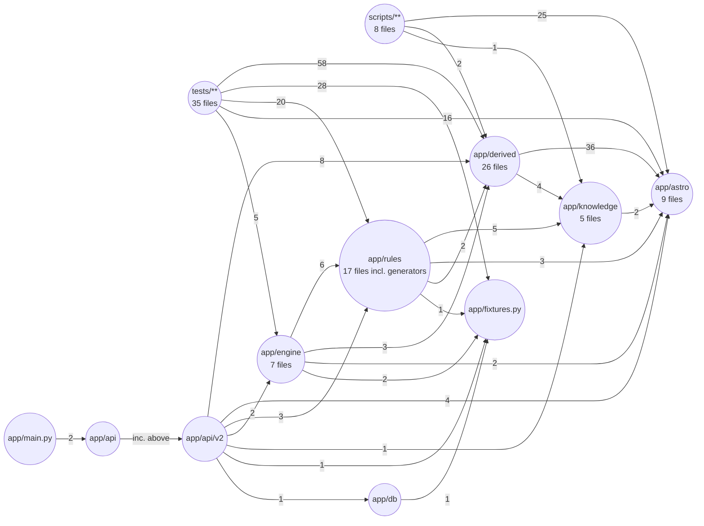
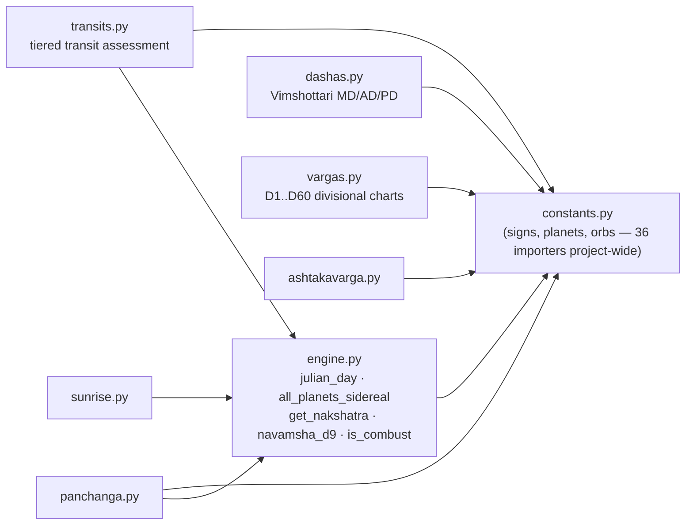
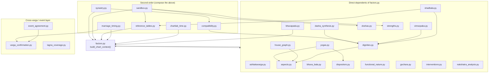
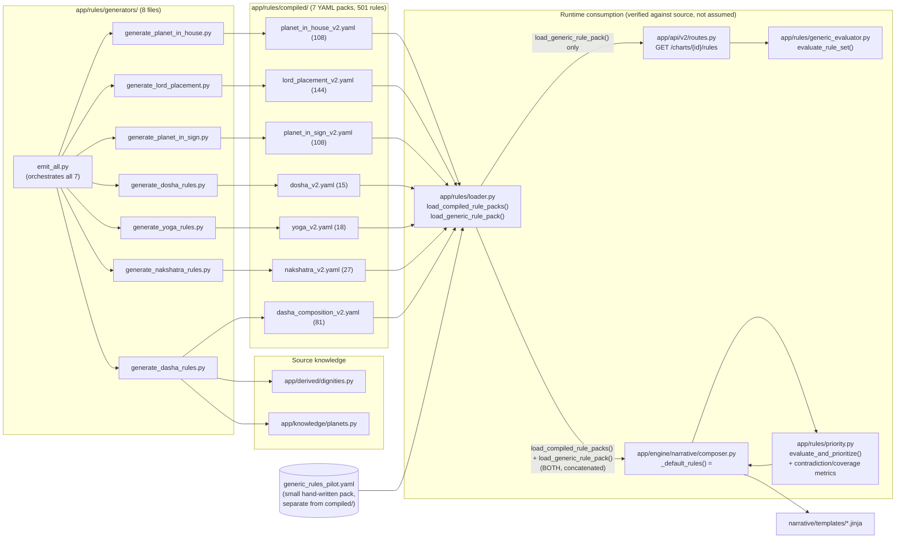
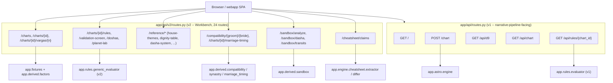
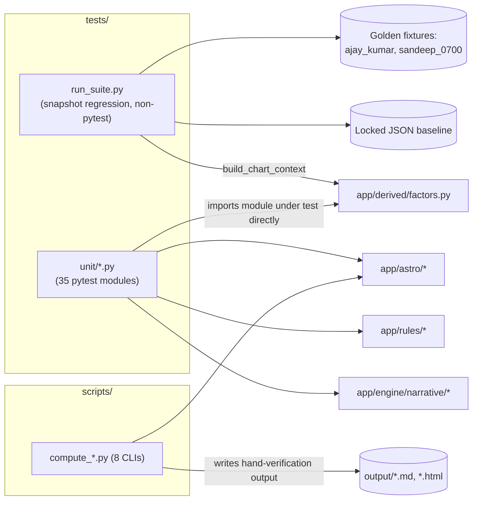

# Jyotisha — Technical Architecture (As-Built)

> **Status:** As-built reference, generated 2026-09-16 by walking the actual source tree
> (`ast.parse` over every in-scope `.py` file — never `import`, so Swiss-Ephemeris side
> effects can't interfere) and the real `git` history for the day's 24 commits / 140
> changed files. This document supersedes the short 2026-04-11 version of this file and
> is a companion to two other documents you should not confuse it with:
> - `docs/technical-architecture.md` — the **forward-looking Workbench build spec**
>   ("APPROVED FOR BUILD", 2026-08-24). Treat it as the plan; treat *this* file as what
>   actually exists today. §6 (end of the note under Diagram 1) reconciles the two.
> - `docs/file-inventory.md` — **per-file** descriptions + AST structure for all 118
>   in-scope Python files. This file is about **call flow between** those files; that
>   file is about **what's inside** each one.

---

## 1. What this system is

Jyotisha is a Swiss-Ephemeris-backed Vedic astrology engine with three coexisting
consumers of one shared computation core:

1. **The narrative reading pipeline** (`AGENTS.md`) — an MCP server
   (`jyotisha_mcp_server.py`) that a paramparā-trained LLM persona drives through an
   8-step process to produce long-form horoscope readings (`output/*.md`, `*.html`).
2. **The v1 web app** (`app/api/routes.py`) — a small Jinja2-rendered chart page plus a
   legacy rule-evaluation JSON endpoint. Untouched by today's work; still serves the
   narrative pipeline's simple chart view.
3. **The v2 Workbench** (`app/api/v2/routes.py` + `webapp/`) — a React/TypeScript SPA
   consuming a JSON API that exposes every calculator, rule evaluation, and validation
   screen described in `docs/technical-architecture.md`. This is where nearly all of
   today's engineering landed.

All three sit on top of the same four internal layers — **Truth (`app/astro/`) →
Derived (`app/derived/`) → Rules (`app/rules/`) → Engine (`app/engine/`)** — so no
astrology logic is ever duplicated between the narrative pipeline, the v1 app, and the
v2 Workbench. This single-source-of-truth constraint is the load-bearing design rule of
the whole codebase (AGENTS.md §6, this doc §2).

---

## 2. Layer reference

| Layer | Path | Responsibility | Design rule |
|---|---|---|---|
| **Truth** | `app/astro/` | Julian day, Lahiri ayanāṁśa, sidereal longitudes, nakṣatras, D1–D60 vargas, Vimśottarī daśās, transits, sunrise, pañcāṅga. Pure Swiss-Ephemeris astronomy — never touches rule YAML. | Deterministic, no interpretation. |
| **Derived** | `app/derived/` | Everything computed *from* the Truth Layer that is not yet interpretation: house lordship, aspects, dignities, dispositors, doṣas, yogas, bhāva/ṣaḍbala, vimśopaka, bhāvapada/ārūḍha, nakṣatra profiles, gochara, daśā synthesis, event agreement, marriage timing/compatibility, cross-varga confirmation. | `factors.py::build_chart_context()` is the single aggregation point. |
| **Rules** | `app/rules/` | v1 (legacy, hand-branched `evaluator.py`) and v2 (generic, Pydantic-schema'd, data-driven `generic_evaluator.py`) rule execution. `generators/` compile source knowledge into versioned YAML under `compiled/`. | YAML defines interpretation policy; Python only resolves conditions and evaluates. Never hardcode a rule outcome in Python. |
| **Engine** | `app/engine/` | Narrative Composer (Jinja templates turning rule matches into prose) + Cheat-Sheet Cross-Validation Console (extracts claims from `docs/*.md`, diffs against computed output). | Pure data-shaping / templating — no new astrology logic. |
| **API v1** | `app/api/` | Jinja2 chart page, legacy `/api/rules/{chart_id}`. | Unchanged; narrative-pipeline-facing. |
| **API v2** | `app/api/v2/` | JSON surface for `webapp/`: charts, vargas, rules, events, doṣas, compatibility, marriage timing, sandbox ("Chart Lab"), cheat-sheet console. | Every route: load fixture → `build_chart_context()` → call derived/rules engine(s) → return JSON. UI never computes Jyotiṣa logic. |
| **Knowledge** | `app/knowledge/` | Static reference tables (houses, planets, nakṣatras) + the original hand-written prose `interpreter.py`, predating the rule engine. | Being incrementally replaced by rule-evaluation-first logic (docs/architecture.md's original migration note, still true). |
| **DB** | `app/db/` | Thin SQLAlchemy Core layer seeding the Workbench's `charts` table from `data/charts/*.yaml`. | Core, not ORM — this is a computation app, not a CRUD app. |
| **Fixtures** | `app/fixtures.py`, `data/charts/*.yaml` | Locked, versioned chart inputs. `ajay_kumar` and `sandeep_0700` are golden regression fixtures. | Fixtures are seed data, never mutated silently. |
| **Scripts** | `scripts/*.py` | One-off CLIs computing a named person's chart end-to-end; not part of the runtime API. | Manual smoke tests / artifact generators. |
| **Tests** | `tests/run_suite.py`, `tests/unit/*.py` | Snapshot regression harness + one pytest module per calculator. | Run before every merge (AGENTS.md §9). |
| **MCP** | `jyotisha_mcp_server.py` | Exposes `compute_chart`, horoscope file I/O, and reference-scripture listing as MCP tools for the narrative-pipeline LLM persona. | Thin wrapper over `app/astro` + `app/knowledge`; never re-implements astronomy. |
| **Frontend** | `webapp/` (React + TS + Vite) | Renders API v2 JSON only. | Never computes Jyotiṣa logic client-side (non-negotiable, spec §3/§16). |

**Design rules carried over unchanged from the original `docs/architecture.md`:**
Markdown corpus files are documentation, not runtime truth. YAML rule packs define
interpretation policy. Python computes deterministic factors and rule-evaluation traces
only. Every rule outcome must expose evidence and any data gaps. When corpus formulas
conflict, the runtime preserves the conflict explicitly (see `upapada_lagna` vs.
`upapada_lagna_project_legacy` in `app/derived/factors.py`) rather than silently picking
a side.

**Migration-direction status (the original 2026-04-11 version of this file listed six
open items — status of each, so nothing that guidance said gets silently dropped):**
"Keep `app/astro/` as-is and extend it" — done, `app/astro/` grew from 6 to 9 files
without breaking its zero-outgoing-dependency property (§8). "Gradually replace
prose-first logic in `app/knowledge/interpreter.py`" — in progress, `interpreter.py`
still exists and is still called by `app/api/routes.py` (v1); the v2 stack bypasses it
entirely in favor of the rule engine. "Add missing calculators incrementally: Upapada,
Pada, Argala, Ishta/Kashta, Shadbala, Vimsopaka" — **Shadbala and Vimsopaka shipped
today** (`app/derived/{shadbala,vimsopaka}.py`, full classical schemes per BPHS Ch.27);
Upapada/Pada/Argala/Ishta-Kashta already existed pre-today as `computed_simplified`
heuristics (`factors.py`, `interventions.py`, `strengths.py`) and remain so — see
AGENTS.md §6 for the current, authoritative data-gap list, which this document does not
duplicate to avoid the two drifting out of sync.

---

## 3. What changed today (2026-09-16) — 24 commits, 140 files

Today's work executed `build_plan.md` Phases 2 through 5 in full, plus a same-day bugfix
and two full horoscope-generation runs. Grouped by phase:

| Phase | Theme | Representative new/changed files |
|---|---|---|
| **Phase 2** | Rule Engine v2 foundation: 375 compiled v2 rules (planet-in-house, lord-placement, planet-in-sign, dosha), generic evaluator wiring, Bhāva Bala/Avastha, cross-varga confirmation engine, daśā-lord synthesis, generic Event Agreement Engine (23 themes), Interpretation Priority + contradiction/confidence/coverage metrics, Lagna-coverage audit, historical-event validation protocol. | `app/rules/generic_evaluator.py`, `app/rules/priority.py`, `app/rules/schema.py`, `app/derived/{bhava_bala,varga_confirmation,dasha_synthesis,event_agreement,lagna_coverage,house_graph}.py`, `app/rules/compiled/{planet_in_house,lord_placement,planet_in_sign,dosha}_v2.yaml`, `app/rules/generators/generate_{planet_in_house,lord_placement,planet_in_sign,dosha_rules}.py` |
| **Phase 3** | Narrative Composer v1 (Jinja templates for lagna/doṣa/yoga sections + gap reporting), composer-vs-LLM diff evidence for `ajay_kumar`, a real bug found and fixed via that diff (Mangal Doṣa missing an own-sign/exalted cancellation condition). | `app/engine/narrative/{composer,gap_report}.py`, `app/engine/narrative/templates/*.jinja`, `docs/phase3-composer-vs-llm-diff.md` |
| **Phase 4** | Yoga detection engine (18 classical yogas), nakṣatra profile engine (27 profiles + gaṇḍānta/Abhukta Mūla), Bhāvapada family (A1–A12) + generalized Graha Ārūḍha, dosha-registry recheck vs. PyJHora reference (added Ghata + Śrāpit doṣas), Marriage Compatibility engine (Aṣṭakūṭa + synastry + Dasha/Transit/D9 Triple Agreement). | `app/derived/{yogas,nakshatra_analysis,bhavapada,compatibility,synastry,marriage_timing}.py`, `app/rules/compiled/{yoga,nakshatra}_v2.yaml`, `app/rules/generators/generate_{yoga_rules,nakshatra_rules}.py` |
| **Phase 5** | 81 daśā MD×AD composition rules, full 9-planet Gochara transit engine, Vimśopaka Bala (all 4 classical schemes), full classical Ṣaḍbala (BPHS Ch.27) — **Phase 5 COMPLETE**, closing out the roadmap in `build_plan.md`. | `app/derived/{gochara,vimsopaka,shadbala}.py`, `app/rules/compiled/dasha_composition_v2.yaml`, `app/rules/generators/generate_dasha_rules.py` |
| **Bugfix** | Compounding day-truncation bug in Vimśottarī Antardaśā/Pratyantardaśā boundary math. | `app/astro/dashas.py` |
| **Test coverage** | ~28 new `tests/unit/*.py` modules, one per new calculator/engine, per AGENTS.md §9. | `tests/unit/test_{yogas,shadbala,vimsopaka,gochara,marriage_timing,compatibility,synastry,bhavapada,nakshatra_analysis,dasha_composition_rules,narrative_composer,...}.py` |
| **Reading runs** | Two full 8-step AGENTS.md readings generated end-to-end (validates the whole pipeline against real output). | `output/Itta_Madhavi_*` (11 files: Validation.md, Execution_Log.md, 5 Internal + 5 Shareable HTML parts), `output/Itta_Sai_Shivani_*` (same 11-file shape), `output/Roop_Kumar_Summary_D1_D4_D10.html` — **24 output artifacts total, treated as a group here** (they are pipeline *outputs*, not source code; see `docs/file-inventory.md`'s scope note). |
| **Frontend** | Workbench UI wired to the day's new API v2 endpoints. | `webapp/src/App.tsx`, `webapp/src/screens/LearningTab.tsx`, `webapp/src/screens/chartlab/{ChartLabTab,ObservationsPanel,TransitOverlay,layout.ts}` — TypeScript, intentionally outside this doc's Python/YAML AST scope; mentioned here for call-flow completeness only. |
| **Docs/meta** | `docs/rule-v1-to-v2-parity.md`, `docs/yoga-compilation-backlog.md`, `docs/marriage-compatibility-notes.md`, `docs/historical-event-validation-protocol.md`, `docs/public-repo-review/*` (license/feature/validation comparison against vendored reference repos), `build_plan.md` (Phases 2–5 checklists marked done). | — |

Net effect on the Python surface: **app/derived/ grew from 4 files to 26**,
**app/rules/ grew a `generators/` sub-package (8 files) and a `compiled/` YAML
directory (7 packs)**, and **app/engine/ gained a `narrative/` sub-package**. See
`docs/file-inventory.md` for the full per-file breakdown.

---

## 4. Entry points (verified by grep, not inferred)

| Entry point | Trigger | First call into the shared core |
|---|---|---|
| `jyotisha_mcp_server.py::compute_chart()` | LLM persona (AGENTS.md Step 1: Dual Computation) | `scripts.compute_chart_cli.compute_full_chart()` → `app.astro.engine` + `app.astro.dashas` (direct Swiss-Ephemeris computation, not the fixture/context pipeline) |
| `app/main.py` → `app/api/routes.py` | v1 web form / `/api/chart`, `/api/d9`, `/api/rules/{chart_id}` | `app.astro.engine`, `app.knowledge.interpreter`, `app.rules.evaluator` |
| `app/main.py` → `app/api/v2/routes.py` | v2 Workbench SPA (`webapp/`) | `app.fixtures.load_chart_fixture()` → `app.derived.factors.build_chart_context()` |
| `app/rules/generators/emit_all.py` | Manual: `python -m app.rules.generators.emit_all` whenever source knowledge changes | Runs all 7 `generate_*.py` generators, each writing one `app/rules/compiled/*_v2.yaml` |
| `app/engine/narrative/composer.py::compose_chart_narrative()` | Called by API v2 / tests, or directly | `app.fixtures` → `app.derived.factors` → `app.rules.loader` → `app.rules.priority` → Jinja templates |
| `tests/run_suite.py` | `.venv/bin/python tests/run_suite.py --mode verify` (required pre-merge gate) | `app.derived.factors.build_chart_context()` against golden fixtures, diffs against a locked JSON baseline |
| `tests/unit/*.py` (pytest) | `.venv/bin/pytest tests/unit` | Imports the specific calculator module(s) under test directly |
| `scripts/compute_*.py` | Manual CLI run per person | `app.astro.engine` + `app.astro.dashas`/`transits` directly (bypasses the fixture/context pipeline — see §8 caveat) |

---

## 5. Call-flow walkthroughs

### 5.1 MCP narrative pipeline (AGENTS.md 8-step process)

```
LLM persona
  -> jyotisha_mcp_server.compute_chart(name, dob, tob, utc_offset, lat, lon)
       -> scripts.compute_chart_cli.compute_full_chart(...)   # the ONE shared hop
            -> app.astro.engine.julian_day()
            -> app.astro.engine.all_planets_sidereal()
            -> app.astro.engine.get_nakshatra() / navamsha_d9() / darakaraka() / is_combust() / planet_state()
            -> app.astro.constants.{SIGNS, NAKSHATRAS}
            -> app.astro.dashas.{compute_dashas, compute_antardashas,
                                  compute_pratyantaradashas, current_dasha_antar}
  -> LLM cross-checks Pass-1 vs. an independent Pass-2 re-derivation (no shared code path
     by design -- this IS the verification)
  -> jyotisha_mcp_server.save_horoscope_part(...)  # writes output/{Name}_Part{N}_*.html
```

This path deliberately does **not** go through `app.fixtures` / `build_chart_context()`
— the MCP tool computes directly from raw birth data supplied at call time (via the
same generic `scripts/compute_chart_cli.py` CLI script that a human can also run
standalone), since the narrative pipeline handles people who don't yet have a
`data/charts/*.yaml` fixture. This makes `compute_chart_cli.py` the one script under
`scripts/` that **is** part of a production call path, not just a manual smoke test —
worth remembering if it is ever refactored.

### 5.2 v1 web chart page

```
app/main.py (FastAPI app, mounts app.api.routes.router)
  -> GET /  ->  app.api.routes.index()
  -> POST /chart  ->  app.api.routes.compute_chart(form data)
       -> resolve_location()
       -> app.astro.engine.{julian_day, all_planets_sidereal, navamsha_d9}
       -> build_si_grid()  # South-Indian grid layout
       -> templates/chart.html (Jinja2, server-rendered)
  -> GET /api/rules/{chart_id}  ->  app.api.routes.api_rule_evaluation()
       -> app.rules.loader.load_rule_pack()      # v1 YAML, bphs_top20_rule_cards_v1.yaml
       -> app.rules.evaluator.evaluate_chart_fixture()
```

### 5.3 v2 Workbench (today's primary surface)

```
app/main.py (mounts app.api.v2.routes.router under /api/v2)
  -> GET /api/v2/charts/{chart_id}
       -> app.api.v2.routes._load_context(chart_id)
            -> app.fixtures.load_chart_fixture(chart_id)      # data/charts/{id}.yaml
            -> app.derived.factors.build_chart_context(fixture)
                 -> app.astro.engine / dashas / transits / panchanga   (Truth Layer)
                 -> app.derived.{aspects,dignities,dispositors,doshas,
                       yogas,bhava_bala,shadbala,vimsopaka,bhavapada,
                       nakshatra_analysis,gochara,dasha_synthesis,
                       house_graph,functional_nature,strengths,
                       ashtakavarga,interventions}   (Derived Layer, ~16 sub-calculators)
  -> GET /api/v2/charts/{chart_id}/rules
       -> app.rules.loader.load_generic_rule_pack()   # generic_rules_pilot.yaml ONLY
       -> app.rules.generic_evaluator.evaluate_rule_set(rules, context)
       -- NOTE (verified against source, not assumed): this route does **not** yet load
          the 7 compiled/*_v2.yaml packs from today's Phase 2-5 work, and does not run
          them through app.rules.priority. Today's 501 compiled rules are wired into
          the Narrative Composer (§5.5) and their own tests, but not into this endpoint
          -- a real, honest gap worth flagging rather than glossing over (AGENTS.md's
          "state the data gap" spirit applied to code, not just chart interpretation).
  -> GET /api/v2/charts/{chart_id}/doshas
       -> app.derived.doshas  (direct doṣa register, not routed through generic rules)
  -> GET /api/v2/compatibility/{groom_id}/{bride_id}
       -> app.derived.compatibility.ashtakuta_score(...) + app.derived.synastry
  -> GET /api/v2/charts/{chart_id}/marriage-timing
       -> app.derived.marriage_timing.marriage_timing_report()
            -> app.derived.varga_confirmation, app.astro.transits, app.astro.dashas
  -> POST /api/v2/sandbox/*
       -> app.derived.sandbox  (hypothetical, non-birth-data "Chart Lab" charts)
```

### 5.4 Rule compilation pipeline (build-time, not request-time)

```
app/rules/generators/emit_all.py::main()
  -> for each of 7 generators:
       generate_planet_in_house.py   -> app/rules/compiled/planet_in_house_v2.yaml   (108 rules)
       generate_lord_placement.py    -> app/rules/compiled/lord_placement_v2.yaml    (144 rules)
       generate_planet_in_sign.py    -> app/rules/compiled/planet_in_sign_v2.yaml    (108 rules)
       generate_dosha_rules.py       -> app/rules/compiled/dosha_v2.yaml             (15 rules)
       generate_yoga_rules.py        -> app/rules/compiled/yoga_v2.yaml              (18 rules)
       generate_nakshatra_rules.py   -> app/rules/compiled/nakshatra_v2.yaml         (27 rules)
       generate_dasha_rules.py       -> app/rules/compiled/dasha_composition_v2.yaml (81 rules)
                                          (also reads app.derived.dignities +
                                           app.knowledge.planets for source facts)
```

Each generator emits `Rule`-shaped dicts (`app/rules/schema.py`); nothing hand-edits the
compiled YAML directly — re-running `emit_all` is the only sanctioned way to update it.

### 5.5 Narrative Composer (Phase 3)

```
app.engine.narrative.composer.compose_chart_narrative(chart_id)
  -> app.fixtures.load_chart_fixture(chart_id)
  -> app.derived.factors.build_chart_context(fixture)
  -> app.rules.loader.load_compiled_rule_packs() + load_generic_rule_pack()
  -> app.rules.priority.evaluate_and_prioritize(rules, context)
  -> _display_context(ctx)                       # human-readable labels, computed once
  -> render_lagna_section() -> templates/lagna.jinja
  -> render_dosha_section() -> templates/dosha.jinja
  -> render_yoga_section()  -> templates/yoga.jinja
  -> app.engine.narrative.gap_report.build_gap_report(rules, context, chart_id)
       -> app.rules.priority.evaluate_and_prioritize()   # same call, filtered to data_gap
```

### 5.6 Regression + unit tests

```
tests/run_suite.py --mode verify
  -> build_snapshot(chart_id, today)   for chart_id in [ajay_kumar, sandeep_0700]
       -> app.derived.factors.build_chart_context()
  -> critical_checks(snapshots)
  -> _diff(expected=<locked JSON baseline>, actual=<fresh snapshot>)
  -> exit 1 on any diff  (this is the required pre-merge gate, AGENTS.md §9)

tests/unit/test_<calculator>.py  (pytest, ~35 files)
  -> imports the one module under test + app.fixtures/app.derived.factors as needed
  -> asserts on computed VALUES (sign/house/degree/quality), not on "the function ran"
```

### 5.7 Standalone CLI scripts

```
scripts/compute_<person>.py
  -> app.astro.engine.{julian_day, all_planets_sidereal, navamsha_d9}
  -> app.astro.dashas / app.astro.transits directly
  -> prints/writes a chart summary -- used to hand-verify a new person before
     promoting them to a data/charts/*.yaml fixture, or to seed output/ artifacts
```
Scripts intentionally call `app/astro` directly rather than going through
`app.fixtures`/`build_chart_context()` — they predate the fixture pipeline and are
kept as fast, dependency-light smoke tests, not routed through the Rule Engine.

---

## 6. Diagram 1 — System layers (as-built)

```mermaid
flowchart TB
    subgraph ENTRY["Entry Points"]
        MCP["jyotisha_mcp_server.py<br/>(MCP tools)"]
        MAIN["app/main.py<br/>(FastAPI process)"]
        SCRIPTS["scripts/compute_*.py<br/>(CLI)"]
        TESTS["tests/run_suite.py<br/>tests/unit/*.py"]
    end

    subgraph APIV["API"]
        API1["app/api/routes.py<br/>(v1, Jinja2)"]
        API2["app/api/v2/routes.py<br/>(v2, JSON)"]
    end

    subgraph FIX["Fixtures"]
        FIXP["app/fixtures.py"]
        CHARTS[("data/charts/*.yaml<br/>8 fixtures")]
    end

    subgraph TRUTH["Truth Layer — app/astro/"]
        ENGINE["engine.py<br/>(Julian day, ayanamsha,<br/>sidereal longitudes, D9)"]
        CONST["constants.py"]
        DASH["dashas.py"]
        TRANS["transits.py"]
        VARG["vargas.py (D1-D60)"]
        PANCH["panchanga.py"]
        SUN["sunrise.py"]
        AV["ashtakavarga.py"]
    end

    subgraph DERIVED["Derived Layer — app/derived/ (26 files)"]
        FACTORS["factors.py<br/>build_chart_context()<br/>*** central hub, 45 importers ***"]
        DSUB["aspects · dignities · dispositors · doshas<br/>yogas · shadbala · vimsopaka · bhavapada<br/>nakshatra_analysis · gochara · dasha_synthesis<br/>house_graph · functional_nature · event_agreement<br/>marriage_timing · compatibility · synastry<br/>varga_confirmation · lagna_coverage · sandbox"]
    end

    subgraph RULES["Rule Engine — app/rules/"]
        GEN["generators/*.py (8 files)"]
        YAML[("compiled/*_v2.yaml<br/>7 packs, 501 rules")]
        LOADER["loader.py"]
        GEVAL["generic_evaluator.py (v2)"]
        LEGEVAL["evaluator.py (v1, legacy)"]
        PRIO["priority.py<br/>(rank/dedupe/coverage)"]
        SCHEMA["schema.py<br/>(Rule/RuleCondition/RuleOutput)"]
    end

    subgraph ENGINE_L["Engine — app/engine/"]
        COMPOSER["narrative/composer.py"]
        GAPR["narrative/gap_report.py"]
        JINJA["narrative/templates/*.jinja"]
        EXTRACT["cheatsheet/extractor.py"]
        DIFFER["cheatsheet/differ.py"]
    end

    subgraph KNOW["Knowledge — app/knowledge/"]
        INTERP["interpreter.py (legacy prose)"]
        REFDATA["houses.py · planets.py · nakshatras.py"]
    end

    subgraph OUT["Outputs"]
        WEBAPP["webapp/ (React+TS)"]
        HTML["output/*.md, *.html<br/>(24 files today)"]
        DOCSMD["docs/*.md<br/>(claim source for cheatsheet console)"]
    end

    MCP --> CLICOMPUTE["scripts/compute_chart_cli.py<br/>compute_full_chart()"]
    CLICOMPUTE --> ENGINE
    CLICOMPUTE --> DASH
    MCP -.writes.-> HTML
    MAIN --> API1
    MAIN --> API2
    API1 --> ENGINE
    API1 --> INTERP
    API1 --> LEGEVAL
    API2 --> FIXP
    API2 -->|"load_generic_rule_pack()<br/>(pilot pack only, NOT compiled/*_v2.yaml)"| LOADER
    API2 --> GEVAL
    API2 -->|JSON only| WEBAPP
    SCRIPTS --> ENGINE
    SCRIPTS --> DASH
    SCRIPTS --> TRANS
    TESTS --> FACTORS
    TESTS --> GEVAL
    TESTS --> ENGINE

    FIXP --> CHARTS
    FACTORS --> ENGINE
    FACTORS --> DASH
    FACTORS --> TRANS
    FACTORS --> PANCH
    FACTORS --> DSUB

    LEGEVAL --> LOADER
    GEVAL --> SCHEMA
    PRIO --> GEVAL
    LOADER --> YAML
    LOADER --> SCHEMA
    GEN --> YAML
    GEN --> DSUB
    GEN --> REFDATA

    COMPOSER --> FIXP
    COMPOSER --> FACTORS
    COMPOSER --> LOADER
    COMPOSER --> PRIO
    COMPOSER --> JINJA
    COMPOSER --> GAPR
    EXTRACT --> DOCSMD
    DIFFER --> EXTRACT
    DIFFER --> FACTORS

    DSUB --> ENGINE
    DSUB --> REFDATA
```



**Deliberate deviation from `docs/technical-architecture.md`'s aspirational diagram:**
that spec proposed dedicated `app/engine/events/` and `app/engine/evidence/` packages.
As-built, that functionality landed inside **`app/derived/event_agreement.py`** (the
Event Agreement Engine) and **`app/rules/priority.py`** (contradiction/confidence/
coverage — the evidence-quality metrics) instead of new top-level packages. This is a
placement decision, not a scope gap — the DRY concern that pointed the spec at a new
package was that context assembly shouldn't be duplicated, and both modules already
sit downstream of `factors.py`, so no duplication actually occurred either way.

---

## 7. Diagram 2 — Package dependency graph (measured, not guessed)

Edge weights are unique file-to-file import counts collected via `ast.parse`, rolled up
to directory level (`docs/file-inventory.md`'s companion script; raw data in this repo's
throwaway `/tmp` build artifacts, not checked in).



**Reading this graph:** dependencies flow strictly downward/rightward — `app/astro` has
zero outgoing edges to any other package (it is the true leaf/foundation layer), and
`tests` + `scripts` are pure consumers (zero incoming edges from production code). No
cycle exists between `app/astro`, `app/derived`, `app/rules`, and `app/engine` — a
structural property worth protecting as the codebase keeps growing.

---

## 8. Diagram 3 — `app/astro/` internals (Truth Layer)



`app/astro/` has **no internal dependency on anything outside itself** — every other
package in the codebase (Derived, Rules, Engine, API, Knowledge, scripts, tests)
consumes it, never the reverse. This is why `engine.py` (25 external importers) and
`constants.py` (36 external importers) are the two highest fan-in files in the entire
project.

---

## 9. Diagram 4 — `app/derived/` internals (Derived Layer, today's biggest growth area)



`factors.py` is both the **most depended-upon** (45 internal importers) and the
**most dependent** (22 internal imports) file in the project — every new Phase
2/4/5 calculator built today wires into it exactly once via `build_chart_context()`,
which is what keeps the "single aggregation point" design rule from §2 actually true
in practice rather than just in the docs.

---

## 10. Diagram 5 — Rule pipeline traceability (generator → YAML → evaluator → narrative)



**Traceability guarantee, and one honest gap.** Every compiled rule pack has exactly
one generator that owns it (regenerate via `python -m app.rules.generators.emit_all`,
never hand-edit the YAML), and every generator is covered by at least one file in
`tests/unit/`. But **the two consumers use different rule sources**: the v2 API's
`/rules` route reads only the small `generic_rules_pilot.yaml` via
`load_generic_rule_pack()`, while the Narrative Composer reads
`load_compiled_rule_packs() + load_generic_rule_pack()` — both sources concatenated
(`app/engine/narrative/composer.py::_default_rules()`, confirmed against source). The
API route has not yet been switched over to the 7 compiled packs from today's build.

| Compiled pack | Generator | Rule count | Pack-level test | Underlying calculator also tested by |
|---|---|---|---|---|
| `planet_in_house_v2.yaml` | `generate_planet_in_house.py` | 108 | `test_compiled_rule_packs.py` | — |
| `lord_placement_v2.yaml` | `generate_lord_placement.py` | 144 | `test_compiled_rule_packs.py` | — |
| `planet_in_sign_v2.yaml` | `generate_planet_in_sign.py` | 108 | `test_compiled_rule_packs.py` | — |
| `dosha_v2.yaml` | `generate_dosha_rules.py` | 15 | `test_compiled_rule_packs.py` | `test_doshas.py` (tests `app.derived.doshas` Python logic, not the YAML pack directly) |
| `yoga_v2.yaml` | `generate_yoga_rules.py` | 18 | `test_yoga_rule_pack.py` | `test_yogas.py`, `test_yoga_karaka.py` (test `app.derived.yogas`/`factors.is_yoga_karaka` directly) |
| `nakshatra_v2.yaml` | `generate_nakshatra_rules.py` | 27 | `test_nakshatra_analysis.py` (covers both the pack and `app.derived.nakshatra_analysis` in one file) | — |
| `dasha_composition_v2.yaml` | `generate_dasha_rules.py` | 81 | `test_dasha_composition_rules.py` | — |

Rule counts above are **measured**, not copied from commit messages: each
`compiled/*_v2.yaml` was parsed with `yaml.safe_load()` and its list length counted —
108 + 144 + 108 + 15 + 18 + 27 + 81 = **501 rules exactly**, matching this table and
the totals referenced in §2/§6/§10 verbatim.

---

## 11. Diagram 6 — API surface (v1 vs. v2 entry paths)



---

## 12. Diagram 7 — Test & script consumption (safety net)



---

## 13. How this document was verified

1. **File count parity.** `ast.parse` (never `import`) was run over every `.py` file
   under `app/`, `scripts/`, `tests/`, and `jyotisha_mcp_server.py`: **118 files**,
   zero parse errors. `docs/file-inventory.md` documents exactly these 118 — the two
   documents are guaranteed to agree in scope.
2. **Import graph, not eyeballing.** All `import`/`from...import` statements were
   resolved to concrete in-scope files (331 raw edges, 313 unique file-to-file edges,
   zero unresolved `app.*` references) — the diagrams in §7–§12 are a direct rollup of
   that resolved graph, plus three edges added by hand from source inspection where the
   AST resolver only reaches package granularity (`emit_all.py`'s
   `from app.rules.generators import (...)` — confirmed against source to name all 7
   target modules explicitly in §5.4/§10).
3. **Rule-pack/generator/YAML/test coverage** cross-checked against the actual
   `app/rules/compiled/*.yaml` (7 files present), `app/rules/generators/*.py` (8 files,
   including `emit_all.py`), and `data/charts/*.yaml` (8 fixtures present) — all appear
   in §10's table and §6's diagram exactly as counted on disk.
4. **Exclusion scope.** `public-git-repos/**` (OpenJyotish, PyJHora, VedAstro — 338
   vendored `.py` files) is excluded from every diagram and count in this document, for
   the same reason given in `docs/file-inventory.md`: these are third-party reference
   implementations used for cross-validation (AGENTS.md §6, `docs/public-repo-review/`),
   not first-party runtime code.

---

*Pramāṇa-pūrvakaṁ gaṇanaṁ kṛtvā, śāstra-dṛṣṭyā vicārayet.*
