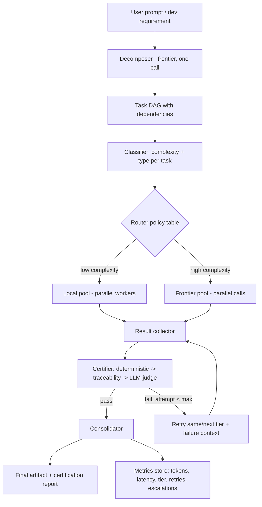

# Tiered LLM Task Routing — White Paper & Solution Guide

## Abstract

Development workflows that route every task — regardless of complexity — through a single frontier LLM waste tokens on mechanical work a smaller, locally-hosted model could handle just as well. This paper proposes a **complexity-aware routing architecture**: decompose a development requirement into a dependency-ordered task graph, classify each task's true reasoning complexity, dispatch low-complexity tasks to a local open-weights model and high-complexity tasks to a frontier model, certify every output against deterministic and requirement-based checks, escalate failures with accumulated failure context, and measure token/cost split across tiers. The goal is a **measurable reduction in frontier-token spend without a measurable reduction in output quality**.

---

## 1. Problem Statement

### 1.1 The core inefficiency

Most agentic coding workflows today use one model tier for everything: every file edit, every mechanical transcription task, every architecture decision, and every one-line docstring goes through the same (usually expensive, rate-limited, or quota-constrained) frontier model. This is wasteful because:

- **Task complexity varies enormously within a single requirement.** Compiling 216 near-identical "planet-in-house" rule entries from an already-distilled markdown doc is mechanically repetitive; deciding how two contradicting classical astrological sources should both be preserved in a schema is a genuine reasoning task. These do not deserve the same model.
- **Frontier tokens are the scarcest, most expensive resource** in the loop — whether metered by cost, by rate limit, or by a shared quota across a team. Every token spent on a low-complexity task is a token unavailable (or unnecessarily costly) for a high-complexity one.
- **Local open-weight models are "free" per-token but slower and noisier** — lower reliability, more hallucination on judgment-heavy tasks, but entirely adequate on narrow, well-specified, mechanical tasks, *provided their output is verified before being trusted.*

### 1.2 What "solving" this actually requires

A workable solution is not just "use a cheaper model sometimes." It requires, in order:

1. A reliable way to **break a requirement into independently routable units of work** (a task DAG, not a flat list).
2. A **complexity classifier** that predicts routing tier from cheap, computable signals — not vibes, not a frontier-model self-report.
3. A **concurrent execution model** that tolerates local models being slow without serializing the whole batch behind them.
4. A **certification gate** — deterministic checks first, requirement-traceability second, LLM-as-judge only as a last, minimal-cost resort — so a "local model might be wrong" risk never silently reaches the final artifact.
5. A **bounded retry/escalation protocol** that carries failure context forward into the next attempt/tier instead of re-asking from scratch.
6. A **metrics substrate** that makes the token/cost split, escalation rate, and quality outcomes visible and auditable — otherwise "did this actually save tokens" is unanswerable.

### 1.3 Success criteria

- Frontier-token share of total spend decreases over time for a stable task-type mix (the "shrinkage" metric).
- Final artifact quality (test pass rate, regression pass rate, requirement coverage) is statistically indistinguishable from an all-frontier baseline.
- No task silently fails "average quality" into the final output — every accepted output passed the same certification bar regardless of which tier produced it.

---

## 2. Solution Architecture



### 2.1 Decomposer

Turns the requirement into a **task DAG**, not a flat checklist. Each node carries explicit, machine-checkable acceptance criteria — a task is only eligible for local routing if it has a single, verifiable acceptance condition.

```yaml
task:
  id: T-014
  title: "Compile planet-in-house rules for Mars (12 entries)"
  depends_on: []
  inputs: [docs/mars_placements.md, app/rules/schema.py]
  acceptance:
    - schema_valid: true
    - test: tests/unit/test_mars_house_rules.py
    - golden_fixture_match: [ajay_kumar, roop_kumar]
  complexity_hint: low
  output_artifact: app/rules/generic_rules_mars.yaml
```

Run the decomposition step itself on the **frontier model, once per requirement** — a bad DAG poisons every downstream task, and this is a single cheap call relative to the batch it produces.

### 2.2 Classifier + router policy

Route on **reasoning depth required, not prompt size**. Maintain the policy as versioned data (mirroring a "rules are data" philosophy), not inline model judgment:

```yaml
- task_type: rule_yaml_transcription
  tier: local
  model: qwen2.5-coder:14b
- task_type: mechanical_test_scaffold
  tier: local
  model: qwen2.5-coder:14b
- task_type: architecture_decision
  tier: frontier
- task_type: contradiction_resolution
  tier: frontier
- task_type: license_or_legal_reasoning
  tier: frontier
```

Signals that inform classification, all computable without an LLM call: number of files/modules touched, whether the task references an existing distilled doc (mechanical) vs. requires synthesizing across multiple conflicting sources (judgment), and historical escalation rate for that `task_type` (the single highest-value feedback signal once the system has run a few batches).

### 2.3 Execution model — concurrency and waiting

- Independent DAG nodes execute **concurrently**, bounded per tier: local pool concurrency capped by actual hardware inference capacity (often 1–3 concurrent generations on a single GPU/unified-memory machine); frontier pool capped by API rate limit and a per-batch cost ceiling.
- **Per-task timeout, not a global one** — a stalled local generation must not block independent tasks; on timeout, treat as a failed attempt and proceed to retry/escalate.
- **Async wait, not synchronous polling per task** — gather over the "ready" frontier of the DAG (nodes whose dependencies are done) so slow local tasks never serialize the batch.
- A lightweight **progress ledger** (SQLite/JSON row per task: `queued/running/done/failed/escalated`) makes a long-running batch inspectable mid-flight instead of an opaque wait.

### 2.4 Certification gate

Three layers, cheapest and most deterministic first — most errors should be caught before any judgment-based check is even reached:

1. **Deterministic checks** (free): schema validation, unit/regression test execution, lint, format checks, golden-fixture diffs. This layer should catch the overwhelming majority of local-model mistakes.
2. **Requirement-traceability check**: verify the output actually satisfies each item in the task's structured `acceptance` list — a programmatic cross-reference, not open-ended judgment.
3. **LLM-as-judge** (only for the subset requiring genuine subjective/faithfulness judgment): the frontier model is used here only to *judge* a candidate output, which is a single short call — far cheaper than having it *author* the output from scratch.

```python
def certify(task, result):
    if not schema_valid(result):
        return "fail", "schema"
    if not tests_pass(task.acceptance.get("test")):
        return "fail", "tests"
    if not fixtures_match(task, result):
        return "fail", "fixture_mismatch"
    if task.needs_judgment:
        verdict = frontier_judge(task, result)
        if not verdict.pass_:
            return "fail", verdict.reason
    return "pass", None
```

### 2.5 Retry and escalation protocol

Bounded, and each attempt carries the **failure reason forward** rather than re-prompting cold:

```
attempt 1: local model, base prompt                           -> certify
attempt 2 (if fail): local model, prompt + failure reason
                      + a passing few-shot example of the
                      same task_type                            -> certify
attempt 3 (if fail): escalate to frontier, include full
                      failure history so it does not repeat
                      the same mistake                          -> certify
if frontier also fails: surface to a human, do not loop forever
```

Default caps: 2 local attempts + 1 frontier escalation per task, configurable per `task_type` — mechanical transcription tasks should rarely need all three; judgment-heavy composition tasks may be routed to skip straight to frontier.

### 2.6 Consolidator

Once every DAG node reaches `pass`, merge outputs into their `output_artifact` targets, re-run the full regression suite at the batch level (catches cross-task interaction issues no single-task certifier can see), and emit a certification report:

```yaml
batch_id: 2026-09-16-mars-rules
tasks_total: 12
passed_local: 9
escalated_to_frontier: 3
final_status: certified
tokens_local: 48200
tokens_frontier: 6100
frontier_share_pct: 11.2
wall_clock_minutes: 34
```

### 2.7 Metrics substrate

A single append-only table, one row per task attempt:

| task_id | tier | model | attempt | tokens_in | tokens_out | latency_s | result | escalated |
|---|---|---|---|---|---|---|---|---|

Derived, over time or per batch:

- **Token split** frontier vs. local — the headline cost metric.
- **Escalation rate per `task_type`** — feeds back into the router policy; a type escalating above a threshold (e.g. 30%) should simply be reclassified to frontier-tier directly, avoiding a wasted local attempt going forward.
- **Local-model win rate** — the percentage of tasks fully resolved without escalation; the real measure of how much the local tier is actually saving.

---

## 3. Step-by-Step Implementation Guide

1. **Define the task-type taxonomy** for your domain (mirror your rule/work-item categories) and write the initial static router policy table. Start conservative — bias toward frontier for anything ambiguous.
2. **Build the decomposer prompt** that turns a requirement into a task DAG with structured `acceptance` criteria. Test it on a handful of known requirements before trusting it on new ones.
3. **Stand up the local model runtime** (e.g., Ollama serving a quantized Qwen2.5-Coder or DeepSeek-Coder-V2-Lite) and confirm real achievable concurrency on your hardware.
4. **Wire the certifier** to your existing deterministic checks (test suite, schema validators, regression fixtures) before writing any new judgment logic — reuse what already exists rather than inventing a parallel quality system.
5. **Implement the async orchestrator**: DAG-aware scheduler, per-task timeout, progress ledger, bounded retry/escalation with failure-context carryover.
6. **Add the metrics store** and a small report generator before running any real batch — you want the token-split number from batch one, not retrofitted later.
7. **Pilot on a real but low-risk batch** (a set of genuinely mechanical, well-specified tasks) and inspect the certification report and metrics manually before trusting the loop unattended.
8. **Feed escalation-rate data back into the router policy** after a few batches — this is what turns a static table into a self-improving system without adding LLM-based routing overhead.

---

## 4. Caveats and Failure Modes

- **A bad decomposition poisons everything downstream.** If the DAG is wrong (wrong granularity, missing dependency, acceptance criteria too vague to check), no amount of tiering or certification recovers cleanly — invest disproportionately in getting this step right, including a human skim of the DAG before large batches.
- **Local models are systematically overconfident on judgment-heavy tasks.** Never trust a local model's own self-reported confidence as an escalation trigger by itself; always back it with an objective check. Confidence-based escalation (Option C in the router design) should only be layered on top of deterministic certification, never replace it.
- **Deterministic certification has coverage gaps.** Tests and schema checks only catch what they were written to catch — a local model can produce output that passes all mechanical checks yet is subtly unfaithful to source material (e.g., a paraphrased rule that drifts from the classical text's actual meaning). Domains with a "faithfulness to source" requirement need the LLM-as-judge layer, not just layers 1–2.
- **Concurrency limits are hardware-specific and easy to overestimate.** Running more local-model workers than your machine can actually serve concurrently degrades everything to worse-than-serial due to memory thrashing/context-swapping — measure actual sustainable concurrency, don't assume it from core count.
- **Escalation-context carryover can itself become expensive.** If a task fails twice locally before reaching the frontier model, the accumulated failure history adds tokens to that frontier call — for very failure-prone task types this can erode the savings; this is exactly why the escalation-rate metric must feed back into reclassifying such types to frontier-tier upfront.
- **The frontier-token savings are workload-dependent.** A backlog dominated by mechanical, repetitive tasks (e.g., ~500 target rules noted in this repo's `build_plan.md`, most currently uncompiled) is the ideal case for this architecture. A backlog dominated by genuinely novel architecture/judgment work will see much smaller savings — measure before assuming this approach is a fit for every batch of work.
- **Certification is only as strong as its weakest layer for a given task type.** If a task type has neither good deterministic tests nor a well-defined traceability structure nor a cheap judgeable dimension, it should not be routed to local at all regardless of apparent "mechanical" appearance — when in doubt, route to frontier.
- **This adds orchestration complexity and a new point of failure** (the orchestrator itself). It is worth building only once the backlog of low-complexity, well-specified tasks is large enough that the token savings outweigh the engineering and maintenance cost of the router/certifier/metrics system.

---

## 5. Summary

This architecture treats LLM tiering as a data-and-verification problem, not a prompting problem: decompose into a checkable task graph, route on computable complexity signals maintained as versioned policy, execute concurrently with per-task timeouts, certify with deterministic checks before any LLM judgment, escalate with failure context rather than blind retries, and measure the token split explicitly so the savings claim is verifiable rather than assumed. The approach generalizes to any development backlog with a meaningful share of mechanical, well-specified work — which is precisely the shape of the rule-compilation backlog already described in this repository's `build_plan.md`.
