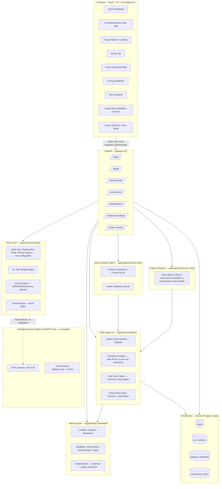

# Jyotiṣa Workbench — Technical Architecture (v1)

> Status: **APPROVED FOR BUILD** — confirmed with Ajay 2026-08-24.
> Frontend stack: **Option A (React + TypeScript)**, spec-literal per
> `jyotisha_cheatsheet_app_build_spec.md`.
> This document is the engineering source of truth for the **Workbench build**.
> `AGENTS.md` remains the source of truth for the existing **narrative
> reading pipeline** — see §10 for how the two coexist.

---

## 1. Why this document exists — the two-track vision

Ajay's own framing, verbatim intent preserved:

1. **Track 1 — Engine Accuracy.** Perfect the existing Swiss-Ephemeris-backed
   computation + rule layer so chart derivation is unimpeachable: full
   divisional-chart coverage, classical-precision strength models where
   feasible, a truly data-driven rule engine, and — critically — a
   **Cheat-Sheet Cross-Validation Console** that runs every cheat sheet
   (`docs/*.md`, `Marriage_Guide_Part*.md`, BPHS rule cards) against computed
   chart output side-by-side, so disagreements between corpus documents and
   runtime truth surface immediately instead of silently drifting.

2. **Track 2 — Learning & Validation Platform.** A polished, explainable,
   customer-facing web app (per `jyotisha_cheatsheet_app_build_spec.md`) that
   teaches the mental grammar *Ownership → Placement → Strength → Association
   → Varga Confirmation → Dasha Activation → Transit Trigger → Interpretation*,
   with heat maps, house-flow Sankeys, an evidence/"Why?" drawer, and a tutor
   mode — good enough to show to a customer, not just an internal debug tool.

These two tracks share one truth layer. Track 1 makes the engine trustworthy;
Track 2 makes that trust *visible and teachable*. Building them together
(rather than sequentially) is deliberate: every new calculator built for
Track 1 gets a Track 2 visualization in the same phase, so nothing gets built
twice and nothing ships unvisualized/unvalidated.

---

## 2. Current-state audit (condensed — full detail in kennel/chat history)

| Area | State | Verdict |
|---|---|---|
| Astro engine (`app/astro/`) | Swiss Ephemeris, Lahiri ayanāṁśa (hardcoded), whole-sign houses, D1+D9 only, MD/AD/PD dashas, combustion, retrograde | Solid core, narrow varga coverage, config not wired |
| Derived factors (`app/derived/`) | House lordship, aspects, dispositors, Arudha/Upapada (dual-formula preserved), simplified Shadbala/Ishta-Kashta/Ashtakavarga/Argala | Honest heuristics, explicitly labeled `computed_simplified` — good practice, not classical-precision |
| Rule engine (`app/rules/`) | 115KB YAML of rich provenance-heavy rule cards (BPHS Ch.3+, citations, examples) BUT `evaluator.py` is a hardcoded `if rid == "RC-001"` chain — **not data-driven** | Violates spec §6 and AGENTS.md's own DRY spirit — top priority fix |
| Persistence | None — hand-authored YAML fixtures for 6 people in `data/charts/` | No DB, no rule versioning, no multi-user |
| Frontend | Server-rendered Jinja2 (`templates/chart.html`, single 19KB page) | No heat maps, no network diagrams, no evidence drawer |
| Testing | Bespoke snapshot-regression tool (`tests/run_suite.py`) against 2 locked fixtures | Good regression discipline, no granular per-calculator unit tests |
| Narrative pipeline (`AGENTS.md`) | LLM-authored, produces long-form Validation.md + 5-Part Internal/Shareable HTML per person | Working well, orthogonal product — becomes a *consumer* of the workbench API |

---

## 3. High-level architecture



**Non-negotiable, carried over from the spec and from `AGENTS.md`:**
The UI never computes Jyotiṣa logic. It only renders structured JSON the API
returns. Every number, color, and label on screen must be traceable to a
`chart_evidence` object.

---

## 4. Backend architecture

### 4.1 Truth Layer extensions (`app/astro/`)

- **Configurable ayanāṁśa / node type / house system.** Currently
  `swe.set_sid_mode(swe.SIDM_LAHIRI)` is set once at import time — a global
  side effect. Refactor to accept `ayanamsha`, `node_type`
  (`mean`/`true`), `house_system` (`whole_sign`/`placidus`/...) as explicit
  parameters threaded through `julian_day()` → `all_planets_sidereal()`.
  Never silently default without echoing the chosen setting back in the
  API response (spec §5.1, §15).
- **Vargas engine (`app/astro/vargas.py` — new).** Implement the full spec
  list: D1, D2 (Horā), D3 (Drekkāṇa), D4 (Chaturthāṁśa), D7 (Saptāṁśa),
  D9 (already done — refactor into this module), D10 (Daśāṁśa), D12
  (Dvādaśāṁśa), D16 (Ṣoḍaśāṁśa), D20 (Viṁśāṁśa), D24 (Siddhāṁśa), D27
  (Bhāṁśa/Nakṣatrāṁśa), D30 (Triṁśāṁśa), D60 (Ṣaṣṭyāṁśa).
  - Every mapping algorithm gets a **unit test with a known-good fixture**
    before being wired into the API (spec §5.7, §22).
  - D60 responses **always** carry a `birth_time_sensitivity_warning` field —
    never a bare claim (spec §5.7, §15).
  - Odd/even sign counting direction must be explicit in code comments and
    in a `docs/varga-formulas.md` companion reference (new doc).
- **Transit engine tiers.** Extend `app/astro/transits.py` with the Tier
  A(structural)/B(action)/C(fast) classification and the orb-trigger-factor
  table from spec §9 (`<1°→1.00 ... >8°→0.20`) as an explicit, overridable
  config table — not a magic number buried in logic.

### 4.2 Derived Layer (`app/derived/`)

Keep all four existing modules (`factors.py`, `strengths.py`,
`ashtakavarga.py`, `interventions.py`). Each already self-labels its model
(`"simplified_practical"`, `"practical_bindu_proxy"`, `"d1_d9_weighted"`) —
**keep doing this everywhere new code is added.** These labels flow straight
into the UI's confidence badges (spec §16 "tradition-sensitive = purple
outline" convention extends naturally to "heuristic = dashed border").

New addition: `app/derived/vimsopaka.py` for classical Vimśopaka Bala
(weighted multi-varga strength, currently a documented `data_gap` in
`AGENTS.md` §6) — first genuinely classical (non-simplified) calculator
added in this build, since it's a pure weighted-sum formula over the vargas
engine once that exists.

### 4.3 Rule Engine v2 (`app/rules/`) — the centerpiece fix

**Problem:** `evaluator.py` today is a 20-branch `if rid == "RC-00N"` chain.
Every new rule requires editing Python. This is the single largest
spec-compliance gap (violates spec §6 "Never store rules as prose only" /
"data-driven" mandate) and the single largest DRY violation in the codebase.

**Fix — generic schema + generic evaluator:**

```python
# app/rules/schema.py
class RuleCondition(BaseModel):
    path: str            # dotted path into chart context, e.g. "chart.Mercury.house"
    op: Literal["eq","neq","in","not_in","gt","lt","gte","lte","house_in","aspect_from_to"]
    value: Any

class RuleOutput(BaseModel):
    kind: Literal["classification","connection","yoga_flag","score_modifier"]
    payload: dict[str, Any]

class Rule(BaseModel):
    id: str
    title: str
    category: Literal["functional_nature","lord_placement","dignity","aspect",
                       "yoga","dasha","transit","varga","event"]
    source_tier: Literal[1,2,3,4,5]
    source_ref: str
    tradition: str
    conditions: list[RuleCondition]
    outputs: list[RuleOutput]
    confidence: Literal["high","medium","low"]
    status: Literal["DRAFT","SOURCE_FOUND","VERIFIED","ACTIVE","DEPRECATED","CONTESTED"]
    contradictions: list[str] = []
    notes: list[str] = []
```

`evaluator.py` becomes ~80 lines: resolve each `RuleCondition.path` against
the chart-context dict via `operator.attrgetter`-style dotted lookup, apply
`op`, AND all conditions, emit outputs with an evidence trace — zero
per-rule branching. This is a **rewrite**, not a patch, and it is Phase 1's
top deliverable.

**Migration path for the existing 20 BPHS rule cards** (rich prose/citation
format): they stay exactly as-is as the **provenance/documentation layer**
(source-of-truth for citations, examples, chapter signals — nothing here is
thrown away). A one-time authoring pass translates each card's
`activation_conditions` (currently free-text) into the structured
`RuleCondition[]` list. This is tracked per-rule with a `compiled: bool`
flag so partially-migrated rule packs remain honest about what's
machine-executable vs. documentation-only — consistent with the
`DRAFT → SOURCE_FOUND → VERIFIED → ACTIVE` status pipeline in spec §23.

### 4.4 Cheat-Sheet Cross-Validation Console (new — Ajay's explicit ask)

This is the direct technical answer to *"I will also be able to use all the
cheat sheets with results side by side to ensure they are dealt with utmost
accuracy."*

```
app/engine/cheatsheet/
  extractor.py   # parses claims out of docs/*.md, Marriage_Guide_Part*.md,
                 # interpretive-frameworks.md, dosha-registry.md,
                 # nakshatra-framework.md into structured ClaimRecord objects
  differ.py      # runs each ClaimRecord's referenced formula against the
                 # Rule Engine v2 / vargas engine and produces a
                 # MATCH / MISMATCH / UNVERIFIABLE verdict
  models.py      # ClaimRecord, ValidationResult
```

```python
class ClaimRecord(BaseModel):
    source_file: str          # e.g. "docs/dosha-registry.md"
    section: str              # e.g. "Kala Sarpa Dosha"
    claim_text: str           # verbatim excerpt
    formula_ref: str | None   # which rule_id / calculator this maps to, if known
    applies_to_chart: str | None  # chart_id, if claim is chart-specific

class ValidationResult(BaseModel):
    claim: ClaimRecord
    computed_value: Any
    verdict: Literal["match","mismatch","unverifiable","data_gap"]
    diff_detail: str
```

**UI surface:** the Cheat-Sheet Validation Console (§6 screen list below)
renders every corpus document's claims **side by side** with live computed
output for a selected chart — mismatches are flagged in amber/red per the
spec's status-color convention (§16), never silently reconciled (this
directly extends the "Known Conflicts" section of `AGENTS.md` from a static
list into a living, queryable dashboard). This is how "predictions become
finer and sharper" over time: every generated reading's claims eventually
route through this differ before being trusted as a corpus reference.

### 4.5 Event Domain Engine (`app/engine/events/`)

Implements spec §10-§12 exactly:

```python
def event_readiness(promise: float, activation: float, transit: float) -> dict:
    """promise/activation/transit in [0,1]. Returns readiness + gate labels."""
    readiness = 100 * (promise ** 0.50) * (activation ** 0.30) * (transit ** 0.20)
    gates = []
    if promise < 0.35:
        readiness = min(readiness, 40)
        gates.append("capped: low natal promise")
    if activation < 0.30:
        gates.append("promised, not currently activated")
    if promise > 0.60 and activation > 0.60 and transit < 0.30:
        gates.append("loaded but waiting for transit trigger")
    return {"readiness": round(readiness, 1), "gates": gates,
            "weights_disclaimer": "Weights are application heuristics, not classical percentages."}
```

Initial event configs (`data/events/*.yaml`) for: career_reward, promotion,
salary_increase, job_change, property_purchase, marriage, children,
litigation, foreign_move, education, spiritual_practice — each declaring
`primary_houses`, `supporting_houses`, `primary_varga`, `karakas` per spec
§10 examples. Promise/Activation/Friction sub-scores are computed from
existing Rule Engine v2 output + Shadbala/Varga-quality — **never** a raw
`82 - 61` subtraction (spec §11 explicit prohibition).

### 4.6 Evidence Engine (`app/engine/evidence/`)

Builds the `Observation → Rule → Connection → Modifier → Interpretation`
chain object (spec §14) from Rule Engine v2 evaluation traces. This is a
pure data-shaping layer — no new astrology logic, just structuring existing
`chart_evidence` + `strength_modifier` + `friction_modifier` outputs into
the trace format the "Why?" drawer renders.

### 4.7 Persistence (SQLite → Postgres-ready)

```sql
charts(id, name, dob, tob, utc_offset, lat, lon, ayanamsha, node_type,
       house_system, created_at, notes)
rule_versions(rule_id, version, status, payload_json, created_at, created_by)
analysis_snapshots(id, chart_id, rule_pack_version, computed_at, result_json)
cheatsheet_claims(id, source_file, section, claim_text, formula_ref,
                  last_validated_at, last_verdict)
```

Use SQLAlchemy Core (not full ORM — keep it thin, this is a computation app
not a CRUD app) so a later Postgres swap is a one-line engine URL change,
per the Walmart default-stack guidance. Existing `data/charts/*.yaml`
fixtures remain as **seed data + regression fixtures** (`tests/run_suite.py`
keeps working against them unchanged) — they get imported into `charts` on
first run, not replaced.

### 4.8 API surface (`app/api/v2/`)

Existing `app/api/routes.py` (Jinja2-serving) stays untouched and keeps
serving the narrative-pipeline's simple chart page. New versioned routes:

| Endpoint | Purpose |
|---|---|
| `POST /api/v2/charts` | Create/persist a chart from birth input |
| `GET /api/v2/charts/{id}` | Full D1 + all vargas + dashas + transits |
| `GET /api/v2/charts/{id}/vargas/{n}` | Single varga detail |
| `GET /api/v2/charts/{id}/rules` | Rule Engine v2 evaluation (replaces old `/api/rules/{chart_id}`) |
| `GET /api/v2/charts/{id}/events/{event}` | Promise/Activation/Friction/Readiness |
| `GET /api/v2/charts/{id}/evidence/{claim_id}` | Why-trace for one conclusion |
| `GET /api/v2/cheatsheet/claims` | List extracted claims, filterable by source/verdict |
| `POST /api/v2/cheatsheet/validate/{chart_id}` | Run differ for a chart against all claims |
| `GET /api/v2/validation-screen/{chart_id}` | Chart Integrity screen data (spec §15) |

All Pydantic response models. FastAPI auto-generates OpenAPI — the React
app's TypeScript types are generated from this schema (`openapi-typescript`)
so frontend/backend never drift silently.

---

## 5. Frontend architecture — Option A (React + TypeScript)

### 5.1 Stack

```
Vite + React 18 + TypeScript
Tailwind CSS (design tokens per spec §16 palette)
shadcn/ui (accessible primitives — dialogs, tabs, drawers)
React Flow (house network / knowledge graph — spec §7.5, §7.6, §18)
Recharts (heat maps, timelines, bar charts — spec §7.1, §7.7, §8)
Mermaid.js (generated explanatory diagrams — spec §14 "Why?" traces)
Lucide icons
TanStack Query (data fetching/caching against FastAPI v2)
openapi-typescript (generated API types — zero hand-maintained interfaces)
```

### 5.2 Folder structure

```
webapp/
  src/
    api/            # generated types + thin fetch wrappers
    components/
      heatmaps/      FunctionalNatureHeatMap.tsx, CrossVargaHeatMap.tsx
      network/       HouseFlowSankey.tsx, AspectNetwork.tsx, KnowledgeGraph.tsx
      cards/         PlanetStateCard.tsx, HouseThemeCard.tsx
      drawers/       WhyDrawer.tsx, SourceDrawer.tsx
      dasha/         VimshottariTimeline.tsx
      transit/       TransitDashboard.tsx
      events/        EventExplorer.tsx, ReadinessGauge.tsx
      cheatsheet/     CheatSheetValidationConsole.tsx, ClaimDiffRow.tsx
      validation/    ChartIntegrityScreen.tsx
    screens/          one file per spec §17 screen (see 5.3)
    lib/              design tokens, color-status mapping (never color-alone, spec §7.7)
    hooks/            useChart, useRuleEvaluation, useEventScore
  index.html, vite.config.ts, tailwind.config.ts, tsconfig.json
```

### 5.3 Screens (mapped 1:1 to spec §17)

1. **Chart Dashboard** — 10-second summary (Lagna, Moon, current daśā, top
   3 strong/stressed planets, top 5 house connections, top 3 active houses,
   event scores)
2. **Functional Nature Heat Map** — 12-Lagna × 7-planet grid, click → detail
   drawer, "Functional Nature only — not planet strength" banner (spec §7.1)
3. **House Network / Sankey** — flagship view, filters
   [Lordship][Aspects][Dispositors][Dasha][Transit], line-style semantics
   exactly per spec §7.5
4. **Planet Lab** — tabbed (`Role/Placement/Dignity/Aspects/Vargas/Dasha/
   Transits/Sources`)
5. **Cross-Varga Heat Map** — planets × D1/D4/D9/D10/D20/D24..., color +
   icon overlay (never color alone)
6. **Timing Dashboard** — combined Vimśottarī + slow-transit + fast-trigger
   lanes
7. **Event Explorer** — Promise/Activation/Transit/Friction bars per event
8. **Cheat-Sheet Validation Console** *(new, Ajay's addition)* — side-by-side
   corpus claim vs. computed value, filterable by verdict
9. **Classical Source Browser** — searchable rule/citation index
10. **Chart Validation Screen** (spec §15) — shown **before** any
    interpretation, gates entry into the rest of the app
11. **Learning/Tutor Mode** — `[Interpret for me] / [Teach me]` toggle,
    8-level progression (spec §19)

### 5.4 Design system

Palette, typography, and status-color rules lifted verbatim from spec §16
into `webapp/src/lib/tokens.ts` (Tailwind theme extension) — background
`#F8F7F3`, primary ink `#1E293B`, gold accent `#B58A3A`, etc. Source
Serif/Noto Serif for headings + Sanskrit, Inter/Geist for UI. **Never** use
red as a universal "bad planet" signal — status colors map to
beneficence(green)/strength(indigo)/friction(amber-red)/activation(gold)/
tradition-sensitive(purple outline), always paired with an icon or label,
never color alone (WCAG 2.2 AA — non-negotiable per your Walmart front-end
standard even though this isn't a Walmart-banner product).

---

## 6. Data contracts (illustrative)

```json
// GET /api/v2/charts/{id}
{
  "chart_id": "ajay_kumar",
  "settings": {"ayanamsha": "lahiri", "node_type": "mean", "house_system": "whole_sign"},
  "d1": { "Lagna": {...}, "Sun": {...}, "...": "..." },
  "vargas": { "D9": {...}, "D10": {...}, "D60": {"...": "...", "birth_time_sensitivity_warning": true} },
  "dashas": {...},
  "transits": {...}
}
```

```json
// GET /api/v2/charts/{id}/rules
{
  "chart_id": "ajay_kumar",
  "evaluations": [
    {
      "rule_id": "RC-001",
      "matched": true,
      "chart_evidence": {"lagna": "Scorpio", "planet": "Mercury", "houses_owned": [8, 11]},
      "interpretation_atoms": ["H8+H11 -> H2"],
      "confidence": "high",
      "source_tier": 1,
      "status": "ACTIVE"
    }
  ]
}
```

---

## 7. Dependencies

### Backend (managed via `uv`, per Walmart standard — never plain `pip`)

```
fastapi
uvicorn
pydantic
jinja2                # kept — old narrative UI still serves via this
python-multipart
PyYAML
pyswisseph
sqlalchemy            # Core usage only, thin persistence layer
python-dateutil
```

Install command (per your org's proxy requirement):
```
uv pip install --index-url https://pypi.ci.artifacts.walmart.com/artifactory/api/pypi/external-pypi/simple \
  --allow-insecure-host pypi.ci.artifacts.walmart.com \
  fastapi uvicorn pydantic jinja2 python-multipart PyYAML pyswisseph sqlalchemy python-dateutil
```

### Frontend (npm, Node 24 already available)

```
react, react-dom, typescript, vite, @vitejs/plugin-react
tailwindcss, postcss, autoprefixer
@radix-ui/* (via shadcn/ui generator), class-variance-authority, clsx
reactflow
recharts
mermaid
lucide-react
@tanstack/react-query
openapi-typescript (devDependency, codegen only)
```

### Testing

```
pytest, pytest-cov          # backend unit tests, per-calculator
playwright                  # E2E, per-feature isolated tests (per your standing rule)
```

---

## 8. Repo structure changes

```
jyotisha/
  app/                      # UNCHANGED root package name — extended, not replaced
    astro/
      vargas.py             # NEW — D2..D60 engine
      engine.py             # MODIFIED — configurable ayanamsha/node/house-system
    derived/
      vimsopaka.py          # NEW
    rules/
      schema.py             # NEW — generic Rule/RuleCondition/RuleOutput models
      evaluator.py           # REWRITTEN — generic, data-driven
      bphs_top20_rule_cards_v1.yaml   # UNCHANGED — stays as provenance layer
    engine/                 # NEW package
      events/
      evidence/
      cheatsheet/
    db/                     # NEW — SQLAlchemy models + migrations (alembic optional)
    api/
      routes.py             # UNCHANGED — old narrative-facing routes
      v2/                   # NEW — workbench API
  webapp/                   # NEW — React+TS+Vite app, entirely separate build
  data/
    charts/                 # UNCHANGED — seed/regression fixtures
    events/                 # NEW — event config YAML
  docs/
    technical-architecture.md   # this file
    varga-formulas.md            # NEW companion reference
    (all existing docs unchanged — remain the narrative pipeline's authority)
  tests/
    unit/                   # NEW — pytest, one file per calculator
    e2e/                    # NEW — Playwright, one spec per screen/feature
    run_suite.py            # UNCHANGED — regression snapshot tool stays
```

---

## 9. Testing strategy

- **Unit (pytest):** one test module per calculator — `test_vargas_d2.py`
  through `test_vargas_d60.py`, `test_combustion.py`, `test_aspects.py`,
  `test_dispositors.py`, `test_rule_engine_generic.py` (spec §22 exact
  requirement list). Golden fixtures: keep `ajay_kumar`, `sandeep_0700` as
  locked regression charts; every new person chart becomes an additional
  fixture, never a replacement.
- **Rule tests:** assert on `Rule Engine v2` output shape, e.g.
  `assert "H8 -> H2" in result.connections` (spec §22 example, adapted to
  generic engine).
- **E2E (Playwright):** one isolated spec per screen (Chart Dashboard,
  Heat Map, Sankey, Cheat-Sheet Console, etc.) — per your standing rule
  "Isolate tests per feature."
- **Regression:** `tests/run_suite.py` keeps running unchanged as the fast
  CI gate; Playwright suite runs as a slower, fuller check.

Run before any merge: `.venv/bin/python tests/run_suite.py --mode verify`
**and** `.venv/bin/pytest tests/unit` **and** `npx playwright test` (once
webapp exists).

---

## 10. Relationship to the existing narrative pipeline

`AGENTS.md`'s 8-step process (Input Lock → Dual Computation → Validation
Document → Style Reference → Generate Parts → Post-Gen Verification →
Completion Summary → Execution Log) **does not change.** The narrative
pipeline becomes a **consumer** of the same `app/astro` + `app/derived` +
Rule Engine v2 libraries — no duplicated astrology logic anywhere. Over
time, Step 1 (Dual Computation) and Step 2 (Validation Document) can pull
directly from `GET /api/v2/charts/{id}` and
`GET /api/v2/validation-screen/{chart_id}` instead of ad-hoc script calls,
but that migration is optional and non-blocking — the MCP server
(`jyotisha_mcp_server.py`) keeps working exactly as-is throughout this
build.

---

## 11. Phased build roadmap

| Phase | Deliverable | Depends on |
|---|---|---|
| **0 — Repo Prep** | Folder restructure, `webapp/` scaffold, SQLite schema created, `uv`-installed deps confirmed | — |
| **1 — Truth Layer + Rule Engine v2** | Full D1-D60 vargas, configurable ayanamsha/node/house-system, generic Rule schema + rewritten evaluator, Chart Validation Screen (API+UI) | Phase 0 |
| **2 — Learning Layer UI** | Chart Dashboard, Functional Nature Heat Map, House Network/Sankey, Planet Lab, Why-Drawer | Phase 1 |
| **3 — Vargas Deep-Dive** | Cross-Varga Heat Map, Vimśopaka calculator | Phase 1 |
| **4 — Timing** | Timing Dashboard (Vimśottarī + tiered transits), orb-trigger-factor table | Phase 1 |
| **5 — Events** | Event Domain Engine (all 11 initial events), Event Explorer UI, gated readiness formula | Phase 1-2 |
| **6 — Cheat-Sheet Validation Console** | Claim extractor across all `docs/*.md`/guides, differ engine, Console UI | Phase 1 (Rule Engine v2) |
| **7 — Sources & Tutor** | Classical Source Browser, Learning/Teach-Me mode with 8-level progression | Phases 2-6 |

Each phase ships both the backend calculator/engine work **and** its
corresponding UI in the same phase — per the two-track vision, accuracy and
UX are never allowed to drift apart.

---

## 12. Open risks / explicit data gaps (carried forward honestly)

- Full classical Śaḍbala (ṣaṣṭyāṁśa-precision), full Iṣṭa/Kaṣṭa Phala, full
  classical Argala with strength comparison, full Aṣṭakavarga (true
  Bhinnāṣṭakavarga+Sarvāṣṭakavarga), Bhāvapada family beyond A1/UL, and
  Pañcāṅga computation remain `data_gap` per `AGENTS.md` §6 — this build
  does **not** silently upgrade their confidence labels. Vimśopaka is the
  one calculator promoted from `data_gap` to genuinely classical in Phase 3.
- D60 birth-time sensitivity is a hard product constraint, not just a UI
  warning — Event Engine and Evidence Engine must down-weight any D60-only
  claim automatically when `birth_time_confidence` is not `verified`.
- The rule-card-to-structured-condition migration (§4.3) is a real editorial
  effort, not just code — budget real time per rule, don't rush provenance.

---

*Pramāṇa-pūrvakaṁ gaṇanaṁ kṛtvā, śāstra-dṛṣṭyā vicārayet.*
